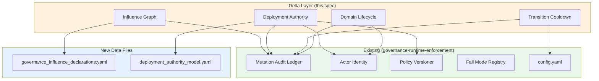
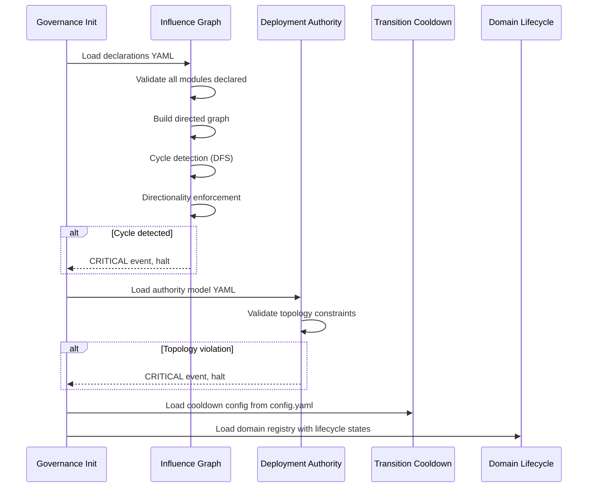
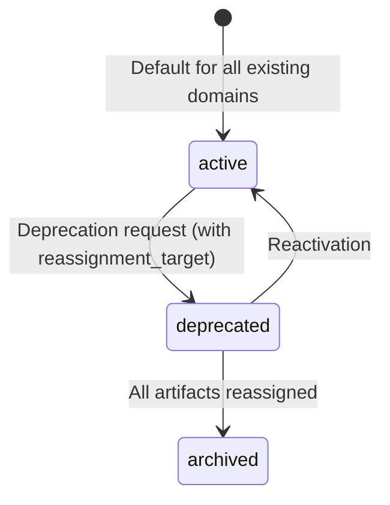

# Design Document: Deployment Authority and Domainization Hardening

## Overview

This design is a **lean delta layer** extending governance-runtime-enforcement. It addresses four structural gaps at the meta-governance level without redefining existing enforcement semantics, fail modes, or provenance systems.

**What this design adds:**
1. **Governance Influence Graph** — Static dependency declarations + cycle detection to prevent governance feedback loops
2. **Deployment Authority Model** — OWNER/CI/RUNTIME role partitioning with topology constraint (no single actor deploys AND mutates governance)
3. **Transition Cooldown** — 4h default anti-flapping guard for enforcement mode transitions
4. **Domain Lifecycle** — Three-state model (active/deprecated/archived) with deprecation-triggered artifact reassignment

**What this design does NOT do:**
- Define new enforcement modes (observability/soft/hard exist in governance-runtime-enforcement)
- Define new fail modes (fail_open/fail_soft/fail_closed exist in governance-runtime-enforcement)
- Create parallel audit/provenance systems (reuses Mutation_Audit_Ledger, Actor_Identity, Governance_Policy_Version)
- Introduce plugin architecture, event bus, or generic runtime kernel (HARDENING 10)

**Reused infrastructure from governance-runtime-enforcement:**
- `governance/mutation_audit_ledger.py` — `MutationAuditLedger.append(LedgerEntry)`
- `governance/actor_identity.py` — `ActorType`, `ActorIdentity`
- `governance/policy_versioner.py` — `PolicyVersioner.get_current_version()`
- `governance/fail_mode_registry.py` — `FailMode` enum
- `.domainization/config.yaml` — `enforcement_mode` reading

**New modules (6 files, intentionally minimal):**
- `governance/influence_graph.py` — Dependency declarations + cycle detection + directionality enforcement
- `governance/deployment_authority.py` — Authority model + topology constraint + deploy provenance
- `governance/transition_cooldown.py` — Anti-flapping cooldown logic
- `governance/domain_lifecycle.py` — Domain state model + deprecation reassignment
- `.domainization/governance_influence_declarations.yaml` — Module dependency declarations (data)
- `.domainization/deployment_authority_model.yaml` — Authority role assignments (data)

## Architecture

### Delta Layer Topology



### Initialization Sequence



### Domain Lifecycle State Machine



### Module Placement

| New Module | Location | Lines (est.) | Rationale |
|-----------|----------|:---:|-----------|
| `governance/influence_graph.py` | `governance/` | ~180 | Cycle detection + directionality — single-purpose |
| `governance/deployment_authority.py` | `governance/` | ~150 | Authority model + topology + provenance — cohesive |
| `governance/transition_cooldown.py` | `governance/` | ~100 | Cooldown logic — minimal, self-contained |
| `governance/domain_lifecycle.py` | `governance/` | ~200 | State model + reassignment — domain-specific |
| `.domainization/governance_influence_declarations.yaml` | `.domainization/` | ~50 | Static data, not code |
| `.domainization/deployment_authority_model.yaml` | `.domainization/` | ~30 | Static data, not code |


## Components and Interfaces

### 1. Influence Graph (`governance/influence_graph.py`)

Manages governance module dependency declarations, cycle detection, and directionality enforcement.

```python
from dataclasses import dataclass, field
from enum import StrEnum


class InfluenceDirection(StrEnum):
    UPSTREAM = "upstream"
    DOWNSTREAM = "downstream"


@dataclass(frozen=True)
class ModuleDependencyDeclaration:
    module_id: str
    read_dependencies: tuple[str, ...]
    write_dependencies: tuple[str, ...]
    influence_direction: InfluenceDirection


@dataclass
class CycleDetectionResult:
    has_cycle: bool
    cycle_path: list[str] = field(default_factory=list)  # e.g. ["A", "B", "C", "A"]


@dataclass
class DirectionalityViolation:
    source_module: str
    target_module: str
    violation_type: str  # "downstream_writes_upstream"
    edge_direction: str


class GovernanceInfluenceGraph:
    """Directed graph of governance module dependencies.
    
    Loaded from .domainization/governance_influence_declarations.yaml.
    Performs cycle detection and directionality enforcement at init time.
    """

    def __init__(self, declarations_path: str): ...

    def load_declarations(self) -> list[ModuleDependencyDeclaration]: ...

    def validate_declaration(self, decl: ModuleDependencyDeclaration) -> tuple[bool, str]: ...

    def build_graph(self, declarations: list[ModuleDependencyDeclaration]) -> dict[str, list[str]]:
        """Build adjacency list from declarations.
        Edges: module -> each of its write_dependencies (influence direction).
        """
        ...

    def detect_cycles(self, graph: dict[str, list[str]]) -> CycleDetectionResult:
        """DFS-based cycle detection on the directed graph.
        Operates on transitive closure — detects indirect cycles (A->B->C->A).
        """
        ...

    def enforce_directionality(self, declarations: list[ModuleDependencyDeclaration]) -> list[DirectionalityViolation]:
        """Check that no downstream module writes to an upstream module.
        A module declared 'downstream' must not have write_dependencies
        on modules declared 'upstream'.
        """
        ...

    def validate_at_init(self) -> tuple[bool, list[str]]:
        """Run full validation: load, build graph, detect cycles, enforce directionality.
        Returns (is_valid, list_of_error_messages).
        Called once at governance initialization before any enforcement decisions.
        """
        ...
```

**Design decisions:**
- `ModuleDependencyDeclaration` is frozen (immutable) — declarations are static config, not mutable state
- Cycle detection uses DFS on the directed graph built from write_dependencies
- Directionality enforcement: a `downstream` module cannot have write_dependencies on modules declared `upstream`
- All violations emit CRITICAL severity events via the existing Mutation_Audit_Ledger
- Modules without declarations are excluded from influence analysis with a CRITICAL event

### 2. Deployment Authority (`governance/deployment_authority.py`)

Defines the OWNER/CI/RUNTIME authority model, enforces topology constraints, and records deploy provenance.

```python
from dataclasses import dataclass
from enum import StrEnum


class AuthorityRole(StrEnum):
    OWNER = "OWNER"
    CI = "CI"
    RUNTIME = "RUNTIME"


class Authority(StrEnum):
    MUTATE_GOVERNANCE = "mutate_governance"
    CHANGE_ENFORCEMENT_MODE = "change_enforcement_mode"
    DEPLOY = "deploy"
    ACCEPT_RUNTIME_HASH = "accept_runtime_hash"
    EXECUTE_OVERRIDE = "execute_override"
    CHANGE_FAIL_MODE = "change_fail_mode"


@dataclass(frozen=True)
class AuthorityAssignment:
    role: AuthorityRole
    authorities: frozenset[Authority]


@dataclass
class DeployProvenance:
    ci_workflow_run_id: str
    triggering_actor: str  # ActorIdentity.actor_id
    governance_policy_version: str
    runtime_integrity_hash: str
    git_commit_sha: str
    deployment_timestamp: str  # ISO 8601
    is_validated: bool  # False if manual deployment without CI run


# Topology constraints — these pairs MUST NOT coexist on any single role
FORBIDDEN_AUTHORITY_PAIRS: list[tuple[Authority, Authority]] = [
    (Authority.DEPLOY, Authority.MUTATE_GOVERNANCE),
    (Authority.DEPLOY, Authority.CHANGE_ENFORCEMENT_MODE),
]


class DeploymentAuthorityModel:
    """Minimal authority model: OWNER/CI/RUNTIME with topology constraints.
    
    Loaded from .domainization/deployment_authority_model.yaml.
    Validated at governance initialization.
    """

    def __init__(self, model_path: str, ledger, policy_versioner): ...

    def load_model(self) -> list[AuthorityAssignment]: ...

    def validate_topology(self, assignments: list[AuthorityAssignment]) -> tuple[bool, list[str]]:
        """Check that no role holds forbidden authority pairs.
        Returns (is_valid, list_of_violated_constraints).
        """
        ...

    def validate_at_init(self) -> tuple[bool, list[str]]:
        """Load model, validate topology. CRITICAL event on violation."""
        ...

    def record_deploy_provenance(self, provenance: DeployProvenance) -> None:
        """Persist deploy provenance to Mutation_Audit_Ledger with event_type='deployment_authorized'.
        Emits WARNING if provenance.is_validated is False.
        """
        ...

    def check_authority(self, role: AuthorityRole, authority: Authority) -> bool:
        """Check if a role holds a specific authority."""
        ...
```

**Design decisions:**
- Exactly 3 roles, no inheritance, no dynamic role creation
- Topology constraints are compile-time constants (`FORBIDDEN_AUTHORITY_PAIRS`), not configurable
- Deploy provenance reuses `MutationAuditLedger.append()` with event_type `deployment_authorized`
- Unvalidated deployments (manual, no CI run) are flagged but not blocked — WARNING severity

### 3. Transition Cooldown (`governance/transition_cooldown.py`)

Anti-flapping guard for enforcement mode transitions.

```python
from dataclasses import dataclass
from datetime import datetime, timedelta


@dataclass
class CooldownConfig:
    duration_hours: float  # Default 4.0, min 1.0, max 24.0


@dataclass
class CooldownState:
    last_transition_timestamp: datetime | None
    cooldown_duration: timedelta
    is_active: bool

    @property
    def remaining(self) -> timedelta | None:
        """Returns remaining cooldown duration, or None if not active."""
        ...


@dataclass
class TransitionAttempt:
    from_mode: str
    to_mode: str
    timestamp: str  # ISO 8601
    success: bool
    rejection_reason: str | None  # e.g. "cooldown active, 2h 15m remaining"
    actor: str  # ActorIdentity.actor_id
    cooldown_bypassed: bool  # True only for emergency overrides
    bypass_reason: str | None
    justification: str | None  # Required for rollbacks (de-escalation)
    governance_policy_version: str | None  # Included for rollbacks


class TransitionCooldown:
    """Enforcement mode transition cooldown (anti-flapping).
    
    Reads config from .domainization/config.yaml under 'transition_hysteresis'.
    Persists all attempts (success + rejection) to Mutation_Audit_Ledger.
    """

    def __init__(self, config_path: str, ledger): ...

    def load_config(self) -> CooldownConfig:
        """Load cooldown duration from config.yaml.
        Clamps to [1h, 24h] range. Defaults to 4h if missing.
        """
        ...

    def get_cooldown_state(self) -> CooldownState:
        """Query ledger for last successful transition to determine cooldown state."""
        ...

    def attempt_transition(
        self,
        from_mode: str,
        to_mode: str,
        actor,
        is_emergency: bool = False,
        bypass_reason: str | None = None,
        justification: str | None = None,
    ) -> tuple[bool, str]:
        """Attempt a mode transition.
        Returns (allowed, reason).
        If allowed: records successful transition to ledger.
        If rejected: records rejected attempt to ledger with remaining cooldown.
        Emergency overrides bypass cooldown with mandatory audit logging.
        """
        ...

    def query_transition_history(self) -> list[TransitionAttempt]:
        """Return all transition attempts (success + rejected) from ledger."""
        ...
```

**Design decisions:**
- Cooldown applies to ALL transitions (escalation and de-escalation)
- Emergency override (USER actor, per governance-runtime-enforcement Req 35) bypasses cooldown but MUST log bypass_reason
- Both successful and rejected attempts are persisted — extends governance-runtime-enforcement Req 7.3
- Config is read from `config.yaml` under a new `transition_hysteresis` section
- Duration clamped to [1h, 24h] — prevents misconfiguration

### 4. Domain Lifecycle (`governance/domain_lifecycle.py`)

Domain lifecycle state model and deprecation-triggered artifact reassignment.

```python
from dataclasses import dataclass, field
from enum import StrEnum


class DomainLifecycleState(StrEnum):
    ACTIVE = "active"
    DEPRECATED = "deprecated"
    ARCHIVED = "archived"


# Valid transitions between domain lifecycle states
VALID_DOMAIN_TRANSITIONS: dict[DomainLifecycleState, list[DomainLifecycleState]] = {
    DomainLifecycleState.ACTIVE: [DomainLifecycleState.DEPRECATED],
    DomainLifecycleState.DEPRECATED: [DomainLifecycleState.ARCHIVED, DomainLifecycleState.ACTIVE],
    DomainLifecycleState.ARCHIVED: [],  # Terminal state
}


@dataclass
class DeprecationRequest:
    domain_id: str
    reassignment_target: str  # Target domain_id for artifact reassignment
    reason: str
    actor: str  # ActorIdentity.actor_id


@dataclass
class ReassignmentPlanEntry:
    artifact_id: str
    artifact_type: str
    previous_domain: str
    new_domain: str


@dataclass
class ReassignmentPlan:
    deprecated_domain: str
    target_domain: str
    entries: list[ReassignmentPlanEntry]
    blocked_types: list[str]  # Artifact types that cannot_own blocks
    is_valid: bool  # False if blocked_types is non-empty


class DomainLifecycleManager:
    """Domain lifecycle state management with deprecation reassignment.
    
    Extends domain_registry.yaml with a lifecycle_state field per domain.
    Defaults to 'active' for all existing domains.
    """

    def __init__(self, domain_registry_path: str, artifact_registry_path: str, ledger): ...

    def get_domain_state(self, domain_id: str) -> DomainLifecycleState:
        """Get current lifecycle state for a domain. Defaults to ACTIVE."""
        ...

    def validate_transition(
        self, domain_id: str, from_state: DomainLifecycleState, to_state: DomainLifecycleState
    ) -> tuple[bool, str]:
        """Check if transition is valid per VALID_DOMAIN_TRANSITIONS.
        Returns (is_valid, error_message_or_empty).
        """
        ...

    def request_deprecation(self, request: DeprecationRequest) -> tuple[bool, ReassignmentPlan | str]:
        """Process a deprecation request.
        1. Validate transition (active -> deprecated)
        2. Identify all artifacts with this domain as primary_domain
        3. Check reassignment_target can own all artifact types (cannot_own check)
        4. If valid: produce ReassignmentPlan for OWNER approval
        5. If invalid: return error string listing blocked artifact types
        """
        ...

    def execute_reassignment(self, plan: ReassignmentPlan, actor) -> None:
        """Execute approved reassignment plan.
        Records each reassignment in Mutation_Audit_Ledger.
        """
        ...

    def transition_domain(self, domain_id: str, to_state: DomainLifecycleState, actor) -> tuple[bool, str]:
        """Perform a domain lifecycle transition (non-deprecation transitions).
        Validates transition, persists state change, records to ledger.
        """
        ...
```

**Design decisions:**
- `archived` is a terminal state — no transitions out
- Deprecation REQUIRES a `reassignment_target` — cannot orphan artifacts
- `cannot_own` constraints from domain_registry.yaml are checked before deprecation is accepted
- Reassignment plan requires explicit OWNER approval before execution (not auto-executed)
- `lifecycle_state` field is added to domain_registry.yaml entries, defaulting to `active`


## Data Models

### Governance Influence Declarations (`.domainization/governance_influence_declarations.yaml`)

```yaml
schema_version: "1.0.0"
modules:
  - module_id: "influence_graph"
    read_dependencies: []
    write_dependencies: []
    influence_direction: "upstream"

  - module_id: "deployment_authority"
    read_dependencies: ["policy_versioner"]
    write_dependencies: ["mutation_audit_ledger"]
    influence_direction: "downstream"

  - module_id: "transition_cooldown"
    read_dependencies: ["mutation_audit_ledger"]
    write_dependencies: ["mutation_audit_ledger"]
    influence_direction: "downstream"

  - module_id: "domain_lifecycle"
    read_dependencies: ["mutation_audit_ledger"]
    write_dependencies: ["mutation_audit_ledger"]
    influence_direction: "downstream"

  - module_id: "gate_framework"
    read_dependencies: ["fail_mode_registry", "state_provenance_tagger"]
    write_dependencies: ["mutation_audit_ledger"]
    influence_direction: "downstream"

  - module_id: "lifecycle_enforcer"
    read_dependencies: ["policy_versioner"]
    write_dependencies: ["mutation_audit_ledger"]
    influence_direction: "downstream"

  - module_id: "boundary_enforcer"
    read_dependencies: ["shadow_authority_detector"]
    write_dependencies: ["mutation_audit_ledger"]
    influence_direction: "downstream"

  - module_id: "warning_governor"
    read_dependencies: []
    write_dependencies: ["mutation_audit_ledger"]
    influence_direction: "downstream"

  - module_id: "mutation_audit_ledger"
    read_dependencies: []
    write_dependencies: []
    influence_direction: "upstream"

  - module_id: "policy_versioner"
    read_dependencies: []
    write_dependencies: []
    influence_direction: "upstream"

  - module_id: "fail_mode_registry"
    read_dependencies: []
    write_dependencies: []
    influence_direction: "upstream"

  - module_id: "state_provenance_tagger"
    read_dependencies: []
    write_dependencies: []
    influence_direction: "upstream"

  - module_id: "shadow_authority_detector"
    read_dependencies: []
    write_dependencies: []
    influence_direction: "upstream"
```

### Deployment Authority Model (`.domainization/deployment_authority_model.yaml`)

```yaml
schema_version: "1.0.0"
roles:
  - role: "OWNER"
    authorities:
      - "mutate_governance"
      - "change_enforcement_mode"

  - role: "CI"
    authorities:
      - "deploy"
      - "accept_runtime_hash"

  - role: "RUNTIME"
    authorities:
      - "execute_override"
      - "change_fail_mode"
```

### Deploy Provenance (LedgerEntry details)

```yaml
entry_id: "a1b2c3d4-..."
event_type: "deployment_authorized"
timestamp: "2026-06-01T14:00:00Z"
actor:
  actor_type: "CI"
  actor_id: "github-actions-run-12345"
  context:
    workflow: "python-app.yml"
  is_fallback: false
governance_policy_version: "sha256:abc123..."
severity: "INFO"
details:
  ci_workflow_run_id: "12345"
  triggering_actor: "rabieb"
  runtime_integrity_hash: "sha256:def456..."
  git_commit_sha: "abc123def456"
  is_validated: true
```

### Transition Attempt (LedgerEntry details — successful rollback)

```yaml
entry_id: "e5f6g7h8-..."
event_type: "enforcement_mode_rollback"
timestamp: "2026-06-01T16:00:00Z"
actor:
  actor_type: "USER"
  actor_id: "rabieb"
  context: {}
  is_fallback: false
governance_policy_version: "sha256:abc123..."
severity: "WARNING"
details:
  from_mode: "soft"
  to_mode: "observability"
  success: true
  cooldown_bypassed: false
  justification: "Rollback due to false positive blocking in soft mode"
```

### Rejected Transition Attempt (LedgerEntry details)

```yaml
entry_id: "i9j0k1l2-..."
event_type: "enforcement_mode_rollback"
timestamp: "2026-06-01T12:30:00Z"
actor:
  actor_type: "USER"
  actor_id: "rabieb"
  context: {}
  is_fallback: false
governance_policy_version: "sha256:abc123..."
severity: "WARNING"
details:
  from_mode: "hard"
  to_mode: "soft"
  success: false
  rejection_reason: "cooldown active, 2h 15m remaining"
  cooldown_bypassed: false
```

### Domain Lifecycle Transition (LedgerEntry details)

```yaml
entry_id: "m3n4o5p6-..."
event_type: "domain_lifecycle_transition"
timestamp: "2026-06-01T18:00:00Z"
actor:
  actor_type: "USER"
  actor_id: "rabieb"
  context: {}
  is_fallback: false
governance_policy_version: "sha256:abc123..."
severity: "INFO"
details:
  domain_id: "MEMORY"
  from_state: "active"
  to_state: "deprecated"
  reassignment_target: "STATE"
  affected_artifacts: 5
  reason: "Memory domain consolidated into State domain"
```

### Config Extension (`.domainization/config.yaml` addition)

```yaml
# Added under existing config.yaml
transition_hysteresis:
  cooldown_hours: 4  # Default. Min: 1, Max: 24
```

### Domain Registry Extension (`.domainization/domain_registry.yaml` addition)

Each domain entry gains a `lifecycle_state` field, defaulting to `active`:

```yaml
domains:
  - domain_id: GOV
    name: Governance
    lifecycle_state: active  # NEW FIELD
    # ... existing fields unchanged ...
```

### New Ledger Event Types

The delta layer appends these event types to the existing `event_type` enumeration (non-breaking — additive only):

| Event Type | Source | Description |
|-----------|--------|-------------|
| `deployment_authorized` | Deployment Authority | Deploy provenance record |
| `enforcement_mode_rollback` | Transition Cooldown | Mode transition attempt (success or rejected) |
| `domain_lifecycle_transition` | Domain Lifecycle | Domain state change or artifact reassignment |

### Non-Interference Summary

| Existing Component | Delta Layer Interaction | Modification |
|---|---|---|
| Mutation_Audit_Ledger | Append new event types | Schema unchanged, additive event types only |
| Actor_Identity | Consumed (read-only) | No modification |
| Policy_Versioner | Consumed (read-only) | No modification |
| Fail_Mode_Registry | Not touched | No modification |
| Domain_Registry | Add `lifecycle_state` field | Additive field only, no schema break |
| Enforcement modes | Cooldown wraps transitions | Mode semantics unchanged |
| config.yaml | Add `transition_hysteresis` section | Additive section only |


## Correctness Properties

*A property is a characteristic or behavior that should hold true across all valid executions of a system — essentially, a formal statement about what the system should do. Properties serve as the bridge between human-readable specifications and machine-verifiable correctness guarantees.*

### Property 1: Dependency Declaration Round-Trip

*For any* valid `ModuleDependencyDeclaration` object (with arbitrary module_id string, arbitrary tuples of read/write dependency strings, and any valid InfluenceDirection), serializing to a YAML-compatible dict and deserializing back SHALL produce an object equal to the original.

**Validates: Requirements 1.4, 1.5**

### Property 2: Cycle Detection Completeness

*For any* directed graph of governance module dependencies, if the graph contains a cycle (direct or transitive), the cycle detection algorithm SHALL report `has_cycle=True` and produce a `cycle_path` that is a valid cycle in the graph. Conversely, for any acyclic graph, the algorithm SHALL report `has_cycle=False`.

**Validates: Requirements 2.1, 2.2, 2.3, 2.5**

### Property 3: Directionality Enforcement

*For any* set of governance module declarations where all modules have valid influence directions, if a module declared as `downstream` has a write_dependency on a module declared as `upstream`, the directionality enforcement SHALL detect and report a `DirectionalityViolation`. Conversely, if no downstream module writes to an upstream module, no violations SHALL be reported.

**Validates: Requirements 3.1, 3.2, 3.4**

### Property 4: Deployment Authority Model Round-Trip

*For any* valid `DeploymentAuthorityModel` configuration (with exactly 3 roles each holding a frozenset of valid Authority values), serializing to a YAML-compatible dict and deserializing back SHALL produce an equivalent configuration.

**Validates: Requirements 4.3, 4.5**

### Property 5: Topology Constraint Enforcement

*For any* authority configuration where at least one role holds both `deploy` and `mutate_governance` simultaneously, OR both `deploy` and `change_enforcement_mode` simultaneously, the topology validation SHALL reject the configuration. Conversely, for any configuration where no role holds any forbidden authority pair, the topology validation SHALL accept the configuration.

**Validates: Requirements 5.1, 5.2, 5.3**

### Property 6: Deploy Provenance Round-Trip

*For any* valid `DeployProvenance` record (with arbitrary CI workflow run ID, actor ID, policy version hash, integrity hash, git SHA, ISO 8601 timestamp, and boolean is_validated flag), serializing to a YAML-compatible dict and deserializing back SHALL produce an object equal to the original.

**Validates: Requirements 6.1, 6.5**

### Property 7: Cooldown Enforcement

*For any* sequence of enforcement mode transition attempts with timestamps, no two successful (non-emergency) transitions SHALL have timestamps less than `cooldown_duration` apart. Emergency overrides (with `is_emergency=True`) SHALL always succeed regardless of cooldown state, and SHALL produce an audit record with `cooldown_bypassed=True`.

**Validates: Requirements 7.1, 7.2, 7.3, 7.5**

### Property 8: Domain Lifecycle Transition Validation

*For any* domain in any lifecycle state, attempting a transition to a target state SHALL succeed if and only if the (from_state, to_state) pair is in the set of valid transitions: {(active, deprecated), (deprecated, archived), (deprecated, active)}. All other transitions SHALL be rejected.

**Validates: Requirements 9.2, 9.3, 9.4**


## Error Handling

### Fail-Mode Classification for Delta Layer Components

All delta layer components inherit the existing fail-mode framework from governance-runtime-enforcement. No new fail modes are introduced.

| Component | Fail Mode | Rationale |
|-----------|-----------|-----------|
| Influence Graph (init) | `fail_closed` | Cannot proceed with circular governance — non-deterministic enforcement |
| Deployment Authority (init) | `fail_closed` | Cannot proceed with topology violation — security boundary broken |
| Transition Cooldown | `fail_soft` | If cooldown state is unreadable, allow transition with WARNING |
| Domain Lifecycle | `fail_soft` | If domain registry is unreadable, skip lifecycle checks with WARNING |

### Error Scenarios

| Scenario | Behavior | Severity |
|----------|----------|----------|
| Missing `governance_influence_declarations.yaml` | Halt governance init, emit CRITICAL | CRITICAL |
| Missing `deployment_authority_model.yaml` | Halt governance init, emit CRITICAL | CRITICAL |
| Cycle detected in influence graph | Halt governance init, report full cycle path | CRITICAL |
| Topology constraint violated | Halt governance init, report violated constraint | CRITICAL |
| Module lacks dependency declaration | Exclude from analysis, emit CRITICAL, continue | CRITICAL |
| Directionality violation detected | Report violation, emit CRITICAL, continue (non-blocking) | CRITICAL |
| Transition requested during cooldown | Reject transition, emit WARNING with remaining time | WARNING |
| Manual deployment without CI run | Record as `unvalidated`, emit WARNING | WARNING |
| Invalid domain lifecycle transition | Reject transition, emit CRITICAL with valid options | CRITICAL |
| Deprecation target has `cannot_own` conflict | Reject deprecation, report blocked artifact types | CRITICAL |
| Cooldown config out of [1h, 24h] range | Clamp to nearest bound, emit WARNING | WARNING |
| Ledger unavailable during provenance write | Fail soft — log to stderr, continue pipeline | WARNING |

### Emergency Override Behavior

Emergency overrides (USER actor only, per governance-runtime-enforcement Req 35) bypass the transition cooldown. The override:
1. MUST include a `bypass_reason` string (non-empty)
2. MUST be recorded in the Mutation_Audit_Ledger with `cooldown_bypassed=True`
3. Does NOT reset the cooldown timer — the next non-emergency transition still respects the original cooldown window

## Testing Strategy

### Property-Based Tests (Hypothesis — MANDATORY)

All property-based tests use the [Hypothesis](https://hypothesis.readthedocs.io/) library for Python. Each property test runs a minimum of 100 iterations.

| Property | Test File | Hypothesis Strategy |
|----------|-----------|---------------------|
| P1: Declaration Round-Trip | `tests/test_influence_graph_properties.py` | `st.text()` for module_id, `st.lists(st.text())` for dependencies, `st.sampled_from(InfluenceDirection)` for direction |
| P2: Cycle Detection | `tests/test_influence_graph_properties.py` | Custom strategy generating random DAGs (acyclic) and random graphs with injected back-edges (cyclic) |
| P3: Directionality Enforcement | `tests/test_influence_graph_properties.py` | Custom strategy generating module sets with random direction assignments and write dependencies |
| P4: Authority Model Round-Trip | `tests/test_deployment_authority_properties.py` | `st.frozensets(st.sampled_from(Authority))` for each role |
| P5: Topology Constraint | `tests/test_deployment_authority_properties.py` | Custom strategy generating authority assignments with and without forbidden pairs |
| P6: Provenance Round-Trip | `tests/test_deployment_authority_properties.py` | `st.text()` for string fields, `st.booleans()` for is_validated, `st.datetimes()` for timestamp |
| P7: Cooldown Enforcement | `tests/test_transition_cooldown_properties.py` | Custom strategy generating sequences of `(timestamp, is_emergency)` pairs |
| P8: Domain Lifecycle Transitions | `tests/test_domain_lifecycle_properties.py` | `st.sampled_from(DomainLifecycleState)` for from/to states |

### Property Test Configuration

```python
from hypothesis import settings, given

@settings(max_examples=200)  # Minimum 100, using 200 for confidence
@given(...)
def test_property_N(...):
    # Feature: deployment-authority-and-domainization-hardening, Property N: <title>
    ...
```

### Unit Tests (Example-Based)

| Test Area | Test File | Coverage |
|-----------|-----------|----------|
| Influence graph loading | `tests/test_influence_graph.py` | Valid/invalid YAML, missing fields, missing file |
| Authority model loading | `tests/test_deployment_authority.py` | Valid/invalid YAML, role count validation |
| Cooldown config clamping | `tests/test_transition_cooldown.py` | Below min, above max, missing section |
| Domain lifecycle defaults | `tests/test_domain_lifecycle.py` | Default state=active, all 12 domains |
| Deprecation cannot_own check | `tests/test_domain_lifecycle.py` | Known conflict scenarios |
| Reassignment plan generation | `tests/test_domain_lifecycle.py` | Known artifact sets |
| Non-interference smoke tests | `tests/test_delta_non_interference.py` | Existing behavior unchanged |

### Integration Tests

| Test | Description |
|------|-------------|
| Full init sequence | Load all delta components, verify no CRITICAL events on valid config |
| Cycle injection | Add a cyclic declaration, verify init halts |
| Topology violation | Modify authority model to violate constraint, verify init halts |
| End-to-end deprecation | Deprecate a domain, verify plan generation and ledger entries |
| Cooldown + emergency | Trigger transition, attempt second within cooldown, verify rejection, then emergency override |

### Test Execution

```bash
# Run all delta spec property tests
.venv/bin/python -m pytest tests/test_influence_graph_properties.py tests/test_deployment_authority_properties.py tests/test_transition_cooldown_properties.py tests/test_domain_lifecycle_properties.py -v

# Run all delta spec tests with coverage
.venv/bin/python -m pytest tests/test_influence_graph*.py tests/test_deployment_authority*.py tests/test_transition_cooldown*.py tests/test_domain_lifecycle*.py tests/test_delta_non_interference.py --cov=governance -v
```

