# Design Document: Governance Runtime Enforcement

## Scope Freeze

**Status**: CTO-APPROVED (2026-05-29)
**Active Requirements**: 28 of 49 (57% reduction)
**Deferred Requirements**: 21 → `docs/future_framework_backlog.md`
**Principle**: Governance protects MoneyHorst. Governance does not become MoneyHorst.

This design covers ONLY the active scope after CTO-approved scope freeze:
- Deployment Protection (Req 1, 2, 3, 4, 5, 6, 36, 48)
- Domain Boundary Protection (Req 16, 17, 18, 19, 40)
- Data Integrity (Req 7, 8, 9, 10, 11, 12, 13, 14, 15, 33, 34)
- Foundation — already implemented (Req 26, 29, 31, 32, 41, 49)
- Invariants and Structural Constraints (Req 25, 28, 39)

Deferred to backlog: Warning System (Req 20–24), Advanced Hardenings (Req 30, 35, 37, 38, 42), Meta-Governance (Req 43–47).

---

## Overview

This design transitions the Portfolio OS governance system from Level 1 (Observability Only) to Level 2+ (Auditable/Enforceable). The current system detects 15+ violation categories across 5 observers but cannot prevent any of them. CI validates ~10% of what the runtime depends on. This design introduces:

1. **CI Runtime Hardening** — Full test suite execution, all-directory syntax validation, YAML schema validation, and all-engine import checks in the GitHub Actions workflow
2. **Deployment Gate Framework** — Independently configurable gates with per-enforcement-mode blocking behavior, time budgets, and structured output
3. **Lifecycle Runtime Enforcement** — Pre-write validation of lifecycle transitions, read-only state protection, and regenerable state gates
4. **Mutation Audit Ledger** — Append-only structured log of all governance-relevant mutations with actor identity, policy versioning, and event persistence
5. **Boundary Enforcement Runtime** — Write-time enforcement, cannot-own constraint enforcement, canonical boundary runtime discovery, and cross-domain interaction detection
6. **Institutional Hardenings** — Fail-mode classification, cold-start initialization, partial governance tolerance, actor identity model, policy versioning, runtime/CI consistency hashing, anti-ontology constraint, shadow authority detection, governance state provenance tagging, hash canonicalization, and self-disable protection

The design respects HARDENING 10: no plugin architecture, event bus, generic runtime kernel, or framework escalation. All new modules are concrete, single-purpose Python modules with explicit imports.

---

## Architecture

```mermaid
graph TD
    subgraph CI_Pipeline["CI Pipeline (.github/workflows/python-app.yml)"]
        CI_TESTS[Full Test Suite]
        CI_SYNTAX[All-Directory Syntax Validation]
        CI_YAML[Governance YAML Validation]
        CI_IMPORTS[All-Engine Import Validation]
        CI_HASH[Runtime Integrity Hash]
    end

    subgraph Foundation["Foundation - DONE"]
        ACTOR[Actor Identity]
        GATE_FW[Gate Framework]
        FAIL_REG[Fail-Mode Registry]
        PROV_TAG[State Provenance Tagger]
        SELF_DIS[Self-Disable Guard]
    end

    subgraph Enforcement["Enforcement Runtime"]
        GATE_EXEC[Gate Executor]
        LIFECYCLE[Lifecycle Enforcer]
        BOUNDARY[Boundary Enforcer]
        COLD[Cold-Start Handler]
    end

    subgraph Audit["Mutation Audit Ledger"]
        LEDGER[Mutation Audit Ledger]
        POLICY_V[Policy Versioner]
        SHADOW[Shadow Authority Detector]
    end

    subgraph Integrity["Integrity Hashing"]
        HASH[Runtime Integrity Hash]
        CANON[Hash Canonicalizer]
    end

    CI_HASH --> HASH
    HASH --> CANON
    GATE_EXEC --> GATE_FW
    GATE_EXEC --> FAIL_REG
    LIFECYCLE --> GATE_FW
    BOUNDARY --> GATE_FW
    LIFECYCLE --> LEDGER
    BOUNDARY --> LEDGER
    SHADOW --> LEDGER
    GATE_EXEC --> LEDGER
    GATE_EXEC --> PROV_TAG
    COLD --> PROV_TAG
    COLD --> FAIL_REG
    SELF_DIS --> FAIL_REG
    POLICY_V --> LEDGER
    ACTOR --> LEDGER
```



---

## Components and Interfaces

### Section 1: CI Runtime Hardening (Req 1, 2, 3, 4)

**Purpose**: Extend the GitHub Actions CI pipeline to validate governance contracts, syntax, YAML schemas, and engine imports on every push/PR.

**Module**: No new Python module — implemented as CI workflow steps in `.github/workflows/python-app.yml`

```python
# CI Step 1: Full Test Suite (Req 1)
# Command: python -m pytest tests/ -v --tb=short
# Time budget: 60s | Blocks merge on failure

# CI Step 2: All-Directory Syntax Validation (Req 2)
# Command: python -m compileall -q engines/ runtime/ governance/ .domainization/src/ tests/
# Blocks merge on failure

# CI Step 3: Governance YAML Validation (Req 3)
# Inline Python: load + validate required keys in config.yaml, domain_registry.yaml,
#   artifact_registry.yaml, lifecycle_state_machine.yaml
# Blocks merge on parse failure

# CI Step 4: ENGINE_REGISTRY-Based Import Validation (Req 4)
# Reads ENGINE_REGISTRY from engines/engine_registry.py
# Imports only registered engines (not hardcoded list)
# Blocks merge on import failure for any registered engine
```


---

### Section 2: Deployment Gate Framework (Req 5, 6, 26, 32)

**Purpose**: Independently configurable gates with per-enforcement-mode blocking, time budgets, structured output, and partial governance tolerance.

**Module**: `governance/gate_framework.py` (DONE — data contracts)

```python
from dataclasses import dataclass
from enum import StrEnum
from typing import Any

class GateStatus(StrEnum):
    PASS = "pass"
    FAIL = "fail"
    TIMEOUT = "timeout"
    SKIP = "skip"

class EnforcementAction(StrEnum):
    BLOCK = "block"
    WARN = "warn"
    INFO = "info"

class AggregateState(StrEnum):
    HEALTHY = "healthy"       # All gates pass
    PARTIAL = "partial"       # >50% pass, some timeout/unavailable
    DEGRADED = "degraded"     # <=50% pass
    COLLAPSED = "collapsed"   # Zero pass or system unavailable

@dataclass
class GateResult:
    gate_name: str
    status: GateStatus
    enforcement_action: EnforcementAction
    duration_ms: float
    details: list[dict[str, Any]]
    timestamp: str
    governance_policy_version: str
    governance_state_provenance: str

    def to_dict(self) -> dict: ...
    @classmethod
    def from_dict(cls, data: dict) -> "GateResult": ...

@dataclass
class GateSummary:
    total_gates: int
    passed: int
    failed: int
    blocked: int
    timed_out: int
    total_duration_ms: float
    aggregate_state: AggregateState
    git_sha: str
    branch: str
    runtime_integrity_hash: str

    def compute_aggregate_state(self) -> AggregateState: ...
    def to_dict(self) -> dict: ...

class GateFramework:
    def __init__(self, config: dict, enforcement_mode: str): ...
    def execute_gate(self, gate_name: str, check_fn: callable, time_budget_ms: int) -> GateResult: ...
    def execute_all_gates(self) -> GateSummary: ...
```

**Enforcement Mode Logic**:
- `observability` → execute all gates, report as warnings, never block
- `soft` → block on gates configured as `blocking_in_soft`, warn on others
- `hard` → block on all gates configured as `blocking_in_soft` or `blocking_in_hard`

**Time Budget** (Req 6): Each gate has an assigned time budget. Exceeding it produces a `TIMEOUT` GateResult. Total CI gate budget: 120 seconds.

---

### Section 3: Lifecycle Enforcer (Req 8, 9, 10, 11)

**Purpose**: Pre-write validation of lifecycle transitions, read-only state protection, and regenerable state gates.

**Module**: `governance/lifecycle_enforcer.py`

```python
class LifecycleEnforcer:
    def __init__(self, state_machine_path: str, enforcement_mode: str): ...

    def validate_transition(
        self, artifact_id: str, artifact_type: str, from_state: str, to_state: str
    ) -> GateResult: ...

    def is_read_only(self, artifact_type: str, current_state: str) -> bool: ...
    def is_regenerable(self, artifact_type: str, current_state: str) -> bool: ...

    def enforce_transition(
        self, artifact_id: str, artifact_type: str, from_state: str, to_state: str
    ) -> GateResult: ...

    def enforce_read_only(
        self, artifact_id: str, artifact_type: str, current_state: str
    ) -> GateResult: ...

    def enforce_regenerable(
        self, artifact_id: str, artifact_type: str, current_state: str, actor_type: str
    ) -> GateResult: ...
```

**Behavior by Enforcement Mode**:
- `observability` → log warning, permit all transitions
- `soft` → reject invalid transitions with structured warning
- `hard` → reject invalid transitions with enforcement error

**Read-Only States**: `archived`, `superseded`, `deprecated` (per artifact type)
**Regenerable States**: Defined per artifact type (REPORT_OUT, DATA_OUT, SNAPSHOT types)

---

### Section 4: Boundary Enforcer (Req 16, 17, 18, 19)

**Purpose**: Write-time enforcement of allowed_writers, cannot_own constraints, canonical boundary runtime discovery, and cross-domain interaction detection.

**Module**: `governance/boundary_enforcer.py`

```python
class BoundaryEnforcer:
    def __init__(
        self, artifact_registry_path: str, domain_registry_path: str, enforcement_mode: str
    ): ...

    def check_write_permission(self, writing_domain: str, artifact_id: str) -> bool: ...
    def check_cannot_own(self, domain_id: str, artifact_type: str) -> bool: ...

    def enforce_write(self, writing_domain: str, artifact_id: str) -> GateResult: ...

    def enforce_domain_assignment(
        self, domain_id: str, artifact_id: str, artifact_type: str
    ) -> GateResult: ...

    def detect_cross_domain_interaction(
        self, source_domain: str, target_domain: str, artifact_id: str, interaction_type: str
    ) -> dict: ...

    def classify_artifact(self, artifact_id: str) -> str: ...
```

**Key Rules**:
- `allowed_writers: ALL` → universal write permission
- `cannot_own` and `allowed_artifact_types` must be consistent per domain
- Cross-domain interactions: logged as informational in observability/soft, blocked in hard if violating allowed_writers
- Runtime discovery from Artifact_Registry metadata with fallback to hardcoded frozensets

---

### Section 6: Mutation Audit Ledger (Req 12, 13, 14, 15)

**Purpose**: Append-only structured log of all governance-relevant mutations with event persistence, policy change auditing, and sunset recording.

**Module**: `governance/mutation_audit_ledger.py`

```python
from dataclasses import dataclass

@dataclass
class LedgerEntry:
    entry_id: str
    event_type: str
    timestamp: str
    actor: dict          # ActorIdentity.to_dict()
    governance_policy_version: str
    severity: str
    details: dict

    def to_dict(self) -> dict: ...
    @classmethod
    def from_dict(cls, data: dict) -> "LedgerEntry": ...

class MutationAuditLedger:
    def __init__(self, ledger_path: str): ...
    def append(self, entry: LedgerEntry) -> None: ...
    def query_by_time_range(self, start: str, end: str) -> list[LedgerEntry]: ...
    def query_by_event_type(self, event_type: str) -> list[LedgerEntry]: ...
    def recover_from_corruption(self) -> None: ...
    def is_cold_start(self) -> bool: ...
```

**Event Types**:
- `REGISTRY_ADD`, `REGISTRY_MODIFY`, `REGISTRY_REMOVE` (Req 12)
- `GOVERNANCE_EVENT` (mode change, policy reload, gate result, sunset) (Req 13)
- `POLICY_CHANGE` (confidence policy reload, enforcement mode change) (Req 14)
- `SUNSET_TRANSITION` (sunset phase changes) (Req 15)

**Persistence**: Append-only YAML in `.domainization/mutation_audit_ledger.yaml`
**Corruption Recovery**: Create new ledger, log corruption event on recovery (Req 13.5)

---

### Section 7: Actor Identity Model (Req 33) — DONE

**Purpose**: Formally typed mutation actors for audit ledger attribution.

**Module**: `governance/actor_identity.py` (DONE)

```python
from enum import StrEnum
from dataclasses import dataclass

class ActorType(StrEnum):
    SYSTEM = "SYSTEM"
    CI = "CI"
    USER = "USER"
    ENGINE = "ENGINE"
    MIGRATION = "MIGRATION"
    RUNTIME = "RUNTIME"
    HOT_RELOAD = "HOT_RELOAD"

@dataclass
class ActorIdentity:
    actor_type: ActorType
    actor_id: str
    context: dict
    is_fallback: bool = False

    @classmethod
    def from_environment(cls) -> "ActorIdentity": ...
    @classmethod
    def ci_actor(cls, workflow_run_id: str) -> "ActorIdentity": ...
    @classmethod
    def engine_actor(cls, engine_id: str) -> "ActorIdentity": ...

    def to_dict(self) -> dict: ...
    @classmethod
    def from_dict(cls, data: dict) -> "ActorIdentity": ...
```

---

### Section 8: Fail-Mode Registry (Req 29, 49) — DONE

**Purpose**: Deterministic fail-mode classification for every governance component, with self-disable protection.

**Module**: `governance/fail_mode_registry.py` (DONE)
**Configuration**: `.domainization/fail_mode_config.yaml`

```python
from enum import StrEnum

class FailMode(StrEnum):
    FAIL_OPEN = "fail_open"
    FAIL_SOFT = "fail_soft"
    FAIL_CLOSED = "fail_closed"

class FailModeRegistry:
    def __init__(self, config_path: str): ...
    def get_fail_mode(self, component_name: str) -> FailMode: ...
    def get_all_classifications(self) -> dict[str, FailMode]: ...
    def freeze(self) -> None: ...
    def is_frozen(self) -> bool: ...
    def attempt_modification(self, component: str, field: str, value: Any) -> tuple[bool, str]: ...
```

**Component Classifications**:

| Component | Fail Mode | Rationale |
|-----------|-----------|-----------|
| mutation_audit_ledger | fail_soft | Pipeline continues, degradation logged |
| yaml_config_parser | fail_closed (soft/hard), fail_soft (observability) | Cannot enforce without governance truth |
| boundary_enforcer | fail_soft | Pipeline continues, checks skipped |
| lifecycle_enforcer | fail_soft (obs/soft), fail_closed (hard) | Lifecycle paradox handling |
| gate_framework | fail_soft | Individual gate failures don't collapse system |
| policy_versioner | fail_soft | Version unknown but pipeline continues |

**Self-Disable Guard** (Req 49): Once `freeze()` is called at pipeline start, no governance component can weaken its own enforcement state during execution.

---

### Section 10: State Provenance Tagger (Req 41) — DONE

**Purpose**: Explicit provenance tagging for every governance state indicating source and reliability.

**Module**: `governance/state_provenance_tagger.py` (DONE)

```python
from enum import StrEnum

class GovernanceProvenance(StrEnum):
    AUTHORITATIVE = "authoritative"
    CACHED = "cached"
    FALLBACK_DERIVED = "fallback_derived"
    BOOTSTRAP_DERIVED = "bootstrap_derived"
    PARTIALLY_DEGRADED = "partially_degraded"
    INDETERMINATE = "indeterminate"

class StateProvenanceTagger:
    def tag(self, state_source: str, conditions: dict) -> GovernanceProvenance: ...
    def get_current_provenance(self) -> GovernanceProvenance: ...
```

**Rules**:
- `indeterminate` → emit DEGRADED event, treat all enforcement as non-blocking
- `bootstrap_derived` → active during cold-start until normal mode established
- `cached` → used when falling back to last-known-good state

---

### Section 11: Cold-Start Handler (Req 31) — SIMPLIFIED

**Purpose**: Minimal cold-start initialization when governance state is missing.

**Module**: `governance/cold_start_handler.py`

**CTO Directive**: Simplified to minimal version. No stuck-cold-start detection, no 3-run threshold, no complex bootstrap.

```python
class ColdStartHandler:
    def __init__(self, domainization_path: str): ...

    def is_cold_start(self) -> bool:
        """Returns True if governance state is missing (no ledger file exists)."""
        ...

    def initialize(self, actor: "ActorIdentity") -> "LedgerEntry":
        """Initialize minimal defaults and return bootstrap ledger entry."""
        ...
```

**Behavior**:
- IF governance state is missing (no ledger file) THEN initialize minimal defaults AND continue in observability mode
- That is the complete scope. No stuck-cold-start detection, no 3-run threshold, no complex bootstrap.

**Cold-start forces observability** regardless of configured enforcement mode.
**Provenance tagged as** `bootstrap_derived` until first successful pipeline run.

---

### Section 13: Policy Versioner (Req 34)

**Purpose**: Content-hash-based governance policy versioning for historical decision context.

**Module**: `governance/policy_versioner.py`

```python
class PolicyVersioner:
    GOVERNANCE_FILES = [
        ".domainization/config.yaml",
        ".domainization/lifecycle_state_machine.yaml",
        ".domainization/domain_registry.yaml",
        "governance/confidence_policy.yaml",
    ]

    def __init__(self, base_path: str): ...
    def compute_version(self) -> str: ...
    def detect_change(self, previous_version: str) -> bool: ...
    def get_current_version(self) -> str: ...
```

**Computation**: SHA-256 of combined sorted governance file contents.
**Change Detection**: Emits `POLICY_VERSION_CHANGE` event when version differs between runs.

---

### Section 14: Shadow Authority Detector (Req 40)

**Purpose**: Detect undeclared mutation authority paths at runtime.

**Module**: `governance/shadow_authority_detector.py`

```python
class ShadowAuthorityDetector:
    THRESHOLD = 5  # unique paths before CRITICAL event

    def __init__(self, artifact_registry_path: str): ...
    def check_write_authority(self, writing_module: str, target_artifact_id: str) -> bool: ...
    def record_shadow_event(
        self, writing_module: str, target_artifact_id: str, declared_writers: list[str]
    ) -> dict: ...
    def check_threshold(self, events_this_run: list[dict]) -> bool: ...
```

**Behavior**:
- Detects writes not listed in `allowed_writers`
- Distinguishes registered engine shadow authority (potentially legitimate) from unregistered module shadow authority (likely violation)
- Threshold: >5 unique paths in single execution → CRITICAL event
- `hard` mode: blocks shadow writes from unregistered modules

---

### Section 15: Runtime Integrity Hash (Req 36)

**Purpose**: SHA-256 fingerprint for detecting deployment drift between CI validation and runtime execution.

**Module**: `governance/runtime_integrity_hash.py`

```python
class RuntimeIntegrityHash:
    TARGET_PATHS = [
        # Governance Configuration (SSOT)
        ".domainization/config.yaml",
        ".domainization/lifecycle_state_machine.yaml",
        ".domainization/domain_registry.yaml",
        ".domainization/artifact_registry.yaml",
        ".domainization/fail_mode_config.yaml",
        "governance/confidence_policy.yaml",
        # Governance Runtime (enforcement logic)
        "governance/*.py",
        # Runtime (pipeline logic)
        "runtime/*.py",
        # Engine Registry (dependency graph only — not engine implementations)
        "engines/engine_registry.py",
    ]

    def __init__(self, base_path: str, canonicalizer: "HashCanonicalizer"): ...
    def compute(self) -> str: ...
    def verify_against(self, expected_hash: str) -> tuple[bool, dict]: ...
```

**Computation**: SHA-256 over deterministically sorted, canonicalized file contents.
**Scope principle**: Hash files that define system behavior, not files that implement business logic.
**CI produces** the hash and persists it in GateSummary alongside git SHA.
**Runtime verifies** against last CI-computed hash; mismatch → DEGRADED event.

---

### Section 16: Hash Canonicalizer (Req 48)

**Purpose**: Platform-independent file content canonicalization for deterministic hashing.

**Module**: `governance/hash_canonicalizer.py`

```python
class HashCanonicalizer:
    def normalize_line_endings(self, content: str) -> str:
        """CRLF/CR to LF"""
        ...

    def normalize_encoding(self, content: bytes) -> str:
        """Convert to UTF-8"""
        ...

    def strip_trailing_whitespace(self, content: str) -> str:
        """Per-line trailing whitespace removal"""
        ...

    def ensure_final_newline(self, content: str) -> str:
        """Exactly one trailing newline"""
        ...

    def canonicalize_yaml(self, content: str) -> str:
        """Parse then re-serialize with sorted keys"""
        ...

    def canonicalize_python(self, content: str) -> str:
        """LF + UTF-8 + strip trailing whitespace"""
        ...

    def canonicalize_file(self, file_path: str) -> str:
        """Auto-detect by extension, apply appropriate canonicalization"""
        ...

    def compute_hash(self, file_paths: list[str]) -> str:
        """SHA-256 over sorted canonicalized content"""
        ...
```

---

### Section 23: Enforcement Mode Configuration (Req 7)

**Purpose**: Config-driven enforcement mode with auditable transitions.

**Configuration**: `.domainization/config.yaml` → `governance_enforcement.mode`

**Modes**:

| Mode | Behavior |
|------|----------|
| `observability` | Execute all checks, produce warnings only, never block |
| `soft` | Block on gates configured as `blocking_in_soft`, warn on others |
| `hard` | Block on all configured gates |

**Transition Criteria** (documented, config-driven):
- `observability` → `soft`: All property tests pass, deployment integrity score >= 4.0
- `soft` → `hard`: 30 days in soft mode with zero enforcement overrides

**Audit**: Mode changes recorded in Mutation_Audit_Ledger with timestamp, previous mode, new mode, actor.


---

## Data Models

### GateResult (Req 5, 26)

```yaml
gate_name: "lifecycle_transition_check"
status: "pass"
enforcement_action: "warn"
duration_ms: 45.2
details:
  - finding: "Transition validated"
    artifact_id: "report_daily_portfolio"
timestamp: "2026-05-29T10:30:00Z"
governance_policy_version: "sha256:abc123..."
governance_state_provenance: "authoritative"
```

### LedgerEntry (Req 12, 13, 14, 15)

```yaml
entry_id: "uuid-v4"
event_type: "REGISTRY_MODIFY"
timestamp: "2026-05-29T10:30:00Z"
actor:
  actor_type: "ENGINE"
  actor_id: "report_engine"
  context: { run_id: "abc123" }
  is_fallback: false
governance_policy_version: "sha256:abc123..."
severity: "INFO"
details:
  artifact_id: "report_daily_portfolio"
  field: "lifecycle_state"
  previous_value: "active"
  new_value: "regenerating"
```

### ActorIdentity (Req 33)

```yaml
actor_type: "USER"
actor_id: "john.doe"
context:
  source: "git_author"
is_fallback: false
```

### Fail-Mode Configuration (Req 29)

```yaml
schema_version: "1.0.0"
components:
  mutation_audit_ledger:
    fail_mode: fail_soft
    rationale: "Pipeline continues, degradation logged"
  yaml_config_parser:
    fail_mode:
      observability: fail_soft
      soft: fail_closed
      hard: fail_closed
    rationale: "Cannot enforce without governance truth"
  boundary_enforcer:
    fail_mode: fail_soft
    rationale: "Pipeline continues, checks skipped"
  lifecycle_enforcer:
    fail_mode:
      observability: fail_soft
      soft: fail_soft
      hard: fail_closed
    rationale: "Lifecycle paradox handling"
  gate_framework:
    fail_mode: fail_soft
    rationale: "Individual gate failures don't collapse system"
  policy_versioner:
    fail_mode: fail_soft
    rationale: "Version unknown but pipeline continues"
```

### GateSummary (Req 26, 32)

```yaml
total_gates: 5
passed: 4
failed: 0
blocked: 0
timed_out: 1
total_duration_ms: 234.5
aggregate_state: "partial"
git_sha: "abc123def456"
branch: "governance/runtime-enforcement"
runtime_integrity_hash: "sha256:def789..."
```

---

## Module Placement

| Module | Path | Requirements | Status |
|--------|------|--------------|--------|
| Actor Identity | `governance/actor_identity.py` | 33 | DONE |
| Gate Framework | `governance/gate_framework.py` | 5, 6, 26, 32 | DONE (data contracts) |
| Fail-Mode Registry | `governance/fail_mode_registry.py` | 29, 49 | DONE |
| State Provenance Tagger | `governance/state_provenance_tagger.py` | 41 | DONE |
| Cold-Start Handler | `governance/cold_start_handler.py` | 31 | TODO |
| Lifecycle Enforcer | `governance/lifecycle_enforcer.py` | 8, 9, 10, 11 | TODO |
| Boundary Enforcer | `governance/boundary_enforcer.py` | 16, 17, 18, 19 | TODO |
| Mutation Audit Ledger | `governance/mutation_audit_ledger.py` | 12, 13, 14, 15 | TODO |
| Policy Versioner | `governance/policy_versioner.py` | 34 | TODO |
| Shadow Authority Detector | `governance/shadow_authority_detector.py` | 40 | TODO |
| Runtime Integrity Hash | `governance/runtime_integrity_hash.py` | 36 | TODO |
| Hash Canonicalizer | `governance/hash_canonicalizer.py` | 48 | TODO |
| Fail-Mode Config | `.domainization/fail_mode_config.yaml` | 29 | DONE |

---

## Error Handling

### Fail-Mode Behavior Matrix

| Condition | Observability | Soft | Hard |
|-----------|--------------|------|------|
| Ledger corrupt/unavailable | fail_soft: log, continue | fail_soft: log, continue | fail_soft: log, continue |
| YAML config unparseable | fail_soft: use cached | fail_closed: block | fail_closed: block |
| Boundary enforcer unavailable | fail_soft: skip checks | fail_soft: skip checks | fail_soft: skip checks |
| Lifecycle paradox | fail_soft: log, continue | fail_soft: log, continue | fail_closed: block |
| Gate timeout | report timeout, continue | report timeout, continue | report timeout, continue |
| Cold-start detected | force observability | force observability | force observability |

### Aggregate Governance States (Req 32)

| State | Condition | Action |
|-------|-----------|--------|
| `healthy` | All gates pass | Normal operation |
| `partial` | >50% pass, some timeout/unavailable | Report unavailable gates, continue |
| `degraded` | <=50% pass | Emit WARNING, continue with available results |
| `collapsed` | Zero pass or system unavailable | Emit CRITICAL, fall back to per-component fail-modes |

### Cold-Start Handling (Req 31 — Simplified)

IF governance state is missing (no ledger file exists):
1. Initialize minimal defaults (empty ledger with bootstrap entry)
2. Tag provenance as `bootstrap_derived`
3. Force `observability` mode regardless of config
4. Continue pipeline execution

No stuck-cold-start detection. No 3-run threshold. No complex bootstrap.

---

## Testing Strategy

### Property-Based Testing (Hypothesis)

All property tests use `@settings(max_examples=100)`.

**Retained Properties (Active Scope)**:

| # | Property | Validates | Status |
|---|----------|-----------|--------|
| 1 | GateResult Round-Trip Serialization | Req 5.6, 26.4 | DONE |
| 3 | ActorIdentity Round-Trip Serialization | Req 33.6 | DONE |
| 4 | Enforcement Mode Round-Trip | Req 7.6 | DONE |
| 6 | Gate Blocking Correctness | Req 5.1, 5.3, 5.4 | TODO |
| 7 | Lifecycle Transition Validation | Req 8.1-8.5 | TODO |
| 8 | Read-Only State Protection | Req 9.1-9.4 | TODO |
| 9 | Regenerable State Gate | Req 10.1-10.4 | TODO |
| 10 | Boundary Enforcement Correctness | Req 16.1-16.5 | TODO |
| 11 | Cannot-Own Constraint Consistency | Req 17.1-17.4 | TODO |
| 18 | Policy Version Determinism | Req 34.1, 34.5, 34.6 | TODO |
| 19 | Runtime Integrity Hash Determinism | Req 36.1, 36.5, 36.6 | TODO |
| 24 | Shadow Authority Detection Threshold | Req 40.1, 40.3, 40.5 | TODO |
| 31 | Hash Canonicalization Platform Independence | Req 48.1, 48.2, 48.4 | TODO |
| 32 | Self-Disable Guard Immutability | Req 49.1, 49.2, 49.4 | DONE |

### Unit Testing

Each module has corresponding unit tests validating:
- Interface contracts (input/output types)
- Enforcement mode behavior (observability/soft/hard)
- Edge cases (empty inputs, missing files, corrupt data)

### Integration Testing

- Full gate execution pipeline (all gates → GateSummary)
- Lifecycle enforcer + ledger integration (transitions logged)
- Boundary enforcer + shadow authority detector integration
- Cold-start → normal mode transition
- CI hash computation → runtime verification

---

## Correctness Properties

### Property 1: GateResult Round-Trip Serialization
- **Validates: Requirements 5.6, 26.4**
- **Statement**: For all gate_result in GateResult: from_dict(to_dict(gate_result)) == gate_result
- **Status**: DONE

### Property 3: ActorIdentity Round-Trip Serialization
- **Validates: Requirements 33.6**
- **Statement**: For all actor in ActorIdentity: from_dict(to_dict(actor)) == actor
- **Status**: DONE

### Property 4: Enforcement Mode Round-Trip
- **Validates: Requirements 7.6**
- **Statement**: For all mode in EnforcementMode: parse(serialize(mode)) == mode
- **Status**: DONE

### Property 6: Gate Blocking Correctness
- **Validates: Requirements 5.1, 5.3, 5.4**
- **Statement**: For all gate in Gate, mode in EnforcementMode: mode == observability implies enforcement_action(gate, mode) in {warn, info}; mode == soft AND gate.blocking_in_soft implies enforcement_action(gate, mode) == block; mode == hard AND (gate.blocking_in_soft OR gate.blocking_in_hard) implies enforcement_action(gate, mode) == block
- **Status**: TODO

### Property 7: Lifecycle Transition Validation
- **Validates: Requirements 8.1, 8.2, 8.3, 8.4, 8.5**
- **Statement**: For all artifact_type in ArtifactTypes, from_state and to_state in States: (from_state, to_state) in state_machine[artifact_type].transitions if and only if validate_transition(artifact_type, from_state, to_state) == PASS
- **Status**: TODO

### Property 8: Read-Only State Protection
- **Validates: Requirements 9.1, 9.2, 9.3, 9.4**
- **Statement**: For all artifact in Artifacts, state in ReadOnlyStates, mode in {soft, hard}: enforce_read_only(artifact, state, mode).status == FAIL
- **Status**: TODO

### Property 9: Regenerable State Gate
- **Validates: Requirements 10.1, 10.2, 10.3, 10.4**
- **Statement**: For all artifact in Artifacts, state not in RegenerableStates, mode in {soft, hard}: enforce_regenerable(artifact, state, mode).status == FAIL
- **Status**: TODO

### Property 10: Boundary Enforcement Correctness
- **Validates: Requirements 16.1, 16.2, 16.3, 16.4, 16.5**
- **Statement**: For all domain in Domains, artifact in Artifacts: domain not in artifact.allowed_writers AND artifact.allowed_writers != ["ALL"] implies enforce_write(domain, artifact, soft|hard).status == FAIL
- **Status**: TODO

### Property 11: Cannot-Own Constraint Consistency
- **Validates: Requirements 17.1, 17.2, 17.3, 17.4**
- **Statement**: For all domain in Domains: domain.cannot_own intersection domain.allowed_artifact_types == empty set
- **Status**: TODO

### Property 18: Policy Version Determinism
- **Validates: Requirements 34.1, 34.5, 34.6**
- **Statement**: For all file_state in FileStates: compute_version(file_state) == compute_version(file_state) (idempotent)
- **Status**: TODO

### Property 19: Runtime Integrity Hash Determinism
- **Validates: Requirements 36.1, 36.5, 36.6**
- **Statement**: For all file_system_state: compute_hash(file_system_state) == compute_hash(file_system_state) (deterministic)
- **Status**: TODO

### Property 24: Shadow Authority Detection Threshold
- **Validates: Requirements 40.1, 40.3, 40.5**
- **Statement**: For all events in list[ShadowEvent]: count(unique_paths(events)) > 5 implies check_threshold(events) == CRITICAL
- **Status**: TODO

### Property 31: Hash Canonicalization Platform Independence
- **Validates: Requirements 48.1, 48.2, 48.4**
- **Statement**: For all content in FileContent: canonicalize(content_with_crlf) == canonicalize(content_with_lf) == canonicalize(content_with_cr)
- **Status**: TODO

### Property 32: Self-Disable Guard Immutability
- **Validates: Requirements 49.1, 49.2, 49.4**
- **Statement**: For all registry in FrozenFailModeRegistry: attempt_modification(registry, any_component, any_field, any_value) == (False, reason)
- **Status**: DONE

### Invariant Preservation (Req 25)

**Runtime-owned invariants** (validated by this spec):
- INV-3: Chain_Model is SIGNALS(L1)->SEMANTICS(L2)->REASONING(L3)->REPORT(L4)
- INV-4: Severity levels strictly ordered (INFO < WARNING < DEGRADED < CRITICAL < CANONICAL_BREAK < DETERMINISTIC_FAILURE)
- INV-5: Runtime states belong to orthogonal integrity dimensions
- INV-7: Pipeline execution completes (degraded output preferred over no output)
- INV-8: Observability mode never blocks commits or pipeline execution

**Domainization-owned invariants** (NOT validated here — future Domainization Governance ownership):
- INV-1: Every registered artifact has exactly one primary_domain
- INV-2: Every artifact type has a defined lifecycle state machine
- INV-6: Provenance truth lives in sidecar YAML, not markdown
- INV-9: Schema versions use semantic versioning (MAJOR.MINOR.PATCH)
- INV-10: Canonical artifacts subject to full governance; transient artifacts exempt

### Anti-Ontology Constraint (Req 39)

The governance system SHALL NOT introduce:
- New artifact types beyond the 10 defined in Lifecycle_State_Machine
- New governance dimensions beyond the 5 in Runtime_State_Model
- New severity levels beyond the 6 in Severity_Taxonomy
- Total governance concept count must remain <= 50

---

## Performance Considerations

- CI gate total budget: 120 seconds (Req 6.4)
- Individual gate time budgets enforced via timeout mechanism
- Hash computation uses streaming SHA-256 (no full file buffering)
- Ledger append is O(1) — no full-file rewrite
- Boundary enforcement uses in-memory registry cache (loaded once per pipeline run)

---

## Security Considerations

- Self-disable guard prevents governance weakening during execution (Req 49)
- Shadow authority detection identifies undeclared write paths (Req 40)
- Runtime integrity hash detects post-CI file tampering (Req 36)
- Actor identity model provides non-repudiation for audit entries (Req 33)
- Policy versioning enables forensic reconstruction of historical decisions (Req 34)

---

## Dependencies

- **Python 3.13.7** — Runtime language
- **PyYAML** — YAML parsing for governance configuration files
- **Hypothesis** — Property-based testing framework
- **hashlib** (stdlib) — SHA-256 computation for integrity hashing
- **dataclasses** (stdlib) — Data contract definitions
- **enum** (stdlib) — StrEnum for typed enumerations
- **uuid** (stdlib) — Ledger entry identifiers
- **datetime** (stdlib) — Timestamp generation
- **pathlib** (stdlib) — File path handling
