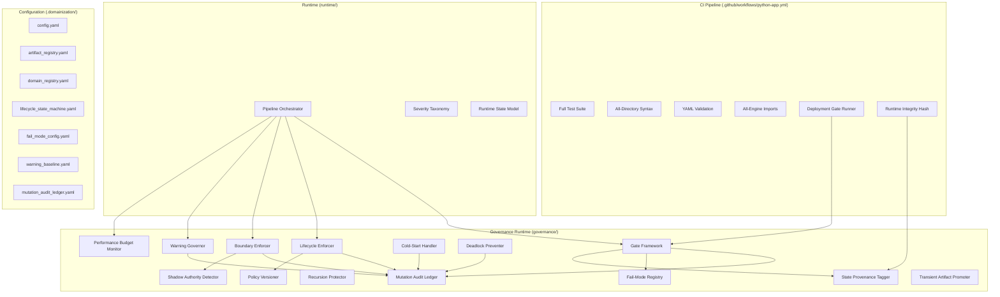
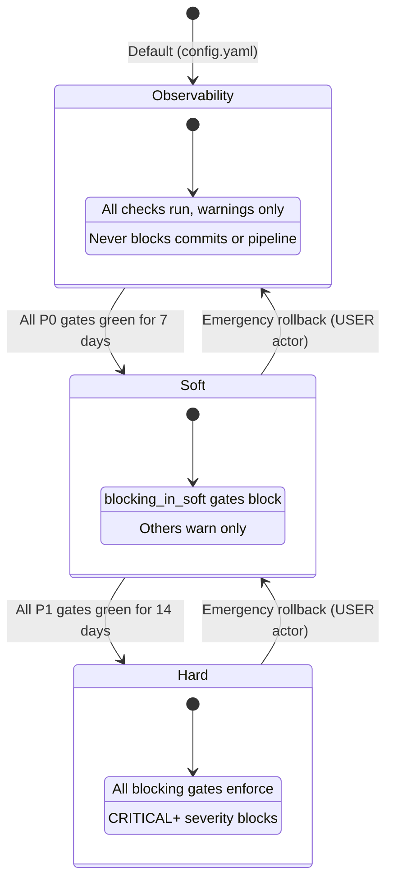

# Design Document: Governance Runtime Enforcement

## Overview

This design transitions the Portfolio OS governance system from Level 1 (Observability Only) to Level 2+ (Auditable/Enforceable). The current system detects 15+ violation categories across 5 observers but cannot prevent any of them. CI validates ~10% of what the runtime depends on. This design introduces:

1. **CI Runtime Hardening** — Full test suite execution, all-directory syntax validation, YAML schema validation, and all-engine import checks in the GitHub Actions workflow
2. **Deployment Gate Framework** — Independently configurable gates with per-enforcement-mode blocking behavior, time budgets, and structured output
3. **Lifecycle Runtime Enforcement** — Pre-write validation of lifecycle transitions, read-only state protection, and regenerable state gates
4. **Mutation Audit Ledger** — Append-only structured log of all governance-relevant mutations with actor identity, policy versioning, and event persistence
5. **Boundary Enforcement Runtime** — Write-time `allowed_writers` enforcement, `cannot_own` constraint enforcement, canonical boundary runtime discovery, and cross-domain interaction detection
6. **Warning Governance** — Baseline suppression, new warning escalation, deduplication, trend tracking, and severity-to-enforcement-mode mapping
7. **Institutional Hardenings** — Fail-mode classification, recursion protection, cold-start mode, partial governance tolerance, actor identity model, policy versioning, deadlock prevention, runtime/CI consistency hashing, transient artifact promotion, performance budget, anti-ontology constraint, shadow authority detection, governance state provenance tagging, and bounded fail-soft degradation

The design respects HARDENING 10: no plugin architecture, event bus, generic runtime kernel, or framework escalation. All new modules are concrete, single-purpose Python modules with explicit imports.

## Architecture

### High-Level Component Topology



### Enforcement Mode Flow



### Module Placement Strategy

| New Module | Location | Rationale |
|-----------|----------|-----------|
| `governance/gate_framework.py` | `governance/` | Deployment gate execution and result formatting |
| `governance/lifecycle_enforcer.py` | `governance/` | Lifecycle state machine enforcement |
| `governance/boundary_enforcer.py` | `governance/` | Write-time boundary checks |
| `governance/warning_governor.py` | `governance/` | Warning baseline, dedup, escalation |
| `governance/mutation_audit_ledger.py` | `governance/` | Append-only ledger operations |
| `governance/fail_mode_registry.py` | `governance/` | Component fail-mode classification |
| `governance/recursion_protector.py` | `governance/` | Governance recursion depth guard |
| `governance/cold_start_handler.py` | `governance/` | Cold-start detection and bootstrap |
| `governance/policy_versioner.py` | `governance/` | Policy content hashing and tracking |
| `governance/deadlock_preventer.py` | `governance/` | Deadlock detection and emergency override |
| `governance/shadow_authority_detector.py` | `governance/` | Undeclared write path detection |
| `governance/state_provenance_tagger.py` | `governance/` | Governance state provenance tagging |
| `governance/transient_artifact_promoter.py` | `governance/` | Explicit promotion with audit |
| `governance/performance_budget_monitor.py` | `governance/` | Governance overhead tracking |
| `governance/actor_identity.py` | `governance/` | Typed actor model for audit entries |
| `governance/runtime_integrity_hash.py` | `governance/` | SHA-256 fingerprint computation |
| `governance/complexity_monitor.py` | `governance/` | Governance layer complexity budget (Req 43) |
| `governance/ledger_rotation.py` | `governance/` | Deterministic ledger archival rotation (Req 44) |
| `governance/baseline_decay.py` | `governance/` | Warning baseline expiration/revalidation (Req 45) |
| `governance/scoped_policy_versioner.py` | `governance/` | Domain-scoped policy version tracking (Req 46) |
| `governance/temporary_authority.py` | `governance/` | Time-bounded write permission grants (Req 47) |
| `governance/hash_canonicalizer.py` | `governance/` | Platform-independent content canonicalization (Req 48) |
| `governance/self_disable_guard.py` | `governance/` | Self-weakening prevention during execution (Req 49) |
| `.domainization/fail_mode_config.yaml` | `.domainization/` | Fail-mode classification per component |
| `.domainization/warning_baseline.yaml` | `.domainization/` | Known warning suppression list |
| `.domainization/mutation_audit_ledger.yaml` | `.domainization/` | Append-only audit ledger |


## Components and Interfaces

### 1. CI Pipeline Hardening (`.github/workflows/python-app.yml`)

The CI workflow is extended with additional steps. No new Python modules are needed — CI steps use `python -m compileall`, `python -m pytest`, and inline Python scripts.

**New CI Steps:**

| Step | Command | Gate Type | Time Budget |
|------|---------|-----------|-------------|
| Full test suite | `python -m pytest tests/ -v --tb=short` | Blocking | 60s |
| All-directory syntax | `python -m compileall {dir} -q` for each of `engines/`, `runtime/`, `governance/`, `.domainization/src/`, `tests/` | Blocking | 15s |
| YAML validation | Inline Python: load + validate required keys | Blocking | 10s |
| All-engine imports | `python -c "from engines import X"` for all 12 engines | Blocking | 15s |
| Runtime integrity hash | `python -c "from governance.runtime_integrity_hash import compute; ..."` | Informational | 5s |

**Interface:** CI steps produce exit codes (0 = pass, non-zero = fail). The runtime integrity hash step persists the hash as a CI artifact.

### 2. Gate Framework (`governance/gate_framework.py`)

Responsible for executing deployment gates, enforcing time budgets, and producing structured `GateResult` objects.

```python
@dataclass
class GateResult:
    gate_name: str
    status: str  # "pass" | "fail" | "timeout" | "skip"
    enforcement_action: str  # "block" | "warn" | "info"
    duration_ms: float
    details: list[str]
    timestamp: str  # ISO 8601
    governance_policy_version: str
    governance_state_provenance: str

@dataclass
class GateSummary:
    total_gates: int
    passed: int
    failed: int
    blocked: int
    timed_out: int
    total_duration_ms: float
    aggregate_state: str  # "healthy" | "partial" | "degraded" | "collapsed"
    git_sha: str
    branch: str
    runtime_integrity_hash: str
    governance_overhead_percent: float

class GateFramework:
    def __init__(self, config: dict, enforcement_mode: str): ...
    def execute_gate(self, gate_name: str, check_fn: Callable, time_budget_ms: int) -> GateResult: ...
    def execute_all_gates(self) -> GateSummary: ...
    def compute_aggregate_state(self, results: list[GateResult]) -> str: ...
```

**Design Decision:** Gates are concrete function calls, not a plugin registry. Each gate is a named function in the gate framework module. This satisfies HARDENING 10 (no plugin architecture).

### 3. Lifecycle Enforcer (`governance/lifecycle_enforcer.py`)

Pre-write validation of lifecycle transitions against the state machine YAML.

```python
class LifecycleEnforcer:
    def __init__(self, state_machine_path: str, enforcement_mode: str): ...
    def validate_transition(self, artifact_id: str, artifact_type: str, from_state: str, to_state: str) -> tuple[bool, str]: ...
    def is_read_only(self, artifact_type: str, current_state: str) -> bool: ...
    def is_regenerable(self, artifact_type: str, current_state: str) -> bool: ...
    def enforce_transition(self, artifact_id: str, artifact_type: str, from_state: str, to_state: str, actor: ActorIdentity) -> GateResult: ...
    def enforce_read_only(self, artifact_id: str, artifact_type: str, current_state: str, actor: ActorIdentity) -> GateResult: ...
    def enforce_regenerable(self, artifact_id: str, artifact_type: str, current_state: str, engine_id: str) -> GateResult: ...
```

**Interaction with Enforcement Mode:**
- `observability`: All transitions permitted, violations logged as warnings
- `soft`: Invalid transitions rejected with structured warning
- `hard`: Invalid transitions rejected with enforcement error

### 4. Boundary Enforcer (`governance/boundary_enforcer.py`)

Write-time enforcement of `allowed_writers` and `cannot_own` constraints.

```python
class BoundaryEnforcer:
    def __init__(self, artifact_registry_path: str, domain_registry_path: str, enforcement_mode: str): ...
    def check_write_permission(self, writing_domain: str, artifact_id: str) -> tuple[bool, str]: ...
    def check_cannot_own(self, domain_id: str, artifact_type: str) -> tuple[bool, str]: ...
    def enforce_write(self, writing_domain: str, artifact_id: str, actor: ActorIdentity) -> GateResult: ...
    def enforce_domain_assignment(self, domain_id: str, artifact_type: str, actor: ActorIdentity) -> GateResult: ...
    def detect_cross_domain_interaction(self, source_domain: str, target_domain: str, artifact_id: str, interaction_type: str) -> dict: ...
```

**Key Rule:** When `allowed_writers` contains `"ALL"`, writes from any domain are permitted.

### 5. Warning Governor (`governance/warning_governor.py`)

Warning baseline management, deduplication, escalation, and trend tracking.

```python
@dataclass
class GovernanceWarning:
    code: str
    artifact_id: str
    message: str
    severity: Severity
    source: str
    timestamp: str

class WarningGovernor:
    def __init__(self, baseline_path: str, enforcement_mode: str): ...
    def process_warnings(self, warnings: list[GovernanceWarning]) -> WarningReport: ...
    def deduplicate(self, warnings: list[GovernanceWarning]) -> list[tuple[GovernanceWarning, int]]: ...
    def classify_against_baseline(self, warning: GovernanceWarning) -> str: ...  # "known" | "new" | "stale"
    def detect_stale_baseline_entries(self, emitted_warnings: list[GovernanceWarning]) -> list[str]: ...
    def compute_trend(self, current_count: int, previous_count: int) -> dict: ...

@dataclass
class WarningReport:
    unique_warnings: int
    total_occurrences: int
    suppressed_count: int
    new_warnings: list[GovernanceWarning]
    stale_baseline_entries: list[str]
    trend_alert: str | None  # None if no alert, message if >20% increase
    overflow_count: int  # Warnings beyond the 50-unique cap
```

### 6. Mutation Audit Ledger (`governance/mutation_audit_ledger.py`)

Append-only structured log for all governance-relevant mutations.

```python
@dataclass
class LedgerEntry:
    entry_id: str  # UUID
    event_type: str  # "registry_add" | "registry_modify" | "registry_remove" | "lifecycle_transition" | "enforcement_mode_change" | "policy_reload" | "gate_result" | "sunset_transition" | "emergency_override" | "cold_start" | "degradation_start" | "degradation_recovery"
    timestamp: str  # ISO 8601
    actor: ActorIdentity
    governance_policy_version: str
    severity: str
    details: dict  # Event-specific structured data

class MutationAuditLedger:
    def __init__(self, ledger_path: str): ...
    def append(self, entry: LedgerEntry) -> None: ...
    def query_by_time_range(self, start: str, end: str) -> list[LedgerEntry]: ...
    def query_by_event_type(self, event_type: str) -> list[LedgerEntry]: ...
    def recover_from_corruption(self) -> None: ...
    def is_cold_start(self) -> bool: ...
```

**Persistence Format:** YAML list of entries in `.domainization/mutation_audit_ledger.yaml`. Append-only — entries are never modified or deleted.

### 7. Actor Identity (`governance/actor_identity.py`)

Typed actor model for audit trail attribution.

```python
class ActorType(StrEnum):
    SYSTEM = "SYSTEM"
    CI = "CI"
    USER = "USER"
    ENGINE = "ENGINE"
    MIGRATION = "MIGRATION"
    RUNTIME = "RUNTIME"
    HOT_RELOAD = "HOT_RELOAD"

@dataclass
class ActorIdentity:
    actor_type: ActorType
    actor_id: str
    context: dict = field(default_factory=dict)
    is_fallback: bool = False  # True when identity could not be resolved

    @classmethod
    def from_environment(cls) -> "ActorIdentity": ...
    @classmethod
    def ci_actor(cls, workflow_run_id: str) -> "ActorIdentity": ...
    @classmethod
    def engine_actor(cls, engine_id: str) -> "ActorIdentity": ...
```

### 8. Fail-Mode Registry (`governance/fail_mode_registry.py`)

Persisted classification of each governance component's failure behavior.

```python
class FailMode(StrEnum):
    FAIL_OPEN = "fail_open"
    FAIL_SOFT = "fail_soft"
    FAIL_CLOSED = "fail_closed"

class FailModeRegistry:
    def __init__(self, config_path: str): ...
    def get_fail_mode(self, component_name: str) -> FailMode: ...
    def get_all_classifications(self) -> dict[str, FailMode]: ...
```

**Default Classifications (from `.domainization/fail_mode_config.yaml`):**

| Component | Fail Mode | Rationale |
|-----------|-----------|-----------|
| Mutation Audit Ledger | `fail_soft` | Pipeline continues, degradation logged |
| YAML Config Parser | `fail_closed` (soft/hard) / `fail_soft` (observability) | Cannot enforce without governance truth |
| Boundary Enforcer | `fail_soft` | Pipeline continues, checks skipped |
| Warning Governor | `fail_open` | Pipeline continues without warning processing |
| Lifecycle Enforcer | `fail_closed` (hard) / `fail_soft` (soft/observability) | Lifecycle paradox handling |
| Gate Framework | `fail_soft` | Individual gate failures don't collapse system |
| Policy Versioner | `fail_soft` | Version unknown but pipeline continues |

### 9. Recursion Protector (`governance/recursion_protector.py`)

Prevents governance from infinitely governing its own artifacts.

```python
class RecursionProtector:
    GOVERNANCE_META_ARTIFACTS: frozenset[str]  # Ledger, baselines, gate results
    MAX_RECURSION_DEPTH: int = 1

    def is_governance_meta(self, artifact_id: str) -> bool: ...
    def should_apply_governance(self, artifact_id: str, operation: str) -> bool: ...
    def check_recursion_depth(self, current_depth: int) -> bool: ...
```

**Rule:** Governance-internal artifacts (ledger entries, gate results, warning baselines) are subject to integrity validation but NOT to lifecycle enforcement, mutation auditing, or boundary enforcement.

### 10. Cold-Start Handler (`governance/cold_start_handler.py`)

Detects and manages first-run scenarios.

```python
class ColdStartHandler:
    def __init__(self, ledger_path: str, baseline_path: str, gate_history_path: str): ...
    def is_cold_start(self) -> bool: ...
    def initialize(self, actor: ActorIdentity) -> None: ...
    def check_stuck_cold_start(self, consecutive_runs: int) -> bool: ...
    def get_cold_start_event(self) -> LedgerEntry | None: ...
```

**Cold-start precedence:** When cold-start mode is detected, it forces `observability` behavior regardless of configured enforcement mode or component fail-mode classification.

### 11. Policy Versioner (`governance/policy_versioner.py`)

Content-hash-based governance policy version tracking.

```python
class PolicyVersioner:
    GOVERNANCE_FILES: list[str] = [
        ".domainization/config.yaml",
        ".domainization/lifecycle_state_machine.yaml",
        ".domainization/domain_registry.yaml",
        "governance/confidence_policy.yaml",
    ]

    def compute_version(self) -> str: ...  # SHA-256 of combined sorted file contents
    def detect_change(self, previous_version: str) -> bool: ...
    def get_current_version(self) -> str: ...
```

### 12. Deadlock Preventer (`governance/deadlock_preventer.py`)

Detects enforcement deadlocks and provides emergency override mechanism.

```python
class DeadlockPreventer:
    def detect_deadlock(self, rejected_artifact_id: str, violation_source_artifact_id: str) -> bool: ...
    def emergency_override(self, artifact_id: str, violation: str, justification: str, actor: ActorIdentity) -> LedgerEntry: ...
    def check_override_frequency(self, window_days: int = 7) -> int: ...
```

**Constraint:** Only `USER` and `MIGRATION` actors may invoke emergency overrides.

### 13. Shadow Authority Detector (`governance/shadow_authority_detector.py`)

Detects undeclared write paths at runtime.

```python
class ShadowAuthorityDetector:
    def __init__(self, artifact_registry_path: str): ...
    def check_write_authority(self, writing_module: str, target_artifact_id: str) -> bool: ...
    def record_shadow_event(self, writing_module: str, target_artifact_id: str, declared_writers: list[str]) -> dict: ...
    def check_threshold(self, events_this_run: list[dict]) -> bool: ...  # True if >5 unique paths
```

### 14. State Provenance Tagger (`governance/state_provenance_tagger.py`)

Tags governance state with provenance indicators.

```python
class GovernanceProvenance(StrEnum):
    AUTHORITATIVE = "authoritative"
    CACHED = "cached"
    FALLBACK_DERIVED = "fallback_derived"
    BOOTSTRAP_DERIVED = "bootstrap_derived"
    PARTIALLY_DEGRADED = "partially_degraded"
    INDETERMINATE = "indeterminate"

class StateProvenanceTagger:
    def __init__(self): ...
    def tag(self, source: str, is_validated: bool, is_cached: bool, is_cold_start: bool) -> GovernanceProvenance: ...
    def get_current_provenance(self) -> GovernanceProvenance: ...
```

### 15. Performance Budget Monitor (`governance/performance_budget_monitor.py`)

Tracks governance overhead relative to pipeline execution time.

```python
class PerformanceBudgetMonitor:
    BUDGET_PERCENT: float = 15.0  # Max 15% of pipeline time

    def __init__(self): ...
    def start_pipeline_timer(self) -> None: ...
    def start_governance_timer(self) -> None: ...
    def stop_governance_timer(self) -> None: ...
    def is_over_budget(self) -> bool: ...
    def get_overhead_percent(self) -> float: ...
    def get_priority_order(self) -> list[str]: ...  # fail_closed > fail_soft > fail_open > informational
```

### 16. Runtime Integrity Hash (`governance/runtime_integrity_hash.py`)

Deterministic SHA-256 fingerprint of governance and runtime files.

```python
class RuntimeIntegrityHash:
    TARGET_PATHS: list[str] = [
        ".domainization/config.yaml",
        ".domainization/lifecycle_state_machine.yaml",
        ".domainization/domain_registry.yaml",
        "governance/confidence_policy.yaml",
        "runtime/",  # All .py files
        "governance/",  # All .py files
    ]

    def compute(self) -> str: ...  # SHA-256 over deterministically sorted file contents
    def verify_against(self, expected_hash: str) -> tuple[bool, str]: ...
```

### 17. Transient Artifact Promoter (`governance/transient_artifact_promoter.py`)

Explicit promotion of transient artifacts to canonical status.

```python
class TransientArtifactPromoter:
    def __init__(self, enforcement_mode: str, ledger: MutationAuditLedger): ...
    def detect_boundary_crossing(self, artifact_name: str, is_persisted: bool, is_passed_downstream: bool) -> bool: ...
    def promote_to_canonical(self, artifact_name: str, reason: str, actor: ActorIdentity) -> bool: ...
    def validate_canonical_requirements(self, artifact_name: str) -> tuple[bool, list[str]]: ...
```

### 18. Governance Complexity Monitor (`governance/complexity_monitor.py`)

Tracks governance layer growth and enforces complexity budget thresholds.

```python
@dataclass
class ComplexityMetrics:
    total_governance_modules: int
    total_config_files: int
    total_state_categories: int  # artifact_types + severity_levels + integrity_dimensions + enforcement_modes + actor_types + provenance_states + fail_modes
    total_enforcement_paths: int
    budget_exceeded: bool
    exceeded_dimensions: list[str]

class GovernanceComplexityMonitor:
    BUDGET = {
        "max_governance_modules": 25,
        "max_config_files": 10,
        "max_state_categories": 60,
        "max_enforcement_paths": 15,
    }

    def __init__(self, config_path: str = ".domainization/config.yaml"): ...
    def compute_metrics(self) -> ComplexityMetrics: ...
    def is_over_budget(self) -> bool: ...
    def check_addition(self, category: str) -> tuple[bool, str]: ...  # Can we add one more?
```

**Validates: Requirement 43**

### 19. Ledger Rotation Manager (`governance/ledger_rotation.py`)

Deterministic archival rotation for the Mutation Audit Ledger.

```python
class LedgerRotationManager:
    MAX_ENTRIES: int = 1000
    MAX_FILE_SIZE_KB: int = 500

    def __init__(self, ledger_dir: str = ".domainization/"): ...
    def needs_rotation(self) -> bool: ...
    def rotate(self) -> str: ...  # Returns path to archived file
    def list_archived_ledgers(self) -> list[str]: ...  # Chronological order
    def query_across_all(self, event_type: str | None = None, start: str | None = None, end: str | None = None) -> list[dict]: ...
    def compute_chain_hash(self) -> str: ...  # Hash continuity verification
```

**Storage layout:**
```
.domainization/
├── mutation_audit_ledger.yaml              # Active ledger
├── mutation_audit_ledger_2026-06-01.yaml   # Archived (first entry = previous file hash)
├── mutation_audit_ledger_2026-05-15.yaml   # Archived
└── ...
```

**Validates: Requirement 44**

### 20. Warning Baseline Decay Manager (`governance/baseline_decay.py`)

Enforces periodic revalidation of warning baseline entries.

```python
@dataclass
class BaselineEntry:
    code: str
    artifact_id: str
    reason: str
    added_date: str  # ISO 8601
    expires_after_days: int  # Default 90
    revalidation_reason: str | None = None

class BaselineDecayManager:
    DEFAULT_EXPIRY_DAYS: int = 90
    CRITICAL_THRESHOLD_PERCENT: float = 30.0

    def __init__(self, baseline_path: str, reference_date: date | None = None): ...
    def get_expired_entries(self) -> list[BaselineEntry]: ...
    def get_expiring_soon(self, within_days: int = 14) -> list[BaselineEntry]: ...
    def revalidate(self, code: str, artifact_id: str, reason: str) -> None: ...
    def compute_health(self) -> dict: ...  # total, expired, expiring_soon, avg_age
    def is_maintenance_overdue(self) -> bool: ...  # >30% expired
```

**Validates: Requirement 45**

### 21. Scoped Policy Versioner (`governance/scoped_policy_versioner.py`)

Extends the Policy Versioner with domain-scoped version tracking.

```python
POLICY_DOMAINS = {
    "lifecycle": [".domainization/lifecycle_state_machine.yaml"],
    "boundary": [".domainization/domain_registry.yaml"],
    "severity": ["runtime/severity_taxonomy.py"],
    "warning": [".domainization/warning_baseline.yaml"],
    "gate": [".domainization/config.yaml", ".domainization/fail_mode_config.yaml"],
}

class ScopedPolicyVersioner:
    def __init__(self): ...
    def compute_scoped_version(self, domain: str) -> str: ...  # SHA-256 of domain files
    def compute_global_version(self) -> str: ...  # SHA-256 of all scoped versions combined
    def detect_scoped_changes(self, previous_versions: dict[str, str]) -> list[str]: ...  # Changed domains
    def get_all_versions(self) -> dict[str, str]: ...  # domain → hash
```

**Validates: Requirement 46**

### 22. Temporary Authority Manager (`governance/temporary_authority.py`)

Manages time-bounded write permission grants.

```python
@dataclass
class TemporaryAuthority:
    target_pattern: str  # Glob or exact artifact_id
    granted_domain: str
    expires_at: str  # ISO 8601
    reason: str
    declaring_actor: ActorIdentity
    created_at: str  # ISO 8601

class TemporaryAuthorityManager:
    MAX_DURATION_DAYS: int = 7

    def __init__(self, ledger: MutationAuditLedger): ...
    def declare(self, target_pattern: str, granted_domain: str, duration_hours: int, reason: str, actor: ActorIdentity) -> TemporaryAuthority: ...
    def is_authorized(self, artifact_id: str, writing_domain: str) -> bool: ...
    def get_active_declarations(self) -> list[TemporaryAuthority]: ...
    def expire_stale(self) -> list[TemporaryAuthority]: ...  # Returns expired declarations
    def revoke(self, target_pattern: str, actor: ActorIdentity) -> None: ...
```

**Validates: Requirement 47**

### 23. Hash Canonicalizer (`governance/hash_canonicalizer.py`)

Platform-independent content canonicalization for integrity hashing.

```python
class HashCanonicalizer:
    def canonicalize_python(self, content: bytes) -> bytes: ...
    def canonicalize_yaml(self, content: bytes) -> bytes: ...
    def canonicalize_file(self, file_path: str) -> bytes: ...  # Auto-detects type
    def compute_hash(self, file_paths: list[str]) -> str: ...  # SHA-256 over sorted canonicalized content

    @staticmethod
    def normalize_line_endings(content: bytes) -> bytes: ...  # CRLF/CR → LF
    @staticmethod
    def normalize_encoding(content: bytes) -> bytes: ...  # → UTF-8
    @staticmethod
    def strip_trailing_whitespace(content: bytes) -> bytes: ...
    @staticmethod
    def ensure_final_newline(content: bytes) -> bytes: ...
```

**Canonicalization rules:**
- Line endings: normalize to LF (Unix)
- Encoding: normalize to UTF-8
- Trailing whitespace: strip from each line
- Final newline: ensure exactly one
- YAML files: parse → re-serialize with sorted keys before hashing
- Python files: hash canonicalized text directly

**Validates: Requirement 48**

### 24. Self-Disable Guard (`governance/self_disable_guard.py`)

Prevents governance components from weakening their own enforcement during execution.

```python
class SelfDisableGuard:
    def __init__(self): ...
    def lock_enforcement_state(self, fail_mode_config: dict, enforcement_mode: str) -> None: ...
    def attempt_modification(self, component_name: str, target_field: str, new_value: str) -> tuple[bool, str]: ...  # (allowed, reason)
    def detect_circular_weakening(self, modification_chain: list[tuple[str, str]]) -> bool: ...
    def is_locked(self) -> bool: ...
```

**Invariant:** Once `lock_enforcement_state()` is called at pipeline start, no governance component may modify fail-mode classifications, enforcement mode, or blocking behavior until the pipeline completes.

**Validates: Requirement 49**


## Data Models

### GateResult (Serialized to JSON/YAML)

```yaml
gate_name: "lifecycle_transition_check"
status: "fail"  # pass | fail | timeout | skip
enforcement_action: "block"  # block | warn | info
duration_ms: 42.3
details:
  - "Artifact 'daily_report' attempted transition from 'archived' to 'current' which is not in allowed transitions"
timestamp: "2026-06-01T10:30:00Z"
governance_policy_version: "sha256:a1b2c3d4..."
governance_state_provenance: "authoritative"
```

### LedgerEntry (Serialized to YAML)

```yaml
entry_id: "550e8400-e29b-41d4-a716-446655440000"
event_type: "lifecycle_transition"
timestamp: "2026-06-01T10:30:00Z"
actor:
  actor_type: "ENGINE"
  actor_id: "report_engine"
  context:
    pipeline_run_id: "run_20260601_103000"
  is_fallback: false
governance_policy_version: "sha256:a1b2c3d4..."
severity: "WARNING"
details:
  artifact_id: "daily_report"
  artifact_type: "REPORT_OUT"
  from_state: "archived"
  to_state: "current"
  valid: false
  valid_transitions_from_current_state: []
```

### ActorIdentity (Serialized to YAML)

```yaml
actor_type: "USER"
actor_id: "john.doe"
context:
  git_author: "John Doe <john@example.com>"
  commit_sha: "abc123"
is_fallback: false
```

### GovernanceWarning (Serialized to YAML)

```yaml
code: "W801"
artifact_id: "allocation_engine_py"
message: "Artifact not registered in artifact_registry.yaml"
severity: "WARNING"
source: "RegistrationValidator"
timestamp: "2026-06-01T10:30:00Z"
```

### WarningBaseline (`.domainization/warning_baseline.yaml`)

```yaml
schema_version: "1.0.0"
last_updated: "2026-06-01T10:30:00Z"
entries:
  - code: "W801"
    artifact_id: "legacy_briefing_txt"
    reason: "Known legacy artifact, pending sunset"
    added_date: "2026-05-28"
  - code: "W802"
    artifact_id: "engine_runner_py"
    reason: "Deprecated but retained for backward compatibility"
    added_date: "2026-05-28"
```

### FailModeConfig (`.domainization/fail_mode_config.yaml`)

```yaml
schema_version: "1.0.0"
components:
  mutation_audit_ledger:
    fail_mode: "fail_soft"
    rationale: "Pipeline continues, degradation logged, recovery on next successful write"
  yaml_config_parser:
    fail_mode_by_enforcement:
      observability: "fail_soft"
      soft: "fail_closed"
      hard: "fail_closed"
    rationale: "Cannot enforce without governance truth; observability uses cached state"
  boundary_enforcer:
    fail_mode: "fail_soft"
    rationale: "Pipeline continues with boundary checks skipped"
  warning_governor:
    fail_mode: "fail_open"
    rationale: "Pipeline continues without warning processing"
  lifecycle_enforcer:
    fail_mode_by_enforcement:
      observability: "fail_soft"
      soft: "fail_soft"
      hard: "fail_closed"
    rationale: "Lifecycle paradox in hard mode requires resolution before proceeding"
  gate_framework:
    fail_mode: "fail_soft"
    rationale: "Individual gate failures produce partial governance, not collapse"
  policy_versioner:
    fail_mode: "fail_soft"
    rationale: "Version unknown but pipeline continues with indeterminate provenance"
  shadow_authority_detector:
    fail_mode: "fail_open"
    rationale: "Detection failure does not compromise pipeline integrity"
```

### GateSummary (Persisted to Ledger)

```yaml
total_gates: 7
passed: 5
failed: 1
blocked: 1
timed_out: 0
total_duration_ms: 3420.5
aggregate_state: "partial"
git_sha: "abc123def456"
branch: "feature/governance-hardening"
runtime_integrity_hash: "sha256:e5f6g7h8..."
governance_overhead_percent: 8.3
timestamp: "2026-06-01T10:30:00Z"
```

### ColdStartEvent (LedgerEntry details)

```yaml
event_type: "cold_start"
details:
  initialization_timestamp: "2026-06-01T10:30:00Z"
  missing_components:
    - "mutation_audit_ledger"
    - "warning_baseline"
    - "gate_history"
  fallback_behavior:
    enforcement_mode_override: "observability"
    reason: "Cold-start mode active — no prior governance history"
```

### Governance Concept Budget (Anti-Ontology Tracking)

```yaml
artifact_types: 10  # From lifecycle_state_machine.yaml
severity_levels: 6  # From severity_taxonomy.py
integrity_dimensions: 5  # From runtime_state_model.py
enforcement_modes: 3  # observability, soft, hard
actor_types: 7  # SYSTEM, CI, USER, ENGINE, MIGRATION, RUNTIME, HOT_RELOAD
governance_provenance_states: 6  # authoritative, cached, fallback_derived, bootstrap_derived, partially_degraded, indeterminate
fail_modes: 3  # fail_open, fail_soft, fail_closed
total_concepts: 40  # Well under the 50 warning threshold
```


### 18. Governance Complexity Monitor (`governance/complexity_monitor.py`)

Tracks governance layer growth against defined budgets.

```python
@dataclass
class ComplexityMetrics:
    total_modules: int
    total_config_files: int
    total_state_categories: int
    total_enforcement_paths: int
    budget_exceeded: bool
    exceeded_dimensions: list[str]

class ComplexityMonitor:
    def __init__(self, config_path: str = ".domainization/config.yaml"): ...
    def compute_metrics(self) -> ComplexityMetrics: ...
    def check_budget(self) -> tuple[bool, list[str]]: ...  # (within_budget, exceeded_dimensions)
    def validate_addition(self, concept_type: str, justification: str) -> bool: ...
```

**Budgets (from config.yaml):** max_modules=25, max_config_files=10, max_state_categories=60, max_enforcement_paths=15.

### 19. Ledger Rotation Manager (extension of `governance/mutation_audit_ledger.py`)

Handles deterministic archival rotation of the ledger.

```python
class LedgerRotationManager:
    MAX_ENTRIES: int = 1000
    MAX_FILE_SIZE_KB: int = 500

    def __init__(self, ledger_dir: str = ".domainization/"): ...
    def should_rotate(self) -> bool: ...
    def rotate(self) -> str: ...  # Returns path to archived file
    def query_across_archives(self, start: str, end: str) -> list[LedgerEntry]: ...
    def get_archive_chain(self) -> list[str]: ...  # Ordered list of archived file paths
    def verify_chain_integrity(self) -> bool: ...  # Verify hash continuity
```

**Hash continuity:** Each archived file's SHA-256 is recorded as the first entry in the new active ledger, creating a verifiable chain.

### 20. Warning Baseline Decay Manager (extension of `governance/warning_governor.py`)

Handles baseline entry expiration and revalidation.

```python
class BaselineDecayManager:
    DEFAULT_EXPIRY_DAYS: int = 90

    def __init__(self, baseline_path: str): ...
    def check_expired_entries(self, reference_date: date) -> list[dict]: ...
    def revalidate_entry(self, code: str, artifact_id: str, reason: str) -> None: ...
    def get_baseline_health(self) -> dict: ...  # total, expired, expiring_soon, avg_age
    def compute_decay_percentage(self) -> float: ...  # % of entries expired
```

### 21. Scoped Policy Versioner (extension of `governance/policy_versioner.py`)

Computes per-domain policy version hashes.

```python
POLICY_DOMAINS: dict[str, list[str]] = {
    "lifecycle": [".domainization/lifecycle_state_machine.yaml"],
    "boundary": [".domainization/domain_registry.yaml"],
    "severity": ["runtime/severity_taxonomy.py"],
    "warning": [".domainization/warning_baseline.yaml"],
    "gate": [".domainization/config.yaml", ".domainization/fail_mode_config.yaml"],
}

class ScopedPolicyVersioner:
    def compute_scoped_version(self, domain: str) -> str: ...
    def compute_all_scoped_versions(self) -> dict[str, str]: ...
    def detect_scoped_change(self, previous_versions: dict[str, str]) -> list[str]: ...  # Changed domains
```

### 22. Temporary Authority Manager (`governance/temporary_authority.py`)

Manages time-bounded write permission grants.

```python
@dataclass
class TemporaryAuthority:
    target_pattern: str  # Glob or exact artifact_id
    granted_domain: str
    expires_at: str  # ISO 8601
    reason: str
    declaring_actor: ActorIdentity
    created_at: str  # ISO 8601

class TemporaryAuthorityManager:
    MAX_DURATION_DAYS: int = 7

    def __init__(self, storage_path: str = ".domainization/temporary_authorities.yaml"): ...
    def declare(self, authority: TemporaryAuthority) -> bool: ...
    def is_authorized(self, artifact_id: str, writing_domain: str) -> bool: ...
    def expire_stale(self) -> list[TemporaryAuthority]: ...
    def get_active_authorities(self) -> list[TemporaryAuthority]: ...
```

### 23. Hash Canonicalizer (extension of `governance/runtime_integrity_hash.py`)

Platform-independent content canonicalization before hashing.

```python
class HashCanonicalizer:
    def canonicalize_python(self, content: bytes) -> bytes: ...  # LF, UTF-8, strip trailing ws
    def canonicalize_yaml(self, content: bytes) -> bytes: ...  # Parse + re-serialize sorted
    def canonicalize_file(self, file_path: str) -> bytes: ...  # Auto-detect by extension
    def compute_canonical_hash(self, file_paths: list[str]) -> str: ...  # SHA-256 over sorted canonical content
```

**Rules:** LF line endings, UTF-8 encoding, stripped trailing whitespace, single trailing newline. YAML files are parsed and re-serialized with sorted keys before hashing.

### 24. Self-Disable Protector (`governance/self_disable_protector.py`)

Prevents governance components from weakening their own enforcement during execution.

```python
class SelfDisableProtector:
    def __init__(self): ...
    def lock_enforcement_state(self) -> None: ...  # Called at pipeline start
    def check_modification_attempt(self, component: str, target_field: str, new_value: str) -> bool: ...
    def detect_circular_weakening(self, modification_chain: list[tuple[str, str]]) -> bool: ...
    def is_locked(self) -> bool: ...
```

**Invariant:** Once `lock_enforcement_state()` is called at pipeline initialization, no governance component may modify fail-mode classifications, enforcement mode, or blocking behavior until the pipeline completes.


## Correctness Properties

*A property is a characteristic or behavior that should hold true across all valid executions of a system — essentially, a formal statement about what the system should do. Properties serve as the bridge between human-readable specifications and machine-verifiable correctness guarantees.*

### Property 1: GateResult Round-Trip Serialization

*For any* valid `GateResult` object (with arbitrary gate_name, status, enforcement_action, duration_ms, details, timestamp, governance_policy_version, and governance_state_provenance), serializing to JSON and deserializing back SHALL produce an object equal to the original.

**Validates: Requirements 5.6, 26.4**

### Property 2: LedgerEntry Round-Trip Serialization

*For any* valid `LedgerEntry` object (with arbitrary entry_id, event_type, timestamp, actor, governance_policy_version, severity, and details dict), serializing to YAML and deserializing back SHALL produce an object equal to the original.

**Validates: Requirements 11.4, 12.5, 13.3**

### Property 3: ActorIdentity Round-Trip Serialization

*For any* valid `ActorIdentity` object (with arbitrary actor_type from the 7 defined types, actor_id string, context dict, and is_fallback boolean), serializing to a structured format and deserializing back SHALL produce an object equal to the original.

**Validates: Requirements 33.6**

### Property 4: Enforcement Mode Round-Trip

*For any* valid Enforcement_Mode string value (`"observability"`, `"soft"`, or `"hard"`), parsing then serializing the mode SHALL produce the original string value.

**Validates: Requirements 7.6**

### Property 5: Observability Mode Never Blocks

*For any* governance event at any severity level, and *for any* gate result with any status, WHILE Enforcement_Mode is `observability`, the enforcement_action SHALL never be `"block"`.

**Validates: Requirements 5.2, 7.5, 24.4, 25.8**

### Property 6: Enforcement Mode Gate Blocking Correctness

*For any* Deployment_Gate configuration and *for any* Enforcement_Mode value, the enforcement_action produced SHALL match the following rules: in `observability` mode, action is always `"warn"` or `"info"`; in `soft` mode, action is `"block"` only if the gate is configured as `blocking_in_soft`; in `hard` mode, action is `"block"` if the gate is configured as `blocking_in_soft` OR `blocking_in_hard`.

**Validates: Requirements 5.1, 5.3, 5.4**

### Property 7: Lifecycle Transition Validation Correctness

*For any* artifact type defined in the Lifecycle_State_Machine and *for any* (from_state, to_state) pair, the lifecycle enforcer SHALL accept the transition if and only if the pair appears in the `transitions` array for that artifact type. Invalid transitions SHALL be rejected in `soft` and `hard` modes, and warned-but-permitted in `observability` mode.

**Validates: Requirements 8.1, 8.2, 8.3, 8.4, 8.5**

### Property 8: Read-Only State Protection

*For any* artifact in a state listed in its type's `read_only_states` array, content modification attempts SHALL be rejected in `soft` and `hard` enforcement modes, warned-but-permitted in `observability` mode, and metadata-only changes SHALL always be permitted regardless of enforcement mode.

**Validates: Requirements 9.1, 9.2, 9.3, 9.4**

### Property 9: Regenerable State Gate

*For any* artifact and *for any* engine overwrite attempt, the overwrite SHALL be permitted if and only if the artifact's current state is in its type's `regenerable_states` array (in `soft`/`hard` modes). In `observability` mode, overwrites are always permitted with a warning for non-regenerable states.

**Validates: Requirements 10.1, 10.2, 10.3, 10.4**


### Property 10: Boundary Enforcement Correctness

*For any* (writing_domain, artifact_id) pair where the artifact has a defined `allowed_writers` list, the boundary enforcer SHALL permit the write if and only if the writing_domain is in `allowed_writers` OR `allowed_writers` contains `"ALL"`. In `soft`/`hard` modes, unauthorized writes SHALL be rejected; in `observability` mode, they SHALL be warned-but-permitted.

**Validates: Requirements 16.1, 16.2, 16.3, 16.4, 16.5**

### Property 11: Cannot-Own Constraint Consistency

*For any* domain in the Domain_Registry, no artifact type SHALL appear in both the domain's `cannot_own` list and its `allowed_artifact_types` list simultaneously. The boundary enforcer SHALL reject domain assignments where the artifact type is in the target domain's `cannot_own` list (in `soft`/`hard` modes).

**Validates: Requirements 17.1, 17.2, 17.3, 17.4**

### Property 12: Warning Deduplication Correctness

*For any* list of governance warnings, deduplication SHALL produce a result where: (a) each unique (code, artifact_id) combination appears exactly once, (b) the occurrence count for each unique warning equals the number of times it appeared in the input, (c) the sum of all occurrence counts equals the total input count, and (d) the output is capped at 50 unique warnings with overflow correctly reported.

**Validates: Requirements 22.1, 22.2, 22.3, 22.4**

### Property 13: Warning Baseline Suppression Idempotence

*For any* set of warnings and *for any* Warning_Baseline, applying the baseline suppression twice SHALL produce the same result as applying it once (idempotence). Additionally, a warning SHALL be suppressed if and only if it matches a baseline entry by (code, artifact_id).

**Validates: Requirements 20.2, 20.3, 28.8**

### Property 14: Warning Trend Alert Threshold

*For any* pair of consecutive warning counts (previous, current), a trend alert SHALL be emitted if and only if the current count exceeds the previous count by more than 20%.

**Validates: Requirements 23.3, 23.4**

### Property 15: Severity Ordering Preservation

*For any* two severity levels A and B from the Severity_Taxonomy, the strict ordering INFO < WARNING < DEGRADED < CRITICAL < CANONICAL_BREAK < DETERMINISTIC_FAILURE SHALL be preserved. Enforcement decisions SHALL respect this ordering: in `hard` mode, events with `blocks_pipeline_hard_mode=True` block; in `soft` mode, CRITICAL and above block.

**Validates: Requirements 24.1, 24.2, 24.3, 24.5, 25.4**

### Property 16: Governance Recursion Depth Bound

*For any* governance operation targeting a governance-meta artifact (ledger entries, gate results, warning baselines), the governance system SHALL NOT trigger more than one level of nested governance evaluation. Governance-meta artifacts are exempt from lifecycle enforcement, mutation auditing, and boundary enforcement.

**Validates: Requirements 30.1, 30.2, 30.3, 30.4, 30.5, 30.6**

### Property 17: Aggregate Governance State Determinism

*For any* set of individual gate outcomes (each being pass, fail, timeout, or skip), the aggregate governance state SHALL be deterministically computable: `healthy` when all gates pass; `partial` when >50% pass but at least one fails/timeouts; `degraded` when 50% or fewer pass; `collapsed` when zero gates pass. A single gate timeout SHALL never produce `collapsed` if other gates pass.

**Validates: Requirements 32.1, 32.2, 32.4, 32.6**

### Property 18: Policy Version Determinism

*For any* identical set of governance configuration file contents, computing the `governance_policy_version` hash SHALL always produce the same result. For any change to any governance file content, the hash SHALL change.

**Validates: Requirements 34.1, 34.5, 34.6**

### Property 19: Runtime Integrity Hash Determinism

*For any* identical file system state (same governance YAML files, runtime Python modules, governance Python modules), computing the `runtime_integrity_hash` SHALL always produce the same SHA-256 result.

**Validates: Requirements 36.1, 36.5, 36.6**

### Property 20: Deadlock Detection Correctness

*For any* enforcement rejection where the rejected artifact_id matches the violation source artifact_id, the deadlock preventer SHALL detect a deadlock condition. Emergency overrides SHALL only be permitted for actors of type `USER` or `MIGRATION`.

**Validates: Requirements 35.1, 35.4**

### Property 21: Ledger Append-Only Chronological Ordering

*For any* sequence of ledger append operations, the resulting ledger SHALL preserve chronological ordering: for any two entries where entry A was appended before entry B, entry A SHALL appear before entry B in query results.

**Validates: Requirements 13.2**

### Property 22: Cold-Start Forces Observability

*For any* configured Enforcement_Mode (including `soft` and `hard`), WHEN cold-start conditions are detected (no ledger AND no baseline AND no gate history), the effective enforcement behavior SHALL be `observability` regardless of configuration.

**Validates: Requirements 31.7**

### Property 23: Bounded Fail-Soft Degradation Escalation

*For any* governance component in `fail_soft` mode, IF the component remains degraded for more than 5 consecutive pipeline executions, a CRITICAL severity event SHALL be emitted. IF degraded for more than 10 consecutive executions, a `GOVERNANCE_DEGRADATION_PERSISTENT` event SHALL be emitted.

**Validates: Requirements 42.2, 42.3**

### Property 24: Shadow Authority Detection Threshold

*For any* pipeline execution, WHEN more than 5 unique shadow authority paths are detected (writes from modules not in `allowed_writers`), a CRITICAL severity event SHALL be emitted. In `hard` mode, shadow writes from unregistered modules SHALL be blocked.

**Validates: Requirements 40.1, 40.3, 40.5**

### Property 25: Governance Overhead Budget Enforcement

*For any* pipeline execution, the governance overhead percentage SHALL equal (total_governance_time / total_pipeline_time) * 100. WHEN this exceeds 15%, non-critical governance checks SHALL be skipped in priority order (fail_open first, then informational).

**Validates: Requirements 38.1, 38.3, 38.4**

### Property 26: Governance Complexity Budget Enforcement

*For any* governance system state, the complexity metrics (modules, config files, state categories, enforcement paths) SHALL be computable and comparable against budget thresholds. WHEN any threshold is exceeded, additions SHALL be rejected without a recorded justification.

**Validates: Requirements 43.1, 43.2, 43.4**

### Property 27: Ledger Rotation Hash Continuity

*For any* ledger rotation event, the first entry in the new active ledger SHALL contain the SHA-256 hash of the archived file's content. Querying across rotation boundaries SHALL return entries in chronological order indistinguishable from a single-file query.

**Validates: Requirements 44.3, 44.4, 44.5**

### Property 28: Baseline Entry Expiration Determinism

*For any* baseline entry with `added_date` and `expires_after_days`, the entry SHALL be classified as expired if and only if `reference_date - added_date > expires_after_days`. Revalidation SHALL reset the `added_date` to the revalidation date.

**Validates: Requirements 45.1, 45.2, 45.3**

### Property 29: Scoped Policy Version Independence

*For any* change to a single governance configuration file, only the scoped policy version(s) that include that file SHALL change. The global version SHALL change (it's a hash of all scoped versions), but other scoped versions SHALL remain identical.

**Validates: Requirements 46.1, 46.4, 46.5**

### Property 30: Temporary Authority Bounded Duration

*For any* temporary authority declaration, the duration SHALL NOT exceed 7 days. Declarations exceeding this limit SHALL be rejected. Expired declarations SHALL NOT authorize writes.

**Validates: Requirements 47.3, 47.4**

### Property 31: Hash Canonicalization Platform Independence

*For any* file content that differs only in line endings (CRLF vs LF), trailing whitespace, or BOM presence, the canonicalized hash SHALL be identical. For YAML files with different key ordering but identical data, the canonicalized hash SHALL be identical.

**Validates: Requirements 48.1, 48.2, 48.4**

### Property 32: Self-Disable Guard Immutability

*For any* governance component, once `lock_enforcement_state()` is called, all subsequent `attempt_modification()` calls targeting fail-mode, enforcement mode, or blocking behavior SHALL return `(False, reason)`. The lock SHALL persist for the duration of the pipeline execution.

**Validates: Requirements 49.1, 49.2, 49.4**

## Error Handling

### Fail-Mode Hierarchy

The governance system uses a three-tier failure model. Each component has a pre-classified fail-mode that determines behavior when the component cannot operate normally:

| Fail Mode | Behavior | Pipeline Impact | Audit |
|-----------|----------|-----------------|-------|
| `fail_open` | Skip governance, continue | None | Alert to stdout |
| `fail_soft` | Log degradation, continue | Degraded governance | Ledger entry + DEGRADED event |
| `fail_closed` | Block until resolved | Pipeline halted | Ledger entry + CRITICAL event |

### Error Scenarios and Responses

| Scenario | Component | Fail Mode | Response |
|----------|-----------|-----------|----------|
| Ledger file corrupt | Mutation Audit Ledger | `fail_soft` | Create new ledger, log corruption, continue |
| YAML parse failure (hard mode) | Config Parser | `fail_closed` | Block pipeline, require fix |
| YAML parse failure (observability) | Config Parser | `fail_soft` | Use cached state or skip governance |
| Boundary enforcer unavailable | Boundary Enforcer | `fail_soft` | Skip boundary checks, emit DEGRADED |
| Warning governor unavailable | Warning Governor | `fail_open` | Skip warning processing, alert stdout |
| Lifecycle paradox (hard mode) | Lifecycle Enforcer | `fail_closed` | Block until state resolved |
| Gate timeout | Gate Framework | Per-gate `fail_soft` | Report timeout, continue with other gates |
| Cold-start (no history) | Cold-Start Handler | Override to observability | Force observability, bootstrap |
| Recursion detected | Recursion Protector | Terminate chain | Log recursion, skip nested governance |
| Deadlock detected | Deadlock Preventer | Offer override | Log deadlock, await USER/MIGRATION override |
| Performance budget exceeded | Budget Monitor | Skip non-critical | Emit DEGRADED, skip fail_open checks |

### Bounded Degradation

Fail-soft degradation is time-bounded:
- After 5 consecutive degraded runs: escalate to CRITICAL severity
- After 10 consecutive degraded runs: emit GOVERNANCE_DEGRADATION_PERSISTENT event
- Recovery: log recovery event with total degradation duration

### Cold-Start Precedence

Cold-start mode takes precedence over all other fail-mode classifications:
- Forces observability behavior regardless of config
- Bounded: must transition to normal after first successful run
- Stuck detection: CRITICAL alert after 3 consecutive failed bootstraps

### Emergency Override

When enforcement deadlock is detected:
- Only USER and MIGRATION actors may invoke override
- Override is logged with CRITICAL severity and EMERGENCY_OVERRIDE flag
- Frequency tracking: alert if more than 3 overrides in 7-day window
- Automated actors (ENGINE, RUNTIME, HOT_RELOAD) cannot override

## Meta-Governance Hardenings

These hardenings protect the governance system from becoming an uncontrollable meta-system. They are architectural constraints on the governance layer itself.

### 18. Governance Complexity Budget Monitor (Extension of `governance/performance_budget_monitor.py`)

Tracks governance layer growth and enforces hard limits.

```python
@dataclass
class GovernanceComplexityMetrics:
    total_modules: int          # Max 25
    total_config_files: int     # Max 10
    total_state_categories: int # Max 60 (artifact types + severity + dimensions + modes + actors + provenance)
    total_enforcement_paths: int # Max 15
    budget_exceeded: bool

class GovernanceComplexityBudget:
    def __init__(self, config_path: str = ".domainization/config.yaml"): ...
    def compute_metrics(self) -> GovernanceComplexityMetrics: ...
    def is_over_budget(self) -> bool: ...
    def check_addition(self, category: str, count: int) -> tuple[bool, str]: ...
```

**Config location:** `.domainization/config.yaml` → `governance_complexity_budget` section.

**Validates: Requirement 43**

---

### 19. Ledger Rotation (`governance/mutation_audit_ledger.py` extension)

Extends the existing `MutationAuditLedger` class with rotation support.

```python
class MutationAuditLedger:
    # ... existing methods ...

    ROTATION_ENTRY_THRESHOLD: int = 1000
    ROTATION_SIZE_THRESHOLD_KB: int = 500

    def check_rotation_needed(self) -> bool: ...
    def rotate(self) -> str: ...  # Returns archived file path
    def query_across_archives(self, start: str, end: str) -> list[LedgerEntry]: ...
    def get_archive_chain(self) -> list[str]: ...  # Ordered list of archived file paths
    def verify_chain_integrity(self) -> bool: ...  # Verify hash continuity across archives
```

**Archive naming:** `.domainization/mutation_audit_ledger_<ISO-date>.yaml`
**Chain link:** First entry of new active ledger contains `previous_archive_hash` field.

**Validates: Requirement 44**

---

### 20. Warning Baseline Decay (`governance/warning_governor.py` extension)

Extends the existing `WarningGovernor` class with baseline expiration logic.

```python
@dataclass
class BaselineEntry:
    code: str
    artifact_id: str
    reason: str
    added_date: str          # ISO 8601
    expires_after_days: int  # Default 90
    revalidation_reason: str | None = None

class WarningGovernor:
    # ... existing methods ...

    def check_baseline_expiration(self) -> list[BaselineEntry]: ...  # Returns expired entries
    def revalidate_entry(self, code: str, artifact_id: str, reason: str) -> None: ...
    def get_baseline_health(self) -> dict: ...  # total, expired, expiring_soon, avg_age
```

**Validates: Requirement 45**

---

### 21. Scoped Policy Versioner (`governance/policy_versioner.py` extension)

Extends the existing `PolicyVersioner` class with domain-scoped versions.

```python
class PolicyVersioner:
    # ... existing methods ...

    SCOPED_DOMAINS: dict[str, list[str]] = {
        "lifecycle_policy_version": [".domainization/lifecycle_state_machine.yaml"],
        "boundary_policy_version": [".domainization/domain_registry.yaml", ".domainization/artifact_registry.yaml"],
        "severity_policy_version": ["runtime/severity_taxonomy.py"],
        "warning_policy_version": [".domainization/warning_baseline.yaml"],
        "gate_policy_version": [".domainization/config.yaml", ".domainization/fail_mode_config.yaml"],
    }

    def compute_scoped_version(self, domain: str) -> str: ...
    def compute_all_scoped_versions(self) -> dict[str, str]: ...
    def detect_scoped_change(self, previous_versions: dict[str, str]) -> list[str]: ...  # Changed domains
```

**Validates: Requirement 46**

---

### 22. Temporary Authority Registry (`governance/shadow_authority_detector.py` extension)

Extends the existing `ShadowAuthorityDetector` with temporary authority support.

```python
@dataclass
class TemporaryAuthority:
    target_pattern: str       # Glob or exact artifact_id
    granted_domain: str
    expires_at: str           # ISO 8601 timestamp
    reason: str
    declaring_actor: ActorIdentity
    created_at: str           # ISO 8601 timestamp

class ShadowAuthorityDetector:
    # ... existing methods ...

    MAX_TEMPORARY_DURATION_DAYS: int = 7

    def declare_temporary_authority(self, authority: TemporaryAuthority) -> bool: ...
    def revoke_temporary_authority(self, target_pattern: str, granted_domain: str) -> bool: ...
    def is_temporarily_authorized(self, writing_domain: str, artifact_id: str) -> bool: ...
    def expire_stale_authorities(self) -> list[TemporaryAuthority]: ...
```

**Storage:** `.domainization/temporary_authorities.yaml` (auto-cleaned on expiration).

**Validates: Requirement 47**

---

### 23. Hash Canonicalizer (`governance/runtime_integrity_hash.py` extension)

Extends the existing `RuntimeIntegrityHash` with canonicalization logic.

```python
class RuntimeIntegrityHash:
    # ... existing methods ...

    def canonicalize_content(self, content: bytes, file_path: str) -> bytes: ...
    def canonicalize_yaml(self, content: bytes) -> bytes: ...  # Parse + re-serialize sorted
    def canonicalize_python(self, content: bytes) -> bytes: ...  # LF + UTF-8 + strip trailing
    def normalize_line_endings(self, content: bytes) -> bytes: ...  # CRLF/CR → LF
    def strip_trailing_whitespace(self, content: bytes) -> bytes: ...
    def ensure_final_newline(self, content: bytes) -> bytes: ...
```

**Platform guarantee:** Identical results on macOS, Linux, CI (Ubuntu).

**Validates: Requirement 48**

---

### 24. Self-Disable Protection (`governance/fail_mode_registry.py` extension)

Extends the existing `FailModeRegistry` with immutability enforcement during execution.

```python
class FailModeRegistry:
    # ... existing methods ...

    _frozen: bool = False  # Set to True after initialization

    def freeze(self) -> None: ...  # Called after config load, prevents further modification
    def is_frozen(self) -> bool: ...
    def attempt_modification(self, component: str, new_mode: FailMode) -> tuple[bool, str]: ...
    def detect_circular_weakening(self, modification_chain: list[tuple[str, str]]) -> bool: ...
```

**Invariant:** Once `freeze()` is called at pipeline start, no governance component can modify fail-mode classifications until the pipeline completes.

**Validates: Requirement 49**

## Testing Strategy

### Property-Based Testing (Hypothesis)

The project uses Hypothesis for property-based testing (27 existing test files). This feature adds property tests for all 25 correctness properties.

**Library:** `hypothesis` (already in requirements.txt)
**Minimum iterations:** 100 per property test
**Tag format:** `# Feature: governance-runtime-enforcement, Property {N}: {title}`

Each correctness property maps to one Hypothesis test file. Key test files:

- `tests/test_property_gate_result_roundtrip.py` — Property 1
- `tests/test_property_ledger_entry_roundtrip.py` — Property 2
- `tests/test_property_actor_identity_roundtrip.py` — Property 3
- `tests/test_property_enforcement_mode_roundtrip.py` — Property 4
- `tests/test_property_observability_never_blocks.py` — Property 5
- `tests/test_property_gate_blocking_correctness.py` — Property 6
- `tests/test_property_lifecycle_transition_validation.py` — Property 7
- `tests/test_property_read_only_protection.py` — Property 8
- `tests/test_property_regenerable_state_gate.py` — Property 9
- `tests/test_property_boundary_enforcement.py` — Property 10
- `tests/test_property_cannot_own_consistency.py` — Property 11
- `tests/test_property_warning_deduplication.py` — Property 12
- `tests/test_property_baseline_suppression_idempotence.py` — Property 13
- `tests/test_property_trend_alert_threshold.py` — Property 14
- `tests/test_property_severity_ordering.py` — Property 15
- `tests/test_property_recursion_depth_bound.py` — Property 16
- `tests/test_property_aggregate_state_determinism.py` — Property 17
- `tests/test_property_policy_version_determinism.py` — Property 18
- `tests/test_property_runtime_integrity_hash.py` — Property 19
- `tests/test_property_deadlock_detection.py` — Property 20
- `tests/test_property_ledger_chronological_order.py` — Property 21
- `tests/test_property_cold_start_observability.py` — Property 22
- `tests/test_property_bounded_degradation_escalation.py` — Property 23
- `tests/test_property_shadow_authority_threshold.py` — Property 24
- `tests/test_property_overhead_budget_enforcement.py` — Property 25

### Unit Tests (Example-Based)

Unit tests cover specific examples, edge cases, and integration points:

- `tests/test_cold_start_handler.py` — Bootstrap entry creation, stuck detection
- `tests/test_gate_timeout.py` — Timeout detection, result formatting
- `tests/test_deadlock_preventer.py` — Override flow, actor restriction
- `tests/test_yaml_governance_validation.py` — Required keys, parse errors
- `tests/test_fail_mode_registry.py` — Config parsing, mode lookup
- `tests/test_ci_workflow_integrity.py` — Step presence, command correctness

### Integration Tests

- `tests/test_pipeline_governance_integration.py` — End-to-end with governance
- `tests/test_ledger_persistence_integration.py` — Write, restart, read back
- `tests/test_enforcement_mode_transition.py` — Mode change with ledger recording

### Test Execution

- Local: `.venv/bin/python -m pytest tests/ -v --tb=short`
- CI: `python -m pytest tests/ -v --tb=short` (blocking gate)
- Property tests only: `.venv/bin/python -m pytest tests/test_property_*.py -v`
- Minimum 100 iterations per property test via `@settings(max_examples=100)`

### Test Balance

- Property tests handle comprehensive input coverage (100+ iterations each)
- Unit tests focus on specific edge cases and error conditions
- Integration tests verify cross-component behavior and persistence
- Avoid redundant unit tests where property tests already cover the input space
