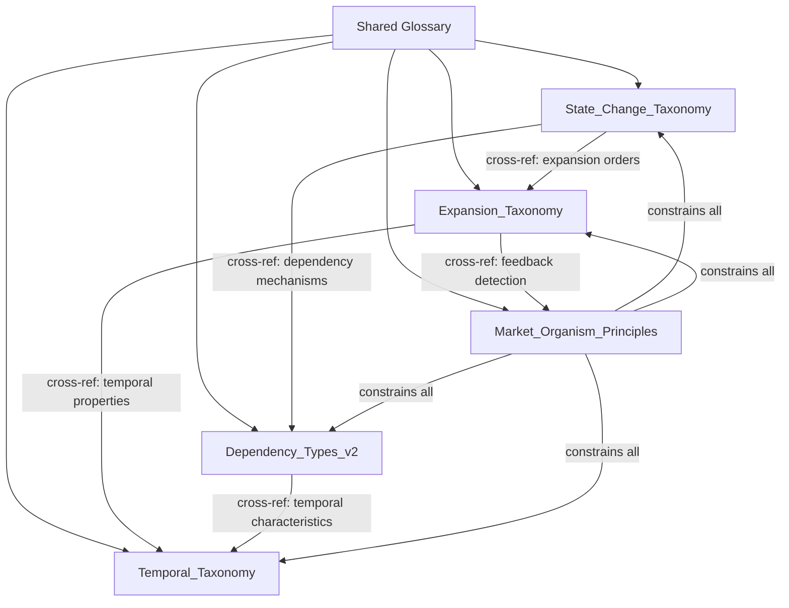
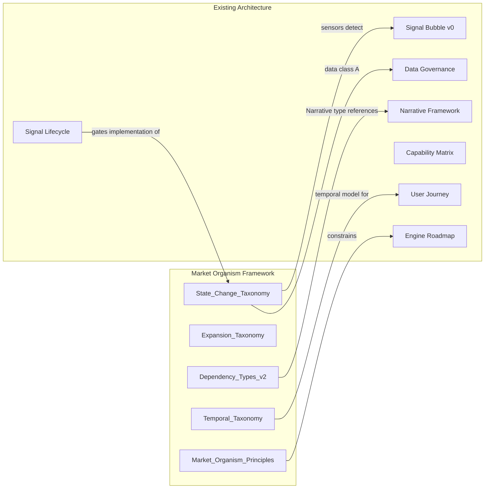

# Technical Design: Market Organism Framework

## Overview

The Market Organism Framework is a **definition-only** specification that produces five formal documents establishing the foundational world model for Portfolio OS. These documents define how markets propagate state changes as an organism — where impulses expand through dependency paths with temporal properties and feedback loops.

This design specifies the **document structure**, **required sections**, **cross-reference rules**, **extension mechanisms**, and **registry compatibility** for each of the five deliverables. No engines, code, scores, or runtime systems are produced.

### Design Scope

| In Scope | Out of Scope |
|----------|--------------|
| Document structure per deliverable | Engine implementations (P0, P1) |
| Required sections and content rules | Python code or executable logic |
| Shared glossary usage | Scoring algorithms or numeric weights |
| Cross-reference conventions | Dashboard/report UI |
| Extension mechanisms | Real-time pricing integration |
| Registry compatibility rules | Data provider licensing |
| Worked example format | Correlation matrices |

### Architectural Position

```
Layer 0: Market Organism Framework (THIS SPEC — Territory Definition)
Layer 1: Narrative Framework (Primitive Ontology)
Layer 2: User Intelligence Journey (Navigation)
Layer 3: Journey Capability Matrix (Muscles)
Layer 4: Engine Roadmap (Training Plan)
Layer 5: Implementation (Execution — FUTURE)
```

The five deliverables sit at Layer 0 — they define the conceptual world model that all downstream layers consume.

### Primitive Chain (Canonical)

```
State_Change → Narrative → System → Asset
(Cause)        (Container)  (Domain)  (Observation)
```

This chain is preserved in every deliverable. Assets are always leaf nodes, never root nodes.

---

## Architecture

### Document Architecture

The framework uses a **federated document model** — five self-contained documents that share a common glossary and reference each other through explicit cross-references.



### Design Decisions

| Decision | Rationale |
|----------|-----------|
| Federated documents (not monolithic) | Each deliverable has a single concern; independent review and maintenance |
| Shared glossary by reference (not duplication) | Single source of truth for term definitions; prevents drift |
| Cross-references by deliverable name | Explicit traceability without coupling document internals |
| Extension via criteria-gated addition | Controlled growth without breaking existing classifications |
| Qualitative-only temporal properties | No mathematics in Phase 1; prevents false confidence |
| Worked examples as validation | Concrete scenarios prove the taxonomy works without requiring code |

### Compatibility Architecture

The framework integrates with the existing Portfolio OS ecosystem through defined compatibility interfaces:



---

## Components and Interfaces

### Component 1: State_Change_Taxonomy

**Purpose**: Answers "What kinds of impulses exist?"

**Required Sections**:

| Section | Content | Satisfies |
|---------|---------|-----------|
| Scope Statement | One paragraph defining what this document covers and does not cover | Req 10.7 |
| Glossary Reference | Pointer to shared glossary; no term duplication | Req 10.7, 10.8 |
| Classification Hierarchy | Mandatory ordering: State_Change type → Expansion type → Affected systems → Affected narratives → Affected assets | Req 1.7 |
| Top-Level Categories | Exactly 4: Macro, Corporate, Narrative, Events | Req 1.1 |
| Macro Sub-Categories | Minimum: Rates, Inflation, Oil, Liquidity, FX | Req 1.2 |
| Corporate Sub-Categories | Minimum: Earnings, Guidance, Capex, M&A, Buybacks | Req 1.3 |
| Narrative Sub-Categories | Minimum: AI, Security, Defense, Robotics, Energy | Req 1.4 |
| Events Sub-Categories | Minimum: Elections, Wars, Pandemics, Sporting_Events | Req 1.5 |
| Sub-Category Descriptions | Per sub-category: (a) one-sentence scope, (b) concrete example, (c) boundary counter-example | Req 1.6 |
| Primary Classification Rule | Disambiguation when a State_Change spans categories — assign by originating causal mechanism | Req 1.8 |
| Extension Criteria | Rules for adding new sub-categories: distinct causal mechanism + required descriptive elements | Req 1.9 |
| Root Node Invariant | Valid/invalid root node examples, disambiguation rule, reformulation requirement | Req 2.1–2.7 |
| Exclusion Constraints | Consolidated prohibitions section | Req 8.7 |
| Cross-References | Explicit references to Expansion_Taxonomy, Dependency_Types_v2 | Req 10.8 |


**Sub-Category Description Format** (per Req 1.6):

```
### [Sub-Category Name]

**Scope**: [One-sentence definition of what this sub-category covers]

**Example**: [Concrete State_Change that belongs here]
  - Root_Node Type: [State_Change | Event | Impulse | Regime_Shift]
  - Why it belongs: [Brief causal mechanism explanation]

**Boundary (Does NOT Belong)**: [Example that appears similar but belongs elsewhere]
  - Why it doesn't belong: [Explanation of the distinguishing causal mechanism]
```

**Root Node Invariant Section Format** (per Req 2):

```
## Root Node Invariant

### Valid Root Nodes
| Example | Root_Node Type | Classification Question |
|---------|---------------|------------------------|
| Fed Hawkish Shift | Regime_Shift | "What kind of state change occurred?" |
| Nvidia Guidance Raise | State_Change | "What kind of state change occurred?" |
| Oil Shock | Event | "What kind of state change occurred?" |
| World Cup Start | Event | "What kind of state change occurred?" |

### Invalid Root Nodes (Invariant Violations)
| Example | Why Invalid | Required Reformulation |
|---------|-------------|----------------------|
| "NVDA" | Names a financial instrument without specifying what changed | "Nvidia Guidance Raise" |
| "Gold" | Names an asset class without specifying what changed | "Gold Safe Haven Demand Spike" |

### Disambiguation Rule
A candidate Root_Node is valid ONLY IF it describes an observable shift in conditions or context.
A candidate Root_Node is INVALID IF it names a financial instrument without specifying what changed.

### Classification Question
CORRECT: "What kind of state change occurred?"
PROHIBITED: "How do I classify this asset?"
```

---

### Component 2: Expansion_Taxonomy

**Purpose**: Answers "How do impulses propagate?"

**Required Sections**:

| Section | Content | Satisfies |
|---------|---------|-----------|
| Scope Statement | One paragraph defining coverage | Req 10.7 |
| Glossary Reference | Pointer to shared glossary | Req 10.7, 10.8 |
| Expansion Definition | Ordered sequence of propagation hops via Dependency_Paths | Req 3.1 |
| 1st Order Definition | Direct effects — 1 hop from Impulse | Req 3.2, 3.3 |
| 2nd Order Definition | Secondary effects — 2 hops from Impulse | Req 3.2, 3.3 |
| 3rd Order Definition | Tertiary effects — 3 hops from Impulse | Req 3.2, 3.3 |
| 4th Order Definition | Quaternary effects — 4 hops from Impulse | Req 3.2, 3.3 |
| Worked Example(s) | Complete propagation through all 4 orders with ≥2 systems per order | Req 3.4 |
| Termination Criteria | When propagation stops (no further identifiable Dependency_Path) | Req 3.5 |
| Feedback Detection Rule | Path revisiting an existing node = Feedback_Loop, not continued expansion | Req 3.6 |
| Temporal Properties per Order | Cross-reference to Temporal_Taxonomy for latency at each order | Req 5.6 |
| Exclusion Constraints | Consolidated prohibitions section | Req 8.7 |
| Cross-References | References to State_Change_Taxonomy, Dependency_Types_v2, Temporal_Taxonomy | Req 10.8 |

**Expansion Order Definition Format**:

```
### [Nth] Order Expansion

**Definition**: Effects that manifest [N] Dependency_Path traversal(s) from the originating Impulse.

**Causal Distance**: [N] hop(s) from Root_Node

**Distinguishing Criterion**: An affected system belongs to [Nth] Order if and only if
the shortest path from the originating Impulse traverses exactly [N] Dependency_Paths.

**Nature of Connection**: [Description of what kind of Dependency_Path typically connects
(N-1)th order systems to Nth order systems]
```

**Worked Example Format**:

```
## Worked Example: [Impulse Name]

Root_Node: [State_Change] (Type: [Root_Node_Type])

### 1st Order (Direct Effects)
| Affected System | Dependency_Type | Temporal Properties |
|----------------|-----------------|---------------------|
| [System A] | [Type] | Latency: [unit], Duration: [unit], Amp: [level], Damp: [level] |
| [System B] | [Type] | Latency: [unit], Duration: [unit], Amp: [level], Damp: [level] |

### 2nd Order (Secondary Effects)
| Affected System | Source (1st Order) | Dependency_Type | Temporal Properties |
|----------------|-------------------|-----------------|---------------------|
| [System C] | [System A] | [Type] | ... |
| [System D] | [System B] | [Type] | ... |

### 3rd Order (Tertiary Effects)
[Same format, showing which 2nd-order system connects to each]

### 4th Order (Quaternary Effects)
[Same format]

### Termination
[Why propagation stops after 4th order in this example — no further identifiable Dependency_Path]

### Feedback Detection
[If any path revisits a node, identify the Feedback_Loop and classify it per Req 3.6]
```

---

### Component 3: Dependency_Types_v2

**Purpose**: Answers "What kinds of causal connections exist?"

**Required Sections**:

| Section | Content | Satisfies |
|---------|---------|-----------|
| Scope Statement | One paragraph defining coverage | Req 10.7 |
| Glossary Reference | Pointer to shared glossary | Req 10.7, 10.8 |
| Type Enumeration | Exactly 10 types: Price, Fundamental, Narrative, Flow, Ownership, Supply_Chain, Macro, Behavioral, Regulatory, Butterfly | Req 4.1 |
| Per-Type Definition | Propagation mechanism identifying causal channel (economic, informational, structural) | Req 4.2 |
| Per-Type Example | Source entity, target entity, specific mechanism | Req 4.3 |
| Multi-Type Coexistence Rules | Ordered/unordered, primary designation, relationship to Temporal_Properties | Req 4.4 |
| Dependency vs. Correlation | Causal propagation vs. statistical co-movement with contrastive example | Req 4.5 |
| Differentiation Criteria | No two types share identical causal channel + directionality + propagation characteristics | Req 4.6 |
| Exclusion Constraints | Consolidated prohibitions section | Req 8.7 |
| Cross-References | References to Temporal_Taxonomy, State_Change_Taxonomy | Req 10.8 |

**Dependency Type Definition Format**:

```
### [Dependency_Type Name]

**Causal Channel**: [Economic | Informational | Structural]

**Propagation Mechanism**: [Description of HOW a State_Change at the source
produces an effect at the target through this specific channel]

**Directionality**: [Unidirectional | Bidirectional | Conditional]

**Typical Temporal Profile**: (See: Temporal_Taxonomy, Section: [relevant section])

**Example**:
- Source: [Entity]
- Target: [Entity]
- Mechanism: [Specific causal explanation]

**Differentiation**: [What distinguishes this type from the most similar other type]
```

**Multi-Type Coexistence Rules**:

```
## Multi-Type Edges

### Rules
1. Multiple Dependency_Types on a single path are UNORDERED (no inherent priority)
2. One type MAY be designated PRIMARY based on which causal channel dominates
3. Combined types inherit the SHORTEST Latency and LONGEST Duration from constituent types
4. Amplification/Dampening are assessed for the combined effect, not per-type

### Example
Path: [Source] → [Target]
- Primary Type: [Type A] (dominant causal channel)
- Secondary Type: [Type B] (contributing mechanism)
- Combined Temporal: Latency=[shortest], Duration=[longest], Amp=[combined], Damp=[combined]
```

**Dependency vs. Correlation Format** (per Req 4.5):

```
## Dependency vs. Correlation

### Definition
- Dependency: A causal propagation mechanism where a State_Change at source PRODUCES
  an effect at target through an identifiable channel
- Correlation: Statistical co-movement where two entities move together without
  an identifiable causal mechanism connecting them

### Contrastive Example
Entity Pair: [Entity A] and [Entity B]

AS CORRELATION: "A and B move together 80% of the time"
  - No causal direction specified
  - No mechanism identified
  - Breaks down when regime changes

AS TYPED DEPENDENCY: "A State_Change in [Entity A] propagates to [Entity B]
  through [Dependency_Type] because [specific mechanism]"
  - Causal direction: A → B
  - Mechanism: [identified]
  - Predictive: survives regime changes if mechanism persists
```

---

### Component 4: Temporal_Taxonomy

**Purpose**: Answers "How fast do effects propagate?"

**Required Sections**:

| Section | Content | Satisfies |
|---------|---------|-----------|
| Scope Statement | One paragraph defining coverage | Req 10.7 |
| Glossary Reference | Pointer to shared glossary | Req 10.7, 10.8 |
| Latency Definition | Time delay; discrete calendar units: Day, Week, Month, Quarter, Year | Req 5.1, 5.2 |
| Duration Definition | Active time span; same calendar units | Req 5.1, 5.3 |
| Amplification Definition | Qualitative 5-level scale: None, Low, Moderate, High, Extreme | Req 5.1, 5.4 |
| Dampening Definition | Qualitative 5-level scale: None, Low, Moderate, High, Extreme | Req 5.1, 5.5 |
| Complete Temporal Example | All 4 properties at each Expansion_Order with increasing Latency | Req 5.6 |
| Feedback_Delay Definition | Qualitative temporal descriptor for back-propagation time | Req 6.3 |
| Numeric Prohibition | Explicit prohibition of scores, weights, probabilities | Req 5.7 |
| Exclusion Constraints | Consolidated prohibitions section | Req 8.7 |
| Cross-References | References to Expansion_Taxonomy, Dependency_Types_v2 | Req 10.8 |

**Temporal Property Definition Format**:

```
### [Property Name]

**Definition**: [Formal definition]

**Units/Levels**: [Enumerated set of valid values]

**Interpretation Guide**:
| Value | Meaning | Example Context |
|-------|---------|-----------------|
| [Unit/Level 1] | [What this means] | [When you'd assign this] |
| [Unit/Level 2] | [What this means] | [When you'd assign this] |
| ... | ... | ... |

**Prohibited**: Numeric scores, weights, probabilities, or quantitative models
```

**Complete Temporal Example Format**:

```
## Temporal Propagation Example: [Impulse Name]

| Order | Affected System | Latency | Duration | Amplification | Dampening |
|-------|----------------|---------|----------|---------------|-----------|
| 1st | [System] | Day | Month | High | None |
| 2nd | [System] | Month | Quarter | Moderate | Low |
| 3rd | [System] | Quarter | Year | Low | Moderate |
| 4th | [System] | Year | Year+ | None | High |

**Observation**: Latency increases with distance from Impulse.
Amplification typically decreases. Dampening typically increases.
These are tendencies, not rules — specific paths may deviate.
```

---

### Component 5: Market_Organism_Principles

**Purpose**: Answers "What are the natural laws of market state propagation?"

**Required Sections**:

| Section | Content | Satisfies |
|---------|---------|-----------|
| Scope Statement | One paragraph defining coverage | Req 10.7 |
| Glossary Reference | Pointer to shared glossary | Req 10.7, 10.8 |
| Principle 1: Organism over Collection | Market is organism with propagation, not assets with correlations | Req 7.3 |
| Principle 2: Taxonomy Precedes Assets | Classify the change first, then identify affected assets | Req 7.4 |
| Principle 3: All Propagation is Temporal | Nothing instantaneous, nothing permanent | Req 7.5 |
| Principle 4: Feedback is Structural | Circular causation is the norm | Req 7.6 |
| Principle 5: Expansion Has Order | Discrete hops from source | Req 7.7 |
| Principle 6: Causation over Correlation | Dependencies are causal mechanisms, not statistical patterns | Req 4.5, 7.3 |
| Violation Conditions | Per principle: what constitutes a breach | Req 7.1 |
| Precedence Declaration | Principles override implementation decisions | Req 7.8 |
| Content Exclusions | No data, assets, scores, implementation details | Req 7.2 |
| Exclusion Constraints | Consolidated prohibitions section | Req 8.7 |
| Cross-References | References to all other deliverables | Req 10.8 |

**Principle Definition Format**:

```
### Principle [N]: [Title]

**Statement**: [One-sentence formal statement of the principle]

**Implication**: [What this means for system design]

**Violation Condition**: [Specific, testable description of what would breach this principle]

**Example of Compliance**: [Brief scenario showing the principle being followed]

**Example of Violation**: [Brief scenario showing the principle being breached]

**Satisfies**: Requirement [X.Y]
```

---


### Shared Infrastructure Components

#### Shared Glossary

The glossary defined in the requirements document serves as the canonical term registry. Each deliverable references it rather than duplicating definitions.

**Glossary Usage Rules**:
1. Every deliverable includes a "Glossary Reference" section pointing to the shared glossary
2. Terms defined in the glossary are used consistently across all deliverables (exact spelling, exact meaning)
3. If a deliverable introduces a term not in the glossary, it must be added to the glossary first
4. No deliverable may redefine a glossary term with a different meaning

#### Cross-Reference Convention

When one deliverable references a concept defined in another:

```
(See: [Deliverable_Name], Section: [Section_Title])
```

Example: `(See: Temporal_Taxonomy, Section: Latency Definition)`

**Rules**:
- Cross-references identify the source deliverable by name
- Cross-references identify the specific section
- No definition duplication — reference only
- Circular cross-references are permitted (the documents form a network, not a tree)

#### Extension Mechanism

Each taxonomy supports controlled growth through criteria-gated addition:

| Deliverable | Extension Criteria |
|-------------|-------------------|
| State_Change_Taxonomy | New sub-category requires: (a) distinct causal mechanism not covered by existing sub-categories, (b) scope definition, (c) concrete example, (d) boundary counter-example |
| Expansion_Taxonomy | New order beyond 4th requires: (a) evidence of identifiable Dependency_Path at that distance, (b) complete worked example |
| Dependency_Types_v2 | New type requires: (a) unique combination of causal channel + directionality + propagation characteristics, (b) mechanism description, (c) concrete example |
| Temporal_Taxonomy | New unit/level requires: (a) justification that existing granularity is insufficient, (b) placement in existing scale |
| Market_Organism_Principles | New principle requires: (a) violation condition, (b) non-redundancy with existing principles, (c) precedence declaration |

#### Registry Compatibility

Each deliverable maintains compatibility with the existing Portfolio OS ecosystem:

**Signal Bubble Compatibility** (Req 11, 12):
- State_Change_Taxonomy nodes produce Intelligence_Objects that Signal_Bubble_v0 sensors detect
- Signal_Bubble_v0 signals are leaf-node observations in the Organism_Graph — evidence of propagation, not causes
- No deliverable replaces or redefines Signal_Bubble_v0 signals

**Signal Lifecycle Compatibility** (Req 13):
- Any signal referenced in worked examples must have a Signal_Lifecycle_Definition before implementation
- The 11-field lifecycle gate applies to all signals regardless of which deliverable references them
- Three implementation statuses (Defined_Signal, Structured_Signal, Implemented_Signal) are respected

**Narrative Framework Compatibility**:
- The "Narrative" Dependency_Type in Dependency_Types_v2 references the Narrative Framework's ontological definition
- Narrative lifecycle states (Emerging → Strengthening → Dominant → Weakening → Dormant → Dead) are referenced, not redefined
- The primitive chain (State_Change → Narrative → System → Asset) is preserved in all deliverables

**User Journey Compatibility**:
- Temporal_Taxonomy provides the temporal model that the Scenario Journey consumes
- State_Change_Taxonomy provides the detection model that the Discovery Journey consumes
- Expansion_Taxonomy provides the drill-down model that the Investigation Journey consumes

**Data Governance Compatibility**:
- All content in these deliverables is Class A (proprietary intellectual property)
- No external data sources are referenced as dependencies
- No licensing implications exist for definition documents

---

## Data Models

### Document Metadata Schema

Every deliverable document carries a standard metadata header:

```yaml
---
artifact_id: [deliverable_name]_md
primary_domain: ARCH
artifact_type: SSOT
lifecycle_status: canonical
created_date: [date]
last_modified: [date]
owner_role: [description of what this document defines]
ssot_relationship: canonical
topic: [topic_identifier]
allowed_writers: [ARCH, GOV]
allowed_readers: [ALL]
dependencies: [list of dependent artifacts]
---
```

### Taxonomy Entry Schema (Conceptual)

Each taxonomy entry (sub-category, expansion order, dependency type) follows a consistent conceptual schema:

```
Entry:
  id: [unique_identifier]
  name: [human_readable_name]
  parent: [parent_category or null]
  definition: [one-sentence scope]
  causal_mechanism: [what makes this distinct]
  example: [concrete instance]
  counter_example: [boundary case that does NOT belong]
  cross_references: [list of (Deliverable, Section) pairs]
  extension_criteria: [what a new child entry must satisfy]
```

### Temporal Property Schema (Conceptual)

```
Temporal_Property_Set:
  latency: Day | Week | Month | Quarter | Year
  duration: Day | Week | Month | Quarter | Year
  amplification: None | Low | Moderate | High | Extreme
  dampening: None | Low | Moderate | High | Extreme
```

### Feedback Loop Schema (Conceptual)

```
Feedback_Loop:
  cycle_nodes: [ordered list of ≥4 nodes forming a closed cycle]
  edge_types: [Dependency_Type per edge in the cycle]
  feedback_delay: Day | Week | Month | Quarter | Year
  growth_structure: [acyclic subgraph — forward propagation]
  feedback_structure: [back-edges creating cycles]
```

### Signal Integration Schema (Conceptual)

```
Intelligence_Object_Reference:
  signal_id: [unique identifier in Signal Bubble namespace]
  category: [one of 6 Signal_Bubble_v0 categories]
  request_type: single_value | composite_bundle | detail_provenance | 
                static_context | variable_context | derived_intelligence
  refresh_mechanism: governance_policy | scheduled_cadence | event_trigger
  organism_role: sensor (leaf-node observation detecting propagation)
```

### Signal_Lifecycle_Definition Schema

```
Signal_Lifecycle_Definition:
  signal_id: [unique identifier]
  category: [signal category]
  owner_domain: [exactly one of 12 domains]
  input_sources: [list of upstream dependencies]
  classification: static | variable
  refresh_policy: [cadence or governance interval]
  cache_policy: [maximum staleness tolerance]
  provenance: [origin and derivation chain]
  consumers: [list of downstream consumers]
  invalidation_rule: [dependency_change | time_expiry | event_trigger]
  implementation_status: Defined_Signal | Structured_Signal | Implemented_Signal
```

---

## Error Handling

Since this is a definition-only specification producing documents (not code), "error handling" translates to **document validation rules** — conditions that indicate a deliverable is malformed or incomplete.

### Validation Rules per Deliverable

| Deliverable | Validation Error | Resolution |
|-------------|-----------------|------------|
| State_Change_Taxonomy | Fewer than 4 top-level categories | Add missing categories |
| State_Change_Taxonomy | Sub-category missing any of: scope, example, counter-example | Complete the description |
| State_Change_Taxonomy | Asset used as Root_Node | Reformulate as underlying State_Change |
| Expansion_Taxonomy | Fewer than 4 Expansion_Orders defined | Add missing orders |
| Expansion_Taxonomy | Worked example missing systems at any order | Add ≥2 systems per order |
| Expansion_Taxonomy | Node revisit not classified as Feedback_Loop | Reclassify per Req 3.6 |
| Dependency_Types_v2 | Fewer than 10 types defined | Add missing types |
| Dependency_Types_v2 | Two types share identical causal channel + directionality | Differentiate or merge |
| Dependency_Types_v2 | Correlation used as substitute for dependency | Replace with causal mechanism |
| Temporal_Taxonomy | Numeric score used for any property | Replace with qualitative descriptor |
| Temporal_Taxonomy | Missing any of the 4 properties | Add missing property definition |
| Market_Organism_Principles | Fewer than 5 principles | Add principles |
| Market_Organism_Principles | Principle missing violation condition | Add violation condition |
| Market_Organism_Principles | Contains implementation details | Remove; principles are constraints only |
| All | Term used inconsistently with glossary | Align with glossary definition |
| All | Definition duplicated from another deliverable | Replace with cross-reference |
| All | Missing exclusion constraints section | Add consolidated prohibitions |

### Exclusion Constraint Violations

The following constitute hard errors in any deliverable (per Req 8):

| Violation | Detection | Resolution |
|-----------|-----------|------------|
| Engine implementation present | Code blocks with executable logic | Remove; replace with conceptual description |
| Numeric scores/weights present | Numbers used as ranking or probability | Remove; use qualitative descriptors only |
| Dashboard/visualization spec present | UI mockups or report templates | Remove; belongs to future implementation |
| Asset as root-level entity | Ticker/asset name as organizational anchor | Reformulate as State_Change |
| Correlation matrix present | Statistical co-movement table | Replace with typed Dependency_Path |

### Architectural Compatibility Violations

| Violation | Detection | Resolution |
|-----------|-----------|------------|
| Domain added/removed/redefined | New domain name or changed responsibility | Revert; 12 domains are fixed |
| Canonical chain altered | Changed sequence or direction | Revert; SIGNALS→SEMANTICS→REASONING→REPORT is fixed |
| Runtime state model changed | New states or dimensions | Revert; 8 states, 5 dimensions are fixed |
| Signal_Bubble_v0 signal replaced | Existing signal deprecated or removed | Restore; signals are preserved as sensors |
| Signal lacks lifecycle definition | Signal referenced without 11-field registration | Add Signal_Lifecycle_Definition or mark as Defined_Signal |

---

## Correctness Properties

Since this specification produces definition documents (not executable code), correctness is defined as structural conformance rather than behavioral properties:

### Property 1: Completeness
Every deliverable contains all required sections as specified in its component design. No section may be omitted or left empty.

**Validates: Requirements 10.1, 10.2, 10.3, 10.4, 10.5, 10.6**

### Property 2: Invariant Preservation
No deliverable violates any of the 5 hard invariants (assets never root, feedback mandatory, taxonomy before assets, temporal properties required, no mathematics).

**Validates: Requirements 2.1, 2.2, 5.7, 6.2, 8.1, 8.2**

### Property 3: Consistency
All glossary terms are used identically across all 5 deliverables. No term is redefined with a different meaning in any document.

**Validates: Requirements 10.7, 10.8**

### Property 4: Non-Duplication
No definition is duplicated across deliverables. Shared concepts are cross-referenced by deliverable name and section title.

**Validates: Requirements 10.8, 10.9**

### Property 5: Architectural Compatibility
No deliverable adds, removes, or redefines any element of the existing 12-domain model, canonical chain, or runtime state model.

**Validates: Requirements 9.1, 9.2, 9.5, 9.6**

### Property 6: Extension Safety
Any new taxonomy entry added via extension criteria does not invalidate existing entries or break existing cross-references.

**Validates: Requirements 1.9, 10.8**

### Property 7: Single Concern
Each deliverable addresses exactly one concern — taxonomy documents define classifications only, and the principles document defines constraints only.

**Validates: Requirements 10.9**

### Property 8: Trust Chain Completeness
A valid architecture must support traversal from any Assessment through Reasoning through Signals through State_Change through Narrative through Expansion_Path using only canonical IDs and provenance metadata. No conclusion may exist without traceability. No narrative may exist without an originating State_Change. No expansion path may exist without a causal source.

**Validates: Requirements 2.1, 7.1, 11.1, 11.9**

### Property 9: Explanation Readiness
Every taxonomy entry must be reachable through at least one explanation chain (Level 0 through Level 5). No entry may exist as an orphan unreachable from any Explanation_Object traversal. Worked examples must demonstrate complete fractal drilldown.

**Validates: Requirements 3.4, 4.3, 5.6, 6.4, 10.2, 10.3, 10.4, 10.5**

### Property 10: Rendering Independence
No canonical ID, cross-reference, or structural element may contain natural language display text, localized strings, or rendered local timestamps as identity. All identifiers must be language-neutral and timezone-neutral per the Language Rendering Framework.

**Validates: Requirements 9.6, 10.7, 10.8**

---

## Testing Strategy

### Why Property-Based Testing Does Not Apply

This specification produces **definition documents** — structured markdown with taxonomies, principles, and worked examples. There are no:
- Pure functions with input/output behavior
- Data transformations or algorithms
- Parsers or serializers
- Executable logic of any kind

Property-based testing is designed for code that processes varying inputs. Definition documents have fixed structure that is validated through schema conformance and review, not through randomized input generation.

### Applicable Testing Approaches

#### 1. Schema Validation (Automated)

Each deliverable can be validated against its required section structure:

- **State_Change_Taxonomy**: Verify 4 top-level categories present, each sub-category has scope/example/counter-example
- **Expansion_Taxonomy**: Verify 4 orders defined, worked example covers all orders with ≥2 systems each
- **Dependency_Types_v2**: Verify 10 types present, each has causal channel/mechanism/example
- **Temporal_Taxonomy**: Verify 4 properties defined with correct enumerated values
- **Market_Organism_Principles**: Verify ≥5 principles, each has violation condition

#### 2. Invariant Checking (Automated)

Hard invariants can be checked by scanning document content:

- No asset appears as a Root_Node (scan for ticker symbols in root node positions)
- No numeric scores, weights, or probabilities appear (scan for numeric patterns in property values)
- All cross-references point to existing deliverables and sections
- Glossary terms are used consistently (term matching across documents)
- Exclusion constraints section exists in every deliverable

#### 3. Completeness Review (Manual)

Human review validates:

- Worked examples are realistic and internally consistent
- Boundary counter-examples genuinely do not belong in the stated category
- Principles are non-redundant and collectively sufficient
- Extension criteria are clear enough to apply unambiguously
- Cross-references are bidirectional where appropriate

#### 4. Compatibility Verification (Manual)

Review against existing architecture documents:

- 12-domain model preserved (compare against domain_registry.yaml)
- Canonical chain preserved (compare against system_architecture.md)
- Signal_Bubble_v0 signals preserved as sensors (compare against signal categories)
- Narrative Framework primitive chain preserved (compare against README_narrative_framework.md)
- Data Governance Class A designation maintained (compare against README_market_data_governance_framework.md)

### Test Execution Plan

| Phase | What | How | Pass Criteria |
|-------|------|-----|---------------|
| 1. Structure | Required sections present | Automated section scan | All required sections exist per component spec |
| 2. Invariants | Hard constraints respected | Automated content scan | Zero invariant violations |
| 3. Completeness | Content quality | Manual review | All examples realistic, all criteria clear |
| 4. Compatibility | Architecture preserved | Manual comparison | Zero compatibility violations |
| 5. Cross-Reference | Links valid | Automated link check | All cross-references resolve |
| 6. Explanation Readiness | Fractal traversal possible | Manual trace | Every taxonomy entry reachable through explanation levels |

---

## Explanation Architecture Integration

### Canonical Primitive Definition

The Explanation_Object is a first-class primitive in the MoneyHorst architecture:

```
Knowledge Primitives:
  State_Change → Narrative → System → Asset

Intelligence Primitives:
  Signal → Semantic_State → Reasoning_Object

Understanding Primitive:
  Explanation_Object (fractal decomposition of any intelligence into causal layers)

Rendering Dimensions:
  Language × Altitude × Timezone × Locale
```

### Key Definitions

| Term | Definition |
|------|-----------|
| Explanation_Object | A structured, fractal decomposition of a Reasoning_Object into progressively deeper causal layers |
| Explanation_Chain | The complete traversal path from Assessment through Reasoning through Signals through State_Change through Narrative through Expansion |
| Explanation_Level | One of six depth layers (0: What, 1: Why, 2: Signals, 3: State Changes, 4: Narratives, 5: Propagation) |
| Fractal_Drilldown_Path | A user-navigable path through the Explanation_Object where every node is expandable |
| Trust_Chain | The provenance path from any assessment back to observable evidence through canonical IDs |

### Fundamental Distinction

- **Reasoning_Object** answers: "What did the system conclude?"
- **Explanation_Object** answers: "Why did the system conclude this, and how deep can the user go?"

These are separate primitives. A Reasoning_Object without an Explanation_Object produces conclusions. A Reasoning_Object WITH an Explanation_Object produces understanding.

### Explanation_Object does NOT require (in this spec):
- Explanation rendering engine
- Pre-computed explanation trees
- Natural language generation
- UI components

It DOES require:
- Every taxonomy entry structured to be traversable through explanation levels
- Every worked example demonstrating the explanation chain
- Every cross-reference supporting fractal navigation

---

## Explanation Compatibility Matrix

Each deliverable serves a specific role in the Explanation Chain:

| Deliverable | Explanation Level Served | Role in Chain | What It Provides |
|-------------|------------------------|---------------|------------------|
| State_Change_Taxonomy | Level 3 | "Because of which state changes?" | Classifies the causal impulse that started the chain |
| Expansion_Taxonomy | Level 5 | "Because of which propagation?" | Shows how the impulse propagated through orders |
| Dependency_Types_v2 | Level 5 (edge labels) | "Through which mechanism?" | Labels the causal channel on each propagation hop |
| Temporal_Taxonomy | Level 5 (temporal context) | "When does each effect arrive?" | Provides latency/duration at each expansion order |
| Market_Organism_Principles | Meta-level | "What laws govern this?" | Constrains all explanation paths to be structurally valid |

### Per-Deliverable Explanation Requirements

**State_Change_Taxonomy:**
- Every sub-category must be reachable as a Level 3 explanation node
- Every sub-category must carry a stable ID (per Language Rendering Framework)
- Every sub-category must link downward to affected Narratives (Level 4 connection)
- Every worked example must demonstrate: "This State_Change explains WHY these downstream effects occurred"

**Expansion_Taxonomy:**
- Every Expansion_Order must be traversable as a Level 5 explanation node
- Every worked example must show the complete explanation chain from Level 3 (State_Change) through Level 5 (propagation)
- Termination criteria must be explainable ("Why does propagation stop here?")
- Feedback detection must be explainable ("Why is this a feedback loop, not continued expansion?")

**Dependency_Types_v2:**
- Every Dependency_Type must be explainable as an edge label in the fractal drilldown
- Every type must answer: "Through WHICH mechanism does this propagation occur?"
- The contrastive example (dependency vs. correlation) must demonstrate explanation depth difference
- Multi-typed edges must be explainable: "This path propagates through BOTH mechanism A and mechanism B"

**Temporal_Taxonomy:**
- Every temporal property must be explainable at Level 5
- The complete temporal example must demonstrate: "Effect arrives at Month 1 BECAUSE of this latency"
- Amplification/Dampening must be explainable: "Effect intensifies BECAUSE of this mechanism"
- Feedback_Delay must be explainable: "Back-propagation takes this long BECAUSE..."

**Market_Organism_Principles:**
- Every principle must be usable as a meta-explanation: "This path is valid BECAUSE of Principle N"
- Violation conditions must be explainable: "This would be invalid BECAUSE it violates Principle N"
- Principles constrain which explanation paths are structurally valid

---

## Fractal Drilldown Hardening

### Structural Guarantee

Every canonical object in the Market Organism Framework must remain traversable through future Explanation_Objects. No dead ends are permitted before reaching a Root_Node or source evidence.

### Level Structure

| Level | Question | Source Deliverable | Traversal Direction |
|-------|----------|-------------------|---------------------|
| 0 | What? | Signal Bubble (current value) | Entry point |
| 1 | Why? | Reasoning_Object (contributing signals) | Downward into signals |
| 2 | Because of which signals? | Signal_Lifecycle_Definition (decomposition) | Downward into causes |
| 3 | Because of which state changes? | State_Change_Taxonomy | Upward to causal origin |
| 4 | Because of which narratives? | Narrative Framework | Lateral to explanatory container |
| 5 | Because of which propagation? | Expansion_Taxonomy + Dependency_Types + Temporal_Taxonomy | Forward through expansion |

### Traversal Rules

1. Every taxonomy entry must have at least one path connecting it to an adjacent explanation level
2. No entry may exist in isolation (unreachable from any explanation chain)
3. Cross-references between deliverables must support level-to-level traversal
4. Worked examples must demonstrate complete Level 0 → Level 5 traversal
5. Feedback loops (Level 5 → Level 3) must be explicitly marked as back-edges

### Dead End Prevention

A dead end occurs when a user asks "Why?" and the system cannot provide a deeper answer. The following structural rules prevent dead ends:

| At Level | Dead End Condition | Prevention Rule |
|----------|-------------------|-----------------|
| 1 | Signal has no contributing factors | Every signal must declare input_sources in Signal_Lifecycle_Definition |
| 2 | Signal decomposition has no causal origin | Every signal must trace to at least one State_Change |
| 3 | State_Change has no narrative context | Every State_Change must link to at least one Narrative (per taxonomy hierarchy) |
| 4 | Narrative has no expansion path | Every Narrative must connect to at least one System through a Dependency_Path |
| 5 | Expansion terminates without explanation | Termination criteria must be explicitly stated |

---

## Trust Chain Hardening

### Trust Chain Definition

A Trust Chain is a complete, verifiable traversal from any user-facing assessment back to observable evidence, using only canonical IDs and provenance metadata.

### Valid Trust Chain

```
Assessment (e.g., "Portfolio Fit: 73")
  → Reasoning_Object (reasoning_id: ro_portfolio_fit_abc123)
    → Source Semantic States (signal_ids: [sem.concentration_risk, sem.ai_dependency])
      → Signal Sources (signal.risk.concentration_score — provenance: allocation_engine)
        → State_Change (sc.corporate.capex.hyperscaler_increase — occurred_at_utc: 2026-08-15T21:00:00Z)
          → Narrative (narrative.ai_infrastructure — lifecycle: dominant)
            → Expansion Path (order.1st → order.2nd → order.3rd — with temporal properties)
```

Every link in this chain uses canonical IDs. No display text. No localized strings.

### Invalid Trust Chains

| Violation | Why Invalid |
|-----------|-------------|
| Conclusion exists but causal chain cannot be traversed | Breaks Trust Journey — user cannot verify |
| Narrative exists without originating State_Change | Violates primitive chain (State_Change → Narrative) |
| Expansion path exists without causal source | Violates Root_Node invariant |
| Signal referenced by display text instead of canonical ID | Violates Language Rendering Framework Rule 4 |
| Temporal reference uses local time instead of UTC | Violates Temporal Rendering Rule 6 |

---

## Altitude and Learning Hardening

### Architectural Constraint

Altitude is a rendering dimension. Not a knowledge dimension.

The same Explanation_Object must support all three altitudes without altering canonical truth:

| Altitude | What Changes | What Does NOT Change |
|----------|-------------|---------------------|
| Beginner | Simpler vocabulary, fewer details, more analogies | Canonical IDs, signal values, causal chain structure |
| Intermediate | Technical vocabulary, full signal names, mechanism descriptions | Canonical IDs, signal values, causal chain structure |
| Expert | Institutional language, confidence intervals, cross-engine confirmation details | Canonical IDs, signal values, causal chain structure |

### Integration with Language Rendering Framework

The rendering pipeline for explanations is:

```
Explanation_Object (language-neutral, altitude-neutral, timezone-neutral)
  → Altitude Renderer (selects depth of explanation text)
    → Language Renderer (translates to user's language)
      → Temporal Renderer (converts UTC to user's timezone)
        → Output
```

### Implication for Deliverables

Every worked example in the taxonomy documents must be structured such that:
- The STRUCTURE (which signals, which state changes, which narratives) is altitude-independent
- The RENDERING (how it is described in text) can vary by altitude
- No altitude-specific content is embedded in canonical IDs or cross-references

---

## Progressive Disclosure Hardening

### Structural Constraint

The architecture must support progressive disclosure. No consumer may require all explanation layers simultaneously.

### Rules

1. Level 0 (What?) is always available without requesting deeper levels
2. Each subsequent level is revealed only on explicit user request
3. The system must never force-render Levels 1-5 without user action
4. Each level is independently loadable (no requirement to load Level 2 before Level 3)
5. Back-navigation (collapse) is always available at every level

### Implication for Document Structure

Every taxonomy entry must be structured as independently addressable at each level:
- A consumer requesting only Level 3 (State_Changes) gets State_Change_Taxonomy content
- A consumer requesting only Level 5 (Propagation) gets Expansion_Taxonomy content
- No deliverable requires reading another deliverable to provide its level's content (per Req 10.7: self-contained)

Cross-references enable DEEPER navigation but are never REQUIRED for the current level to be meaningful.

---

## Memory and Historical Explanation Hardening

### Compatibility Requirements

Future Memory Journey capabilities require that explanation paths remain reconstructable from versioned canonical objects.

### Rules

1. Every canonical ID referenced in an explanation chain must be immutable (per Language Rendering Framework Rule 2)
2. Taxonomy entries, once assigned an ID, never change that ID (even if display text is updated)
3. Historical explanation reconstruction requires: versioned Signal Bubble state + versioned Organism Graph + stable taxonomy IDs
4. The taxonomy documents produced by this spec must use stable IDs that remain valid for historical queries

### What This Does NOT Require (Now)

- Versioned Organism Graph implementation (P3 capability)
- Historical replay engine (P3 capability)
- Snapshot storage for explanation trees (future)

### What This DOES Require (Now)

- Stable IDs on every taxonomy entry (already required by Language Rendering Framework)
- Immutable ID assignment (once assigned, never changed)
- Structure that supports future temporal queries without redesign

---

## Future Phase Markers

The following topics are explicitly OUT OF SCOPE for this spec but are marked as critical dependencies for future phases:

### Marker: Narrative Membership Rules (P0 Dependency)

**Question:** When does an asset belong to a narrative?

**Why it matters:** The P0 capability "Asset-to-Narrative Registry" requires formal membership rules. The current spec defines State_Change → Narrative (how narratives are born/strengthened/weakened/killed). But it does NOT define the criteria for Asset → Narrative membership assignment.

**Open questions for future phase:**
- What evidence qualifies an asset for narrative membership?
- Who/what assigns membership (human, engine, threshold)?
- When does membership expire or change type (primary → legacy)?
- How are multi-narrative conflicts resolved?
- Is membership binary or graduated?

**Blocked until resolved:** Asset-to-Narrative Registry implementation (P0)

**Not blocked:** Current spec deliverables (definition documents only — no membership assignment occurs)

---

## Explanation Registry Compatibility

### ID Requirements

Future Explanation_Objects must reference:
- Stable canonical IDs (e.g., `sc.macro.rates`, `narrative.ai_infrastructure`, `dep.supply_chain`)
- Canonical objects from the Signal Bubble
- Provenance chains from Signal_Lifecycle_Definition

Future Explanation_Objects must NEVER reference:
- Display text (e.g., "AI Infrastructure" as a lookup key)
- Localized text (e.g., "KI-Infrastruktur" as identity)
- Rendered labels (e.g., formatted timestamps in local time)

### Compatibility Matrix

| Framework | Compatibility Requirement |
|-----------|--------------------------|
| Language Rendering Framework | Explanation IDs are language-neutral; rendering is separate |
| Temporal Rendering Framework | Explanation timestamps are UTC; display is rendered per user timezone |
| Signal Bubble | Explanation nodes reference signal_ids from the canonical registry |
| Signal_Lifecycle_Definition | Explanation provenance uses lifecycle fields (input_sources, provenance, consumers) |
| Narrative Framework | Explanation Level 4 references narrative_ids with lifecycle_state |
| Market Data Governance | Explanation provenance respects data_class boundaries (Class A/B/C) |

---

## Explanation Readiness Validation

### Additional Validation Rules

| Condition | Valid/Invalid | Explanation |
|-----------|-------------|-------------|
| Conclusion exists but causal chain cannot be traversed through canonical IDs | INVALID | Trust chain broken |
| User can only drill one level before hitting a dead end | INVALID | Fractal drilldown incomplete |
| Narrative exists without explanation path to originating State_Change | INVALID | Primitive chain violated |
| Localized text used as explanation identity or lookup key | INVALID | Language Rendering Rule 4 violated |
| Local time used as canonical timestamp in explanation chain | INVALID | Temporal Rendering Rule 6 violated |
| Signal → State_Change → Narrative → Expansion traversal works through canonical IDs | VALID | Full explanation chain functional |
| Explanation path remains language-neutral and timezone-neutral in structure | VALID | Rendering independence maintained |
| Every taxonomy entry reachable from at least one explanation chain | VALID | No orphaned entries |
| Worked example demonstrates Level 0 through Level 5 traversal | VALID | Progressive disclosure supported |

### Integration with Test Execution Plan

| Phase | What | How | Pass Criteria |
|-------|------|-----|---------------|
| 6. Explanation Readiness | Fractal traversal possible | Manual trace through worked examples | Every entry reachable; no dead ends before Root_Node |
| 7. Trust Chain | Provenance complete | Manual verification of ID chains | Assessment → State_Change traversal uses only canonical IDs |
| 8. Rendering Independence | No language/time in identity | Automated scan for natural language in ID fields | Zero violations |

