# Design Document

## Overview

This design specifies HOW the existing `docs/README_narrative_framework.md` will be structurally modified to satisfy requirements NFA-REQ-1 through NFA-REQ-11. The deliverable is an in-place replacement of the current Narrative Framework document with a v2 version that preserves the existing ontology while adding formalization layers required by Market Organism Layer 0.

**Scope preservation**: This design specifies document structure only. It does not authorize execution, registry population, runtime validation, or SSOT mutation beyond the future planned in-place Narrative Framework v2 update.

### Design Constraints

- **Definition-only**: No engines, code, scores, probabilities, or runtime behavior
- **Ontology preservation**: The existing Narrative ontology (primitive chain, lifecycle states, hierarchy rules, interaction types) is CORRECT and must be preserved verbatim where applicable
- **Single deliverable**: The aligned document replaces `docs/README_narrative_framework.md` in place — no separate sub-documents
- **Layer 0 compliance**: All structural patterns (YAML metadata, exclusion constraints, cross-references, architectural compatibility) follow the pattern established by the 5 Market Organism deliverables

### Design Decisions Summary

| # | Decision | Resolution | Rationale |
|---|----------|-----------|-----------|
| D-1 | Document structure | 17 top-level sections (see Architecture) | Covers all 11 requirements while maintaining logical flow from ontology to formalization to constraints |
| D-2 | Canonical ID methodology | `narrative.[descriptive_token]` with lowercase underscore-separated naming | Consistent with `sc.*`, `dep.*`, `system.*` patterns in Layer 0 |
| D-3 | Lifecycle state machine | Formal directed graph with 6 states and 7 transitions, each carrying canonical IDs | Satisfies NFA-REQ-3 without introducing numeric thresholds |
| D-4 | Explanation readiness | Dedicated section defining Level 4 contract with upward/downward traversal rules | Satisfies NFA-REQ-5 using existing Explanation Framework Level 4 structure |
| D-5 | Velocity handling | Treated as narrative-specific qualitative observation (Accelerating/Steady/Decelerating), NOT a Temporal_Taxonomy extension | Avoids polluting the canonical 5-property temporal model |
| D-6 | Glossary candidates | Narrative_Container, Narrative_Membership, Narrative_Interaction become FORMAL glossary additions | All three represent distinct concepts not covered by existing glossary |
| D-7 | Section ordering | Ontology first, then formalization, then constraints, then compatibility | Natural reading order: understand what, then how formalized, then what prohibited |

---

## Architecture

### Document Structure — Narrative Framework v2

The aligned document will contain exactly 17 top-level sections in the following order:

```
YAML Metadata Header
1. Scope Statement
2. Glossary Reference + Amendments
3. The Primitive Chain
4. What Is a Narrative? (Definition + Formal Properties)
5. Narrative vs. State_Change
6. Narrative Lifecycle State Machine (Formalized)
7. Narrative Hierarchy (Containment Rules)
8. Multi-Narrative Membership
9. State_Change-to-Narrative Interactions
10. Dependency_Type Integration (dep.narrative distinction)
11. Feedback Loop Integration
12. Explanation Readiness Contract (Level 4)
13. Narrative Extension Criteria
14. Signal Sensor Relationship Declaration
15. Exclusion Constraints
16. Architectural Compatibility
17. Cross-References
--- Satisfies (requirement traceability table) ---
```

### Section-to-Requirement Mapping

| Section | Primary Requirement | Secondary Requirements |
|---------|--------------------|-----------------------|
| YAML Metadata | NFA-REQ-11.7 | — |
| 1. Scope Statement | NFA-REQ-7 | NFA-REQ-2 |
| 2. Glossary Reference | NFA-REQ-6 | NFA-REQ-9 |
| 3. Primitive Chain | NFA-REQ-11 | NFA-REQ-5 |
| 4. Definition | NFA-REQ-1.3, 1.4 | NFA-REQ-2.4 |
| 5. Narrative vs State_Change | NFA-REQ-4 | — |
| 6. Lifecycle State Machine | NFA-REQ-3 | NFA-REQ-2.6 |
| 7. Hierarchy | NFA-REQ-1.6 | NFA-REQ-8 |
| 8. Multi-Narrative Membership | NFA-REQ-2.4, 2.5 | NFA-REQ-1 |
| 9. Interactions | NFA-REQ-3.4 | NFA-REQ-6 |
| 10. Dependency_Type Integration | NFA-REQ-9 | NFA-REQ-6 |
| 11. Feedback Loop Integration | NFA-REQ-10 | NFA-REQ-11 |
| 12. Explanation Readiness | NFA-REQ-5 | NFA-REQ-6 |
| 13. Extension Criteria | NFA-REQ-8 | — |
| 14. Signal Sensor Relationship | NFA-REQ-4 | NFA-REQ-11 |
| 15. Exclusion Constraints | NFA-REQ-7 | NFA-REQ-2 |
| 16. Architectural Compatibility | NFA-REQ-11 | NFA-REQ-4 |
| 17. Cross-References | NFA-REQ-6 | — |

---

## Components and Interfaces

### Component 1: YAML Metadata Header

**Satisfies**: NFA-REQ-11.7

The document opens with a YAML metadata block conforming to the Layer 0 pattern:

```yaml
---
artifact_id: narrative_framework_md
primary_domain: ARCH
artifact_type: SSOT
lifecycle_status: canonical
created_date: 2026-05-31
last_modified: 2026-06-02
owner_role: Defines the ontology of Narrative as a primitive in the MoneyHorst architecture
ssot_relationship: canonical
topic: narrative_ontology
allowed_writers: [ARCH, GOV]
allowed_readers: [ALL]
dependencies: [market_organism.principles_md, dependency_types_v2_md, temporal_taxonomy_md, expansion_taxonomy_md, explanation_framework_md, language_rendering_framework_md]
version: v2
alignment_spec: narrative-framework-alignment
---
```

Changes from v1: Added `version`, `alignment_spec`, updated `last_modified`, expanded `dependencies` to include all Layer 0 deliverables explicitly.

---

### Component 2: Scope Statement

**Satisfies**: NFA-REQ-7 (partial), NFA-REQ-2 (partial)

A concise paragraph declaring what the document IS and IS NOT, following the pattern from `README_market_organism_principles.md`:

Content includes:
- Statement that the document defines the Narrative ontology as a formal primitive
- Declaration that this is a definition-layer document
- Forward pointer to Exclusion Constraints section for consolidated prohibitions
- Explicit exclusion of data, engines, scores, implementation, and runtime behavior

---

### Component 3: Glossary Reference + Amendments

**Satisfies**: NFA-REQ-6, NFA-REQ-9

Structure:

```markdown
## Glossary Reference

All terms used in this document are defined in the canonical glossary:
-> `.kiro/specs/market-organism-framework/requirements.md`, Section: Glossary
(See: README_shared_glossary_reference, Section: Glossary Usage Rules)

This document does not define terms except for the three amendments below.

### Glossary Amendments

| Term | Definition | Status |
|------|-----------|--------|
| Narrative_Container | ... | CANONICAL |
| Narrative_Membership | ... | CANONICAL |
| Narrative_Interaction | ... | CANONICAL |
```

Definitions:
- **Narrative_Container**: The structural role of a Narrative as the explanatory grouping that organizes how a State_Change's effects are understood by market participants. Distinguished from `dep.narrative` (the propagation mechanism).
- **Narrative_Membership**: The relationship between an Asset and a Narrative, classified by membership type (primary/secondary/emerging/legacy) and qualitative influence descriptor (strong/moderate/weak). These are categorical labels, not ordinal numeric proxies.
- **Narrative_Interaction**: A causal relationship between a State_Change and a Narrative, classified by interaction type (Creates/Strengthens/Weakens/Kills/Revives). State_Changes cause interactions; signals detect their effects.

**Governance note**: These amendments are formalized locally inside Narrative Framework v2 for the purpose of this alignment. Updating the central Market Organism glossary (`.kiro/specs/market-organism-framework/requirements.md`, Section: Glossary) is not performed by this spec unless separately authorized by a future governance task. The glossary-first rule remains intact — these terms are defined here before use, and will be proposed for central inclusion as a follow-up action.

---

### Component 4: Canonical ID Namespace

**Satisfies**: NFA-REQ-1 (all acceptance criteria)

Canonical ID rules are declared in the Definition section and applied throughout all sections.

ID Format Specification:

```
Pattern: narrative.[descriptive_token]
Token rules:
  - Lowercase only
  - Underscore-separated words
  - Language-neutral (English descriptive tokens are canonical codes, not display text)
  - Stable once assigned (renaming display text does NOT change the ID)
  - Unique within the narrative.* namespace
  - Hierarchical depth expressed through naming, not nesting (flat namespace)

Examples:
  narrative.ai_infrastructure
  narrative.ai_transformation
  narrative.higher_for_longer
  narrative.defense_rearmament
  narrative.compute_sovereignty
```

Assignment Rules (NFA-REQ-1.5):
1. Unique within namespace — no collisions
2. Descriptive of the belief structure — not opaque codes
3. Language-neutral — English tokens function as codes, not display text
4. Stable once assigned — immutable after first use in any canonical document

Rendering Independence Declaration (NFA-REQ-1.3, 1.4):

> Display text in any language is rendering — never identity.
> Renaming a narrative's display text does NOT change its canonical ID.
> "AI Infrastructure" (EN) and "KI-Infrastruktur" (DE) are renderings of narrative.ai_infrastructure.

(See: README_language_rendering_framework, Section: Rule 4 — Display Text is Never Identity)

---

### Component 5: Lifecycle State Machine (Formalized)

**Satisfies**: NFA-REQ-3 (all acceptance criteria)

State Definitions with Canonical IDs:

| State | Canonical ID | Definition | Capital Flow Indicator |
|-------|-------------|-----------|----------------------|
| Emerging | `narrative.lifecycle.emerging` | A new explanatory belief gaining initial believers after a triggering State_Change | Early movers positioning |
| Strengthening | `narrative.lifecycle.strengthening` | Growing consensus as more participants adopt the explanation | Accelerating inflows |
| Dominant | `narrative.lifecycle.dominant` | Widely accepted as obvious truth; peak positioning | Peak positioning, crowding risk |
| Weakening | `narrative.lifecycle.weakening` | Contradicting evidence appearing; some participants exiting | Outflows beginning |
| Dormant | `narrative.lifecycle.dormant` | No longer driving capital flows but not fully invalidated | Neutral |
| Dead | `narrative.lifecycle.dead` | Fully invalidated; no believers remain | Complete reversal |

Transition Graph (Mermaid):

```mermaid
stateDiagram-v2
    [*] --> Emerging : State_Change creates new belief
    Emerging --> Strengthening : State_Change provides confirming evidence
    Strengthening --> Dominant : Broad consensus reached
    Dominant --> Weakening : State_Change provides contradicting evidence
    Weakening --> Dormant : Capital flows cease; belief not disproven
    Weakening --> Dead : State_Change fully invalidates belief
    Dormant --> Emerging : State_Change provides fresh evidence (revival)
```



Transition Definitions (NFA-REQ-3.2):

| Transition | From | To | Trigger | Prohibition |
|-----------|------|-----|---------|-------------|
| T1: Birth | [none] | `narrative.lifecycle.emerging` | A State_Change creates a new causal explanation adopted by multiple participants | No numeric threshold |
| T2: Confirm | `narrative.lifecycle.emerging` | `narrative.lifecycle.strengthening` | A State_Change provides confirming evidence; participant count growing | No numeric threshold |
| T3: Dominate | `narrative.lifecycle.strengthening` | `narrative.lifecycle.dominant` | Broad market consensus reached; explanation treated as obvious | No numeric threshold |
| T4: Contradict | `narrative.lifecycle.dominant` | `narrative.lifecycle.weakening` | A State_Change provides contradicting evidence; some participants exit | No numeric threshold |
| T5: Exhaust | `narrative.lifecycle.weakening` | `narrative.lifecycle.dormant` | Capital flows cease; belief is not actively driving allocation | No numeric threshold |
| T6: Invalidate | `narrative.lifecycle.weakening` | `narrative.lifecycle.dead` | A State_Change fully invalidates the underlying belief | No numeric threshold |
| T7: Revive | `narrative.lifecycle.dormant` | `narrative.lifecycle.emerging` | A new State_Change provides fresh evidence for the dormant belief | No numeric threshold |

Key Constraints (NFA-REQ-3.4, 3.6):
- All transitions are triggered by State_Changes — never by signals, scores, or time alone
- No numeric thresholds permitted as transition triggers
- Signals may DETECT that a transition has occurred; they do not CAUSE transitions

---

### Component 6: Multi-Narrative Membership (Revised)

**Satisfies**: NFA-REQ-2.4, 2.5, NFA-REQ-1

The current v1 document uses "strength-weighted" in Multi-Narrative Rule 4. This is replaced.

Revised Multi-Narrative Rules:

1. Every asset has a **primary narrative** — the dominant explanation for its current capital flows
2. Every asset may have **secondary narratives** — additional explanations that contribute to flows
3. Narrative membership is **time-dependent** — an asset's primary narrative can change
4. Narrative membership is **qualitatively classified** — membership influence is described categorically (strong/moderate/weak), never as numeric weights or scores
5. When narratives conflict, the **dominant narrative** determines the asset's primary propagation path

Rule 4 change: "strength-weighted" replaced with "qualitatively classified"

Membership Record (Revised):

```
asset_id: [canonical asset ID]
narrative_id: narrative.[name]          <- canonical ID, not display text
membership_type: primary | secondary | emerging | legacy
influence: strong | moderate | weak     <- categorical label, NOT ordinal numeric proxy
since: [date]
evidence: [qualitative description of connection]
```

Change from v1: `strength` field renamed to `influence` to eliminate scoring-adjacent language. Explicit declaration added: "These are categorical labels — not ordinal numeric proxies. Converting them to numbers (strong=3, moderate=2, weak=1) is explicitly prohibited."

---

### Component 7: Dependency_Type Integration

**Satisfies**: NFA-REQ-9 (all acceptance criteria)

Dedicated disambiguation section with the following content:

Dual-Use Distinction Table:

| Context | Role | Canonical ID | Meaning |
|---------|------|-------------|---------|
| Dependency_Type | Propagation MECHANISM | `dep.narrative` | How effects spread through shared belief — one of 10 equal dependency types |
| Narrative Container | Explanatory STRUCTURE | `narrative.*` | What the belief IS — the grouping that organizes assets under a causal explanation |

Worked Example (NFA-REQ-9.3):

> State_Change: `sc.corporate.capex.hyperscaler_increase` (Nvidia guidance raise)
>
> Propagation mechanism: The effects spread THROUGH `dep.narrative` (shared belief system) as market participants interpret the guidance as confirming the AI Infrastructure thesis.
>
> Container destination: The effects flow INTO `narrative.ai_infrastructure` (the explanatory container) which groups Nvidia, AMD, Broadcom, Vertiv under the same causal explanation.
>
> `dep.narrative` is HOW belief propagates. `narrative.ai_infrastructure` is WHAT the belief is about.

Authority Declaration (NFA-REQ-9.4):
`dep.narrative` is one of 10 equal Dependency_Types. It does not have special authority over other propagation mechanisms simply because it shares the word "Narrative."

(See: README_dependency_types_v2, Section: Narrative)

---

### Component 8: Feedback Loop Integration

**Satisfies**: NFA-REQ-10 (all acceptance criteria)

Structure:
1. Declaration that narrative feedback is a structural norm (Principle 4 compliance)
2. Concrete example of narrative-driven circular causation
3. Feedback_Delay qualification
4. Distinction from lifecycle progression

Concrete Example (NFA-REQ-10.2):

```
Narrative Feedback Loop: Self-Reinforcing Belief

narrative.ai_infrastructure strengthens
  -> More capital flows into AI-related assets (dep.flow)
  -> Asset prices rise, confirming the thesis (dep.price)
  -> Rising prices become evidence that the narrative is correct (dep.narrative)
  -> narrative.ai_infrastructure strengthens further

Feedback_Delay: Month
```

(See: README_temporal_taxonomy, Section: Feedback_Delay)
(See: README_market_organism_principles, Section: Principle 4 — Feedback is Structural)

Distinction (NFA-REQ-10.5):
- **Narrative feedback**: Self-reinforcing belief where effects confirm the belief that caused them (circular, structural)
- **Narrative lifecycle progression**: Linear state transitions caused by specific State_Changes (T1 through T7, directional)

These are distinct phenomena. Feedback can occur WITHIN a lifecycle state (a Dominant narrative stays Dominant through self-reinforcement). Lifecycle progression moves BETWEEN states.

---

### Component 9: Explanation Readiness Contract

**Satisfies**: NFA-REQ-5 (all acceptance criteria)

Level 4 Contract:

| Property | Value |
|----------|-------|
| Level | 4 |
| Question | "Because of which narratives?" |
| Position in chain | Between Level 3 (State_Changes) and Level 5 (Expansion paths) |
| Information provided | Narrative canonical ID, lifecycle state, birth trigger State_Change, membership evidence |
| Traversal ID type | `narrative.*` canonical IDs only — never display text |

Upward Connection (Level 4 to Level 3):
Every canonical narrative MUST reference at least one originating State_Change (`sc.*` ID). This is the birth trigger. When an explanation traverses from Level 4 upward to Level 3, it follows the narrative's birth trigger to the originating State_Change.

Downward Connection (Level 4 to Level 5):
Every canonical narrative MUST connect to at least one System (`system.*` ID). Narrative membership channels propagation into specific expansion paths. When an explanation traverses from Level 4 downward to Level 5, it follows the narrative's system membership to identify expansion paths.

No Dead Ends Guarantee (NFA-REQ-5.5):
Every canonical narrative must be:
- Reachable FROM at least one State_Change (upward path exists)
- Connected TO at least one System (downward path exists)

A narrative that fails either condition is not valid for canonical registry inclusion.

(See: README_explanation_framework, Section: Explanation Levels)

---

### Component 10: Narrative Extension Criteria

**Satisfies**: NFA-REQ-8 (all acceptance criteria)

Inclusion Criteria — A new narrative qualifies for canonical registry when it satisfies ALL of:

| # | Criterion | Verification |
|---|----------|-------------|
| 1 | Represents a distinct, shared market belief structure not already covered | Check existing `narrative.*` namespace for overlap |
| 2 | Is falsifiable — contradicting evidence can invalidate it | State the falsification condition explicitly |
| 3 | Connects at least one State_Change to at least one System through a causal explanation | Identify `sc.*` to `narrative.*` to `system.*` path |
| 4 | Assigned a canonical `narrative.*` ID before first use | ID follows namespace rules from Component 4 |

Exclusion Criteria — The following do NOT qualify:

| # | Non-Qualifying Concept | Why |
|---|----------------------|-----|
| 1 | A theme without an identifiable originating State_Change | No causal root = not a narrative |
| 2 | A sector classification without a causal belief | Structural category, not explanatory container |
| 3 | A statistical pattern without a shared market interpretation | Correlation without causal explanation |

Required Fields for New Narrative Registration:
- Canonical ID (`narrative.*`)
- Scope definition (what belief structure it represents)
- Birth trigger State_Change (`sc.*` ID)
- At least one connected System (`system.*` ID)
- At least one falsification condition
- Initial lifecycle state (always `narrative.lifecycle.emerging` at registration)

---

### Component 11: Signal Sensor Relationship Declaration

**Satisfies**: NFA-REQ-4 (all acceptance criteria)

Four Declarations:

1. Signals are sensors that detect narrative-level effects — evidence that propagation has manifested
2. Signals do NOT cause narrative lifecycle transitions; only State_Changes cause transitions
3. Signal_Bubble_v0 signals are leaf-node observations in the Organism_Graph that may detect evidence of narrative membership or narrative lifecycle state — but they do not define or control those states
4. Explicit statement: "A signal may detect that a narrative is strengthening. The signal does not cause the strengthening. The underlying State_Change causes it."

Cross-Reference:
(See: README_market_organism_principles, Section: Architectural Compatibility)
(See: README_market_organism_principles, Section: Signal Layer as Sensor (Req 9.4))

---

### Component 12: Exclusion Constraints

**Satisfies**: NFA-REQ-7 (all acceptance criteria), NFA-REQ-2

Structure following Layer 0 pattern:

| # | Prohibition | Description |
|---|-------------|-------------|
| EC-1 | Engine implementations | No Python code, executable logic, or engine behavior |
| EC-2 | Scoring algorithms | No numeric weights, probabilities, ranking systems, confidence scores |
| EC-3 | Dashboard specifications | No dashboard designs, report templates, or visualization specifications |
| EC-4 | Asset lists as root entities | No asset lists or ticker symbols as root-level organizational structures |
| EC-5 | Correlation matrices | No correlation matrices or statistical co-movement measures |
| EC-6 | Recommendation/optimization logic | No recommendation logic, portfolio allocation, or optimization |
| EC-7 | Numeric lifecycle thresholds | No numeric thresholds for lifecycle transitions |
| EC-8 | Numeric membership weights | No numeric weights for narrative membership strength |

Unified Rationale: Weights on an incomplete model produce false confidence. The Narrative Framework defines WHAT a narrative IS ontologically. Numeric precision belongs to future implementation phases.

(See: README_market_organism_principles, Section: Exclusion Constraints)

---

### Component 13: Architectural Compatibility

**Satisfies**: NFA-REQ-11 (all acceptance criteria)

Structure following Layer 0 pattern:

1. **12-Domain Model Preservation** (NFA-REQ-11.1): Table confirming all 12 domains unchanged
2. **Canonical Chain Preservation** (NFA-REQ-11.2): SIGNALS -> SEMANTICS -> REASONING -> REPORT unchanged
3. **Runtime State Model Preservation** (NFA-REQ-11.3): 8 states, 5 integrity dimensions unchanged
4. **Signal_Bubble_v0 Preservation** (NFA-REQ-11.4): Existing signals preserved as first-generation sensors
5. **Signal Reusability Preservation** (NFA-REQ-11.5): All signals as Intelligence_Objects, 6 request types preserved
6. **Signal_Lifecycle_Definition Preservation** (NFA-REQ-11.6): 11-field mandatory registration gate preserved

Each subsection contains a one-line declaration of compatibility followed by the cross-reference to the authoritative source.

---

### Component 14: Cross-References

**Satisfies**: NFA-REQ-6 (all acceptance criteria)

Format: `(See: [Deliverable_Name], Section: [Section_Title])`

Minimum Required Cross-References:

| Target Deliverable | Section Referenced | Context |
|-------------------|-------------------|---------|
| README_market_organism_principles | Principle 4 — Feedback is Structural | Feedback loop integration |
| README_market_organism_principles | Exclusion Constraints | Prohibition alignment |
| README_market_organism_principles | Architectural Compatibility | Architectural compatibility declarations |
| README_market_organism_principles | Signal Layer as Sensor (Req 9.4) | Signal sensor relationship |
| README_state_change_taxonomy | Classification Hierarchy | State_Change-to-Narrative interaction types |
| README_dependency_types_v2 | Narrative | dep.narrative mechanism definition |
| README_temporal_taxonomy | Feedback_Delay | Narrative feedback loop temporal descriptor |
| README_expansion_taxonomy | Expansion Definition | Level 5 explanation chain connection |
| README_shared_glossary_reference | Glossary Usage Rules | Glossary reference |
| README_explanation_framework | Explanation Levels | Level 4 contract |
| README_language_rendering_framework | Rule 4 — Display Text is Never Identity | Rendering independence |

---

## Data Models

**IMPORTANT**: All examples in this section are illustrative conceptual examples only. They do NOT populate a canonical narrative registry, asset registry, or system registry. They are used solely to demonstrate document structure and identity relationships. IDs such as `narrative.ai_infrastructure`, `asset.nvidia`, and `system.datacenter_networking` are used for illustration purposes — they are not canonical entries created by this spec.

### Narrative Canonical Identity Model

This is the conceptual structure for a canonical narrative entry. It is NOT a database schema or implementation specification.

```yaml
# Canonical Narrative Identity (conceptual)
narrative_id: narrative.ai_infrastructure
display_name:
  en: "AI Infrastructure"
  de: "KI-Infrastruktur"
lifecycle_state: narrative.lifecycle.dominant
birth_trigger: sc.corporate.capex.hyperscaler_increase
birth_date_utc: "2023-03-14T00:00:00Z"
parent_narrative: narrative.ai_transformation
connected_systems: [system.datacenter_networking, system.semiconductor_supply]
falsification_condition: "AI model scaling demonstrates diminishing returns with no alternative architecture emerging"
expected_duration: Year
velocity: Accelerating
```

### Narrative Membership Model (Revised)

```yaml
# Narrative Membership (conceptual)
asset_id: asset.nvidia
narrative_id: narrative.ai_infrastructure
membership_type: primary
influence: strong
since_utc: "2023-03-14T00:00:00Z"
evidence: "Primary GPU supplier for AI training workloads; dominant market share in datacenter AI accelerators"
```

### Narrative Interaction Model

```yaml
# State_Change-to-Narrative Interaction (conceptual)
state_change_id: sc.corporate.capex.hyperscaler_increase
narrative_id: narrative.ai_infrastructure
interaction_type: strengthens
evidence: "Increased capex guidance confirms continued AI infrastructure investment thesis"
```

### Velocity — Narrative-Specific Observation (Design Decision D-5)

Decision: "Velocity" is retained as a narrative-specific qualitative observation property. It is NOT a Temporal_Taxonomy property and MUST NOT be added to the canonical 5-property temporal model.

Values: Accelerating | Steady | Decelerating

Definition: Velocity describes the qualitative observation of how quickly a narrative's lifecycle is progressing — whether belief adoption (or erosion) is speeding up, holding constant, or slowing down.

**Prohibitions**: Velocity MUST NOT be used as a lifecycle transition trigger, ranking input, score proxy, or Temporal_Taxonomy extension. It is an observational annotation only.

Placement: Within the Narrative Lifecycle section as a supplementary observation property, with explicit declaration:

> Velocity is a narrative-specific qualitative observation. It is NOT a property of the Temporal_Taxonomy. It does NOT appear on Dependency_Paths. It describes the narrative's own lifecycle momentum as observed by market participants.

This explicitly does NOT extend the Temporal_Taxonomy's 5 canonical properties (Latency, Duration, Amplification, Dampening, Feedback_Delay).

(See: README_temporal_taxonomy, Section: Temporal Property Enumeration)

---

## Error Handling

Not applicable. This is a definition-layer document spec with no runtime behavior. Structural errors in the document are handled through the Verification Gate Plan defined in `requirements.md`.

---

## Testing Strategy

### Applicability Assessment: Property-Based Testing

PBT does NOT apply to this feature. Rationale:

- The deliverable is a restructured markdown document, not a function with inputs/outputs
- There is no parser, serializer, algorithm, or business logic to test
- There are no universal properties that hold across a range of generated inputs
- Verification is structural: required sections present, required declarations made, prohibited content absent

### Verification Approach

All acceptance criteria are verifiable by document inspection. The verification gates defined in `requirements.md` (VG-1 through VG-8) constitute the testing strategy:

| Gate | Verification Method |
|------|-------------------|
| VG-1: Structural Completeness | Checklist: all 17 sections present, YAML metadata valid |
| VG-2: Cross-Reference Correctness | Manual: every (See: ...) reference points to an existing section in an existing document |
| VG-3: Primitive Responsibility Preservation | Review: Narrative remains container; State_Change remains root; Asset remains leaf |
| VG-4: No Future-Leak Scan | Text search: zero instances of numeric scores, weights, probabilities, "strength-weighted", numeric thresholds |
| VG-5: Rendering Independence | Review: all narrative identities use `narrative.*` IDs; no display text as primary identity |
| VG-6: Explanation Readiness | Review: Level 4 contract complete; upward/downward connections specified; no dead ends |
| VG-7: Layer 0 Compatibility | Checklist: all 6 principles satisfied; architectural compatibility declarations present |
| VG-8: Signal Sensor Relationship | Review: signals declared as sensors; no signal given causal authority |

### Automated Verification (Future)

A future verification script could automate VG-4 (text search for prohibited terms) and VG-2 (cross-reference link validation). This is NOT part of the current spec — it belongs to CI hardening.

---

## Satisfies

| Requirement | How Satisfied in Design |
|-------------|------------------------|
| NFA-REQ-1 | Component 4: Canonical ID Namespace — format, rules, rendering independence |
| NFA-REQ-2 | Components 6, 12: Membership revision removes "strength-weighted"; Exclusion Constraints prohibit numeric scoring |
| NFA-REQ-3 | Component 5: Formal lifecycle state machine with canonical IDs, transition graph, qualitative triggers |
| NFA-REQ-4 | Component 11: Signal Sensor Relationship Declaration — 4 explicit statements |
| NFA-REQ-5 | Component 9: Explanation Readiness Contract — Level 4 definition with upward/downward traversal |
| NFA-REQ-6 | Component 14: Cross-References section with minimum 10 deliverable references |
| NFA-REQ-7 | Component 12: Exclusion Constraints with 8 prohibitions and unified rationale |
| NFA-REQ-8 | Component 10: Extension Criteria with inclusion/exclusion rules and required fields |
| NFA-REQ-9 | Component 7: Dependency_Type Integration with dual-use table, worked example, authority declaration |
| NFA-REQ-10 | Component 8: Feedback Loop Integration with concrete example, Feedback_Delay, distinction from progression |
| NFA-REQ-11 | Components 1, 13: YAML metadata + Architectural Compatibility section (12-domain, chain, runtime, signals) |
