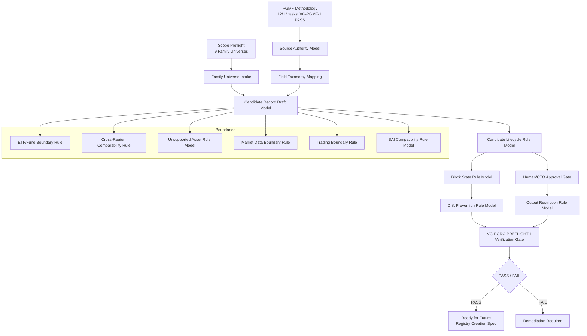
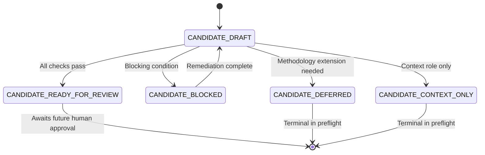
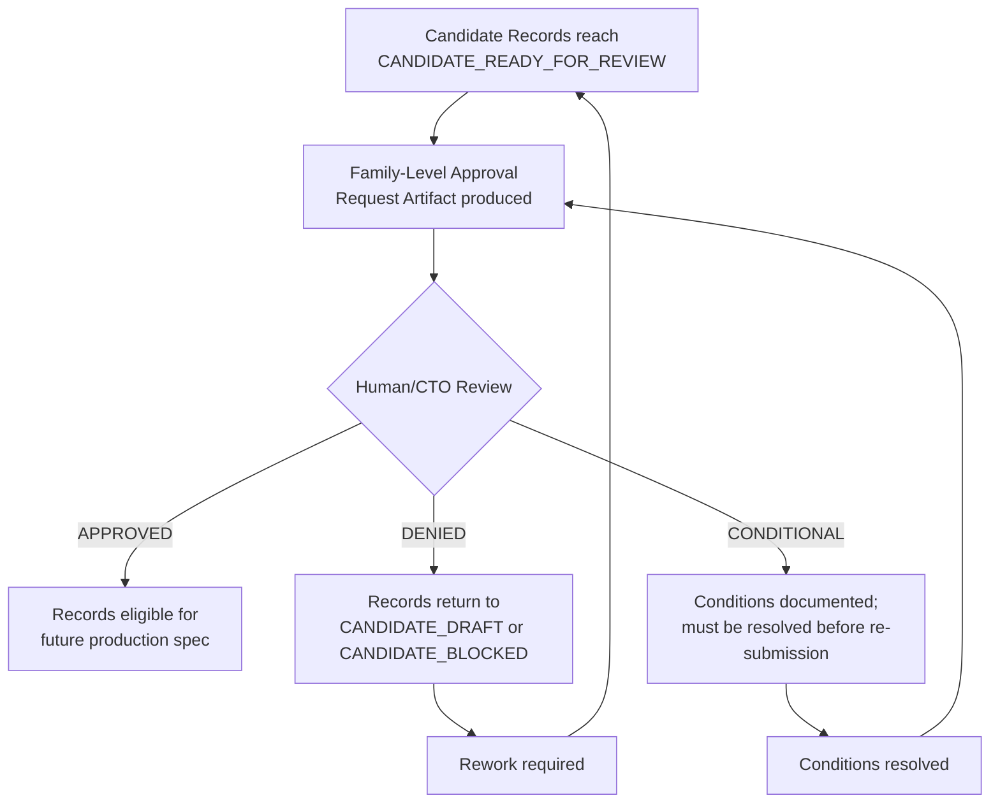

# Design Document

> **Peer Group Registry Creation Preflight — Design**
> Spec: peer-group-registry-creation-preflight | Date: 2026-06-10 | Authority: CTO / Architecture

---

## Design Status

| Dimension | Status |
|-----------|--------|
| design_status | DRAFT_READY_FOR_HUMAN_REVIEW |
| requirements_source | requirements.md v2 hardened |
| implementation_status | DOCUMENTATION_ONLY |
| registry_status | NOT_CREATED |
| candidate_record_status | DESIGN_ONLY_NOT_CREATED |
| runtime_status | NOT_IMPLEMENTED |
| sai_status | NOT_MUTATED |
| market_data_status | NOT_INTEGRATED |
| trading_status | OUT_OF_SCOPE |

---

## Overview

This design document defines the architecture for the Peer Group Registry Creation Preflight. It translates hardened requirements (v2) into a safe, documentation-only architecture that governs future preflight task execution. No candidate records are created by this design. No registry files are produced. No runtime code is implemented.

The design covers: intake model for the 9 confirmed family universes, candidate record draft model, candidate lifecycle states, block state taxonomy, field taxonomy mapping rules, ETF/Fund boundary enforcement, cross-region comparability handling, unsupported asset protection, market data boundary, trading boundary, SAI compatibility shape, human/CTO approval model, output restrictions, verification gate design, and drift prevention architecture.

**This design is a bridge between the completed PGMF methodology and future candidate record preparation. It is not a registry implementation.**

---

## Architecture Position

### Transition Chain

```
Completed PGMF Methodology (12/12 tasks, VG-PGMF-1 PASS)
    ↓
Peer Group Registry Creation Preflight (THIS DESIGN)
    ↓
Candidate-only record preparation design (documentation architecture)
    ↓
Human/CTO review of design
    ↓
Future: Preflight task execution (separate phase, creates candidate records)
    ↓
Future: Human/CTO approval of candidate records
    ↓
Future: Separate production registry creation spec (only after approval)
```

### Position Statement

This design occupies the architectural layer between completed methodology and future candidate record preparation. It defines HOW candidate records will be structured, governed, and validated — without creating those records. The design provides:

1. **Structural rules** — What fields, states, and relationships candidate records must carry
2. **Governance rules** — What approvals, evidence, and source authorities are required
3. **Boundary rules** — What the preflight may NOT do (trading, SAI mutation, production elevation)
4. **Verification rules** — How compliance is checked before downstream work begins

This design does NOT:
- Create candidate records
- Create registry files
- Assign peers
- Mint peer_group_id values
- Implement validation logic
- Produce runtime code

---

## Source Authority Model

### Source Foundation

| Source | Path | Role |
|--------|------|------|
| PGMF Artifacts | `.kiro/specs/peer-group-registry-methodology-framework/artifacts/` | Methodology authority — field taxonomy, peer role taxonomy, governance rules, boundary definitions |
| Scope Preflight | `.domainization/reports/peer_group_registry_scope_preflight_2026-06-07.md` | **Sole authority** for the 9 family universes — tickers, subclusters, benchmark instruments |
| PGMF Source Registry | `.domainization/sources/peer_group_methodology_source_registry_2026-06-08.md` | Source authority registry — 35 institutional sources across 9 categories |
| PGMF Evidence Matrix | `.domainization/reports/peer_group_methodology_evidence_matrix_2026-06-08.md` | Evidence support — Q1–Q10 evidence mapping |
| SAI Deferred Interfaces | `.kiro/specs/single-asset-intelligence-framework/artifacts/deferred_interfaces.md` | Downstream compatibility reference only (Section 2.3) |

### Authority Rules

1. PGMF artifacts are the sole methodology authority for candidate record field rules, peer role taxonomy, and governance lifecycle
2. The scope preflight document is the sole authority for family universe content (tickers, subclusters, benchmark instruments, unresolved decisions)
3. The PGMF source registry is the sole authority for institutional source traceability
4. The PGMF evidence matrix provides evidence support for Q1–Q10 decision linkage
5. The SAI deferred interface contract is a downstream compatibility reference only — it does not govern preflight decisions

### Extension Rule

No source outside the approved source foundation may be used unless human/CTO approval explicitly records the source extension with: approver identity, approval date, extension scope, and justification for why existing sources are insufficient.

---

## Architecture

### Component Architecture



### Layer Model

| Layer | Responsibility | Creates artifacts in this design? |
|-------|---------------|-------------------|
| Intake Layer | Ingests 9 family universes from scope preflight | No — defines intake structure only |
| Mapping Layer | Maps family universe data to PGMF field taxonomy | No — defines mapping rules only |
| Record Layer | Defines candidate record draft model | No — defines record shape only |
| Lifecycle Layer | Defines candidate state transition rules | No — defines state machine only |
| Boundary Layer | Defines ETF, market data, trading, SAI, unsupported boundary rules | No — defines boundary rules only |
| Governance Layer | Defines human/CTO approval, output restrictions, drift prevention rules | No — defines governance model only |
| Verification Layer | VG-PGRC-PREFLIGHT-1 gate definition | No — defines gate criteria only |

**Note**: This design document itself creates no candidate artifacts. Future preflight tasks may create documentation-only candidate/preflight artifacts as allowed by requirements, but may not create production registry files, final peer assignments, canonical peer_group_id values, runtime code, market-data integrations, or trading functionality.


---

## Components and Interfaces

### Component 1: Family Universe Intake

**Purpose**: Defines the intake model for ingesting PGF-01 through PGF-09 from the scope preflight document into the candidate preparation pipeline.

**Interface**: Each family universe intake record captures the following structure:

| Field | Type | Description | Required |
|-------|------|-------------|----------|
| `family_id` | string | PGF-01 through PGF-09 | Yes |
| `family_name` | string | Human-readable family name from scope preflight | Yes |
| `source_section_reference` | string | Exact section reference in scope preflight (e.g., "Section 5, Family PGF-01") | Yes |
| `core_universe_count` | integer | Number of core candidate tickers | Yes |
| `adjacent_universe_count` | integer | Number of adjacent candidate tickers (0 for PGF-08, N/A for PGF-09) | Yes |
| `core_candidate_tickers_from_source` | list[string] | Exact tickers from scope preflight core universe | Yes (except PGF-09) |
| `adjacent_candidate_tickers_from_source` | list[string] | Exact tickers from scope preflight adjacent universe | Yes (NONE_IN_SOURCE if absent) |
| `benchmark_context_candidates_from_source` | list[string] | ETFs/indices from scope preflight benchmark instruments | Yes |
| `subcluster_definitions_from_source` | list[object] | Subcluster names and member assignments from scope preflight | Yes |
| `unresolved_decisions_from_source` | list[string] | Open design questions from scope preflight | Yes |
| `boundary_notes_from_source` | list[string] | Cross-region, ADR, or other boundary notes from scope preflight | Yes (empty list if none) |
| `source_trace` | object | `{file_path, section, accessed_date}` | Yes |

### Family Universe Intake Summary

| Family ID | Family Name | Core | Adjacent | Notes |
|-----------|-------------|------|----------|-------|
| PGF-01 | AI Semiconductors / AI Infrastructure | 11 | 4 | Cross-region (TSM, ASML ADRs), subcluster assignment decisions |
| PGF-02 | Cybersecurity / SaaS Security | 9 | 3 | NET/DDOG subcluster assignment open |
| PGF-03 | Payments / Networks / Merchant Acquiring | 9 | 4 | AXP hybrid subcluster, ADYEN cross-region |
| PGF-04 | Mobility / Delivery / Local Commerce Platforms | 9 | 4 | UBER multi-subcluster, GRAB cross-region |
| PGF-05 | Consumer / Retail / Event Consumption | 11 | 5 | Broadest family, AMZN multi-segment |
| PGF-06 | Defense / Security / C-UAS / Public Safety AI | 12 | 4 | European defense cross-region (EUR/GBP/SEK) |
| PGF-07 | Industrials / Power / Grid / Cooling | 9 | 4 | European industrials cross-region (EUR/CHF), VRT cross-family |
| PGF-08 | Banks / Financials | 10 | 0 | European banks (EUR/CHF), zero adjacent |
| PGF-09 | ETF / Fund Peer Rule | N/A | N/A | Rule-based, no core ticker list |

### PGF-09 Special Intake Structure

PGF-09 is rule-based rather than ticker-based. Its intake structure differs:

| Field | Type | Description |
|-------|------|-------------|
| `family_id` | string | PGF-09 |
| `family_name` | string | ETF / Fund Peer Rule |
| `rule_statement` | string | "ETFs and funds do NOT receive company peer groups" |
| `etf_fund_comparison_dimensions` | list[string] | 10 dimensions: benchmark_index, TER, AUM, tracking_error, liquidity/bid-ask, holdings_overlap, domicile, distribution_policy, replication_method, concentration/look-through |
| `etf_fund_methodology_rules` | list[string] | ETF subcluster rules (ETF-A through ETF-D) |
| `benchmark_context_role_separation` | string | Rule: ETFs as benchmark_context in company families; as etf_peer only within PGF-09 |
| `subcluster_definitions_from_source` | list[object] | ETF-A (Thematic), ETF-B (Broad Market/Index), ETF-C (Sector), ETF-D (Active/Semi-Active) |
| `unresolved_decisions_from_source` | list[string] | UCITS vs US-domiciled peers, leveraged/inverse handling, AUM/TER cross-currency normalization |
| `source_trace` | object | `{file_path, section, accessed_date}` |

---

### Component 2: Candidate Record Draft Model

**Purpose**: Defines the non-production candidate record shape for future preflight task execution. Records described here are NOT created by this design.

**Candidate Record Fields**:

| Field | Type | Default Value | Description |
|-------|------|---------------|-------------|
| `candidate_record_id` | string | Generated during task execution | Unique identifier for this candidate record |
| `candidate_record_id_status` | enum | PREFLIGHT_NON_PRODUCTION | Indicates non-production status |
| `production_authority` | enum | NONE | Candidate records carry no production weight |
| `preliminary` | boolean | true | All preflight records are preliminary |
| `Candidate_Status` | enum | CANDIDATE_DRAFT | See Candidate Lifecycle Design |
| `family_id` | string | — | PGF-01 through PGF-09 |
| `family_name` | string | — | Human-readable family name |
| `asset_name` | string | — | Human-readable asset name |
| `asset_type` | enum | — | company / etf / fund / index / private_company / unsupported_asset_class |
| `object_type` | enum | — | Mirrors asset_type for PGMF field applicability |
| `legal_entity_name` | string | — | Legal entity name or fund name |
| `instrument_type` | enum | — | equity / etf / fund / adr / gdr / index / other |
| `ticker_candidates` | list[string] | — | Known ticker symbols (not stable primary keys) |
| `ISIN_candidates` | list[string] | — | Known ISIN values (REQUIRED_IF_AVAILABLE) |
| `exchange_candidates` | list[string] | — | Known exchange MICs |
| `region` | string | — | Geographic region |
| `domicile` | string | — | ISO 3166-1 alpha-2 country code |
| `reporting_currency` | string | — | ISO 4217 currency code |
| `trading_currency` | string | — | ISO 4217 currency code (per listing venue) |
| `accounting_standard` | enum | — | GAAP / IFRS / other |
| `fiscal_year_end` | string | — | Three-letter month (e.g., DEC) |
| `listing_variant_type` | enum | — | primary / ADR / GDR / secondary |
| `source_authority_status` | enum | — | VERIFIED / SOURCE_EVIDENCE_MISSING / DOMAIN_SCOPE_VIOLATION |
| `source_authority_references` | list[object] | — | `[{source_id, authority_domain, tier_level, field_name}]` |
| `methodology_decision_references` | list[string] | — | PGMF-DEC-01 through PGMF-DEC-10 references |
| `field_taxonomy_mapping_status` | enum | — | COMPLETE / INCOMPLETE / BLOCKED |
| `peer_role` | enum | — | core_peer / adjacent_peer / benchmark_context / etf_peer / excluded_non_peer / private_comparable_context |
| `peer_group_id` | string | PREFLIGHT_PLACEHOLDER_NOT_CANONICAL | **Never** canonical during preflight |
| `peer_group_id_status` | enum | NOT_CREATED | Canonical IDs are not minted in preflight |
| `peer_comparison_allowed` | boolean | false | No peer comparison until production registry exists |
| `blocked_reason` | string | null | Populated when Candidate_Status = CANDIDATE_BLOCKED |
| `unsupported_status` | string | null | Populated for unsupported asset classes |
| `comparability_adjustment_required` | boolean | — | Required for cross-region records |
| `comparability_note` | string | — | Required when comparability_adjustment_required = true |
| `market_data_fields_status` | enum | NOT_POPULATED_IN_PREFLIGHT | Market data fields are reserved only |
| `trading_governance_fields_status` | enum | FUTURE_COMPLIANCE_REFERENCE_NOT_OPERATIONAL | Trading fields are future references only |
| `SAI_contract_status` | enum | PREFLIGHT_NOT_CANONICAL | SAI cannot consume candidate records as production |
| `human_review_status` | enum | NOT_REVIEWED | Tracks human/CTO review state |
| `CTO_approval_status` | enum | NOT_APPROVED | Tracks CTO approval state |
| `notes` | string | null | Free-text notes for human reviewers |


---

### Component 3: Candidate Lifecycle Rule Model

**Purpose**: Defines the state machine rules governing candidate record transitions during future preflight task execution. This is a documentation-only rule model, not an executable engine.

### Component 4: Block State Rule Model

**Purpose**: Defines all block state rules that halt candidate record processing during future task execution. This is a rule taxonomy, not a runtime handler.

### Component 5: Boundary Rule Layer

**Purpose**: Defines ETF/Fund, market data, trading, SAI, cross-region, and unsupported asset boundary rules. This is a rule set for future task compliance, not a runtime enforcement layer.

### Component 6: Governance Layer

**Purpose**: Defines human/CTO approval gate rules, output restriction rules, and drift prevention rules.

### Component 7: Verification Gate (VG-PGRC-PREFLIGHT-1)

**Purpose**: Defines the final compliance check criteria that must be satisfied before downstream registry creation work may begin.

---

## Data Models

### Candidate Lifecycle Design

**Allowed states** (exhaustive — no other states permitted):

| State | Description | Permitted Transitions |
|-------|-------------|----------------------|
| `CANDIDATE_DRAFT` | Initial state; record created but not yet validated | → CANDIDATE_READY_FOR_REVIEW, → CANDIDATE_BLOCKED, → CANDIDATE_DEFERRED, → CANDIDATE_CONTEXT_ONLY |
| `CANDIDATE_READY_FOR_REVIEW` | Record passes all field taxonomy, source authority, and boundary checks | → Human/CTO Approval (future production — outside preflight scope) |
| `CANDIDATE_BLOCKED` | Record has a blocking condition preventing progress | → CANDIDATE_DRAFT (after remediation) |
| `CANDIDATE_DEFERRED` | Record requires future methodology extension — not actionable in this preflight | Terminal within preflight |
| `CANDIDATE_CONTEXT_ONLY` | Record provides context (private_comparable_context or benchmark_context) but no peer comparison | Terminal within preflight |

**Prohibited states**: No ACTIVE. No APPROVED. No production lifecycle. No automated promotion.

**State Transition Rules**:

1. CANDIDATE_DRAFT → CANDIDATE_READY_FOR_REVIEW requires:
   - All CURRENT_METHODOLOGY fields populated or gap-documented
   - At least one Source_Authority reference per methodology-decision field
   - Zero boundary violations (ETF, market data, trading, SAI, unsupported)
   - Zero drift violations
   - field_taxonomy_mapping_status = COMPLETE

2. CANDIDATE_DRAFT → CANDIDATE_BLOCKED requires:
   - At least one blocking condition triggered (see Block State Design below)
   - blocked_reason populated with specific block state identifier

3. CANDIDATE_BLOCKED → CANDIDATE_DRAFT requires:
   - Blocking condition resolved and documented
   - Resolution evidence recorded

4. No state may transition directly to production status within preflight scope



---

### Block State Design

Each block state defines a specific condition that prevents a candidate record from progressing. All block states set Candidate_Status = CANDIDATE_BLOCKED.

| Block State | Trigger | Required Response | Candidate Status Outcome | Remediation Expectation |
|-------------|---------|-------------------|--------------------------|------------------------|
| `BLOCK_SOURCE_INSUFFICIENT` | Methodology-decision field cannot trace to any source in PGMF source registry | Flag field as SOURCE_EVIDENCE_MISSING; document gap | CANDIDATE_BLOCKED | Identify and provide valid source from PGMF source registry within correct authority domain |
| `BLOCK_IDENTITY_UNRESOLVED` | canonical_object_id cannot be confirmed for the asset | Block all assignment; flag for identity resolution | CANDIDATE_BLOCKED | Resolve identity through verified institutional identifier (FIGI, ISIN, or equivalent) |
| `BLOCK_UNSUPPORTED_ASSET_CLASS` | Asset's object_type matches unsupported asset class list | Set unsupported_status = UNSUPPORTED_ASSET_CLASS_NEEDS_SCOPE_DECISION; set peer_comparison_allowed = false; set blocked_reason = BLOCK_UNSUPPORTED_ASSET_CLASS | CANDIDATE_BLOCKED | Requires future methodology extension spec with human/CTO approval |
| `BLOCK_ETF_COMPANY_FALLBACK` | ETF/fund assigned core_peer or adjacent_peer against company, or company assigned etf_peer | Reject record; log BOUNDARY_VIOLATION_ETF_COMPANY_FALLBACK | CANDIDATE_BLOCKED | Correct peer_role assignment to respect ETF/company boundary (PGMF-DEC-05) |
| `BLOCK_CROSS_REGION_COMPARABILITY_UNVERIFIED` | comparability_adjustment_required = true but comparability_note is null/empty, OR cross-region fields incomplete | Set CROSS_REGION_COMPARABILITY_INCOMPLETE or CROSS_REGION_FIELDS_INCOMPLETE | CANDIDATE_BLOCKED | Populate all 7 required cross-region fields with valid values |
| `BLOCK_MARKET_DATA_AS_METHODOLOGY_PROXY` | Market data availability used as criterion for peer_role or Candidate_Status | Reject decision; restore methodology-only basis | CANDIDATE_BLOCKED | Remove market data dependency from methodology decision; re-evaluate on methodology grounds only |
| `BLOCK_TRADING_ELIGIBILITY_INFERENCE` | Trading governance field set to value other than FUTURE_COMPLIANCE_REFERENCE_NOT_OPERATIONAL | Reject record; classify as TRADING_BOUNDARY_VIOLATION | CANDIDATE_BLOCKED | Reset all trading governance fields to FUTURE_COMPLIANCE_REFERENCE_NOT_OPERATIONAL |
| `BLOCK_PRIVATE_COMPANY_FINAL_PEER_ASSIGNMENT` | Private company assigned core_peer or adjacent_peer (only private_comparable_context allowed) | Restrict peer_role to private_comparable_context | CANDIDATE_BLOCKED | Change peer_role to private_comparable_context per PGMF-DEC-07 |
| `BLOCK_DERIVATIVE_AS_PEER_MEMBER` | Derivative, option, warrant, certificate, leveraged product, or structured product assigned peer role other than excluded_non_peer | Reject; enforce unsupported asset handling | CANDIDATE_BLOCKED | Reclassify as excluded_non_peer per PGMF Task 9 |
| `BLOCK_PEER_GROUP_ID_CREATION` | Any attempt to mint or assign canonical peer_group_id during preflight | Reject; enforce PREFLIGHT_PLACEHOLDER_NOT_CANONICAL | CANDIDATE_BLOCKED | Remove canonical ID; restore placeholder value |
| `BLOCK_REGISTRY_CREATION` | Any attempt to create peer_group_registry.yaml or production registry file | Halt artifact production; log OUTPUT_RESTRICTION_VIOLATION | CANDIDATE_BLOCKED | Remove forbidden artifact; restrict to candidate_ prefix or _preflight suffix only |
| `BLOCK_SAI_CONTRACT_SHAPE_VIOLATION` | Candidate record output shape omits SAI output contract field or assigns production-authority value | Reject record; log SAI_CONTRACT_SHAPE_VIOLATION | CANDIDATE_BLOCKED | Add missing fields with PREFLIGHT_NOT_CANONICAL values; remove production-authority values |
| `BLOCK_OUTPUT_RESTRICTION_VIOLATION` | Output artifact violates naming conventions, contains forbidden field values, or implies final peer assignments | Halt production; log OUTPUT_RESTRICTION_VIOLATION | CANDIDATE_BLOCKED | Rename artifact with candidate_ prefix or _preflight suffix; remove forbidden values |
| `BLOCK_DRIFT_VIOLATION` | Any of the 8 drift categories detected | Halt processing; produce DRIFT_VIOLATION entry | CANDIDATE_BLOCKED | Resolve drift violation; return record to CANDIDATE_DRAFT |


---

### Field Taxonomy Mapping Design

**Purpose**: Defines how PGMF field taxonomy categories map to candidate record population during future task execution.

| Scope Label | Preflight Behavior | Value in Candidate Record |
|-------------|-------------------|---------------------------|
| `CURRENT_METHODOLOGY` | Populate from source authority; requires PGMF source registry reference | Actual methodology-derived value (e.g., peer_role, accounting_standard) |
| `CURRENT_MODEL_NULLABLE` | Field exists in record structure; value remains null | `null` |
| `DEFERRED` | Field exists; carries mandated deferred value | Mandated deferred value (e.g., `threshold_calibration_status = NUMERIC_THRESHOLDS_DEFERRED`) |
| `FUTURE_SCOPE` | Field placeholder reserved; not populated | `NOT_POPULATED_IN_PREFLIGHT` |
| `FUTURE_VENDOR_INTEGRATION` | Field placeholder reserved; requires commercial agreement | `NOT_POPULATED_IN_PREFLIGHT` |
| `FUTURE_COMPLIANCE_REFERENCE` | Field is vocabulary reference only; no operational weight | `FUTURE_COMPLIANCE_REFERENCE_NOT_OPERATIONAL` |

**Mapping Rules**:

1. Every CURRENT_METHODOLOGY field with requirement status REQUIRED must be populated or the record is CANDIDATE_BLOCKED
2. Every CURRENT_METHODOLOGY field with requirement status REQUIRED_IF_AVAILABLE must be populated OR carry a documented gap rationale
3. Fields with requirement status NOT_APPLICABLE for the record's asset_type are absent or explicitly marked NOT_APPLICABLE
4. Field applicability is determined by the record's asset_type against the field taxonomy's asset_type applicability column
5. No value other than NOT_POPULATED_IN_PREFLIGHT or FUTURE_COMPLIANCE_REFERENCE_NOT_OPERATIONAL may be assigned to FUTURE_SCOPE, FUTURE_VENDOR_INTEGRATION, or FUTURE_COMPLIANCE_REFERENCE fields

---

### ETF/Fund Boundary Design

**Purpose**: Enforces the architectural boundary between ETF/fund assets and company assets (PGMF-DEC-05).

**Core Rules**:

1. ETFs and funds (asset_type ∈ {etf, fund}) are NEVER company peers
2. Within PGF-09, ETF/fund assets use peer_role = `etf_peer`
3. ETFs in company families (PGF-01 through PGF-08) carry peer_role = `benchmark_context` exclusively
4. No ETF-to-company fallback: an ETF may not be assigned core_peer or adjacent_peer against a company
5. No company-to-ETF fallback: a company may not be assigned etf_peer

**Boundary Violation Detection**:

| Violation Type | Condition | Action |
|----------------|-----------|--------|
| ETF as company peer | ETF/fund asset has peer_role ∈ {core_peer, adjacent_peer} against company asset | BLOCK_ETF_COMPANY_FALLBACK |
| Company as ETF peer | Company asset has peer_role = etf_peer | BLOCK_ETF_COMPANY_FALLBACK |
| ETF comparison fields in company family | ETF-specific fields (TER, AUM, tracking_difference, etc.) populated on benchmark_context record in PGF-01 through PGF-08 | Remove ETF-specific fields; they apply only within PGF-09 |

**PGF-09 Required Fields** (for etf_peer records):

| Field | Description |
|-------|-------------|
| `benchmark_index` | What index the ETF replicates |
| `TER` | Total Expense Ratio |
| `AUM` | Assets Under Management |
| `tracking_difference` | Actual vs. index return deviation |
| `tracking_error` | Volatility of tracking difference |
| `spread` | Bid-ask spread / liquidity quality |
| `holdings_overlap` | Portfolio overlap with peer ETFs |
| `replication_method` | Physical full / physical sampled / synthetic |
| `distribution_policy` | Accumulating / distributing |
| `lookthrough_concentration` | Top holdings weight, single-name concentration |

---

### Cross-Region Comparability Design

**Purpose**: Ensures cross-region differences are visible and never silently normalized (PGMF-DEC-08).

**Required Fields for Cross-Region Records**:

| Field | Type | Description |
|-------|------|-------------|
| `accounting_standard` | enum | GAAP / IFRS / other |
| `reporting_currency` | string | ISO 4217 |
| `trading_currency` | string | ISO 4217 |
| `fiscal_year_end` | string | Three-letter month |
| `taxonomy_reference` | enum | GICS / ICB / other |
| `comparability_adjustment_required` | boolean | Must be true when accounting_standard differs between peers |
| `comparability_note` | string | Documents which adjustments are needed |

**Additional listing fields**:

| Field | Type | Description |
|-------|------|-------------|
| `listing_variant_type` | enum | primary / ADR / GDR / secondary |
| `exchange_mic` | string | ISO 10383 four-character MIC |

**Cross-Region Rules**:

1. When any two assets in the same family differ in accounting_standard, reporting_currency, or domicile — all cross-region fields are REQUIRED on each asset
2. If comparability_adjustment_required = true but comparability_note is null/empty → CANDIDATE_BLOCKED (CROSS_REGION_COMPARABILITY_INCOMPLETE)
3. If accounting_standard differs between peers in same family (GAAP vs. IFRS) → comparability_adjustment_required = true on BOTH records
4. Cross-region differences must be visible — may NOT be silently normalized
5. Missing any of the 7 required cross-region fields → CANDIDATE_BLOCKED (CROSS_REGION_FIELDS_INCOMPLETE)

**Affected Families**:

| Family | Cross-Region Assets | Currency Issues |
|--------|--------------------|--------------| 
| PGF-01 | TSM (TWD/USD ADR), ASML (EUR/USD ADR), ARM (GBP/USD ADR) | TWD, EUR, GBP reporting vs. USD trading |
| PGF-03 | ADYEN (EUR) | EUR reporting and trading |
| PGF-04 | DHER (EUR), MEIT (CNY), GRAB (SGD/USD) | EUR, CNY, SGD vs. USD |
| PGF-05 | ADS/Adidas (EUR) | EUR reporting |
| PGF-06 | Rheinmetall, Hensoldt, Thales (EUR), Leonardo (EUR), Saab (SEK), BAE (GBP) | EUR, SEK, GBP |
| PGF-07 | Schneider Electric (EUR), Siemens (EUR), ABB (CHF), Prysmian (EUR) | EUR, CHF |
| PGF-08 | SAN (EUR), BNP (EUR), DB (EUR), UBS (CHF) | EUR, CHF |

---

### Unsupported Asset Handling Design

**Purpose**: All unsupported asset classes are blocked, deferred, or context-only. No peer assignment for unsupported types.

**Unsupported Asset Classes** (from PGMF Task 9):

Derivatives, options, warrants, certificates, leveraged products, structured products, crypto/tokenized assets, commodities, FX pairs, bonds/fixed-income, money-market instruments, indices (except benchmark_context), baskets, synthetic exposures, private equity (except private_comparable_context), unresolved identities.

**Handling Rules**:

1. Unsupported assets receive Candidate_Status = CANDIDATE_BLOCKED (or CANDIDATE_DEFERRED where future methodology extension is required); unsupported_status = UNSUPPORTED_ASSET_CLASS_NEEDS_SCOPE_DECISION; blocked_reason = BLOCK_UNSUPPORTED_ASSET_CLASS
2. peer_comparison_allowed = false for all unsupported assets
3. Peer_role restricted to: excluded_non_peer (default), private_comparable_context (private companies only), benchmark_context (indices only)
4. No ad-hoc peer sets created to fill coverage gaps
5. If an asset in a confirmed family universe (PGF-01 through PGF-09) is determined to be unsupported → remove from active candidate preparation, set Candidate_Status = CANDIDATE_BLOCKED, set unsupported_status = UNSUPPORTED_ASSET_CLASS_NEEDS_SCOPE_DECISION, document removal

---

### Market Data Boundary Design

**Purpose**: Market data fields are reserved only. No vendor coverage affects peer_role or Candidate_Status.

**Reserved Market Data Fields** (all carry NOT_POPULATED_IN_PREFLIGHT):

| Field Category | Fields | Preflight Value |
|----------------|--------|----------------|
| CURRENT_MODEL_NULLABLE (8 fields) | market_data_source, data_vendor, data_latency_class, exchange_timezone, trading_calendar_id, derived_data_policy, index_license_required, stale_quote_threshold | `null` |
| FUTURE_VENDOR_INTEGRATION (9 fields) | realtime_entitlement_required, display_usage_allowed, non_display_usage_allowed, redistribution_allowed, professional_user_flag, market_data_audit_required, bid_ask_source, quote_timestamp_required, market_data_feed_id | `NOT_POPULATED_IN_PREFLIGHT` |

**Boundary Rules**:

1. Market data availability (price feeds, vendor coverage, exchange connectivity) is NOT a criterion for peer methodology eligibility
2. Market data availability is NOT a criterion for peer_role assignment
3. Lack of market data coverage does NOT downgrade or block peer methodology eligibility
4. No peer_role assignment, Candidate_Status transition, or financial_comparability_gate_status decision may reference market data availability
5. VG-PGRC-PREFLIGHT-1 verifies: zero candidate records have peer_role or Candidate_Status derived from market data field availability


---

### Trading Boundary Design

**Purpose**: Trading governance fields are future compliance references only. No tradability is inferred from peer methodology.

**Reserved Trading Governance Fields** (all carry FUTURE_COMPLIANCE_REFERENCE_NOT_OPERATIONAL):

| Field | Type | Preflight Value |
|-------|------|----------------|
| `execution_venue_eligible` | boolean | FUTURE_COMPLIANCE_REFERENCE_NOT_OPERATIONAL |
| `best_execution_required` | boolean | FUTURE_COMPLIANCE_REFERENCE_NOT_OPERATIONAL |
| `order_routing_policy_required` | boolean | FUTURE_COMPLIANCE_REFERENCE_NOT_OPERATIONAL |
| `pre_trade_controls_required` | boolean | FUTURE_COMPLIANCE_REFERENCE_NOT_OPERATIONAL |
| `price_collar_policy` | string | FUTURE_COMPLIANCE_REFERENCE_NOT_OPERATIONAL |
| `max_order_value_policy` | string | FUTURE_COMPLIANCE_REFERENCE_NOT_OPERATIONAL |
| `kill_switch_required` | boolean | FUTURE_COMPLIANCE_REFERENCE_NOT_OPERATIONAL |
| `audit_log_required` | boolean | FUTURE_COMPLIANCE_REFERENCE_NOT_OPERATIONAL |
| `surveillance_required` | boolean | FUTURE_COMPLIANCE_REFERENCE_NOT_OPERATIONAL |
| `market_abuse_monitoring_required` | boolean | FUTURE_COMPLIANCE_REFERENCE_NOT_OPERATIONAL |
| `tradability_status` | enum | FUTURE_COMPLIANCE_REFERENCE_NOT_OPERATIONAL |
| `trading_enabled` | boolean | FUTURE_COMPLIANCE_REFERENCE_NOT_OPERATIONAL |
| `trade_block_reason` | string | FUTURE_COMPLIANCE_REFERENCE_NOT_OPERATIONAL |

**Boundary Rules**:

1. No tradability, execution eligibility, broker connectivity, order-routing authority, or trading readiness is inferred from peer methodology
2. All 13 trading governance fields carry FUTURE_COMPLIANCE_REFERENCE_NOT_OPERATIONAL — no other value permitted during preflight
3. No connectivity endpoints, connection strings, venue identifiers, or active connectivity assertions are produced
4. No output states, asserts, or represents MoneyHorst as a broker-dealer, investment firm, exchange participant, or regulated trading venue
5. If any trading field carries a value other than FUTURE_COMPLIANCE_REFERENCE_NOT_OPERATIONAL → BLOCK_TRADING_ELIGIBILITY_INFERENCE

---

### SAI Compatibility Design

**Purpose**: Defines the candidate record output shape for future SAI compatibility without mutating SAI.

**SAI Interaction Model**:

| SAI Capability | Allowed? | Condition |
|----------------|----------|-----------|
| SAI reads candidate statuses | Yes | Read-only; no operational consumption |
| SAI-BLK-21 unblocked | No | Stays BLOCK_FINAL_PEER_ASSIGNMENT until production registry exists |
| Candidate records satisfy SAI deferred interface | No | candidate records carry no production authority |
| SAI creates peers/IDs/runtime | No | Absolutely prohibited |
| SAI surfaces blocked reasons from candidates | Yes | Informational only |

**SAI-BLK-21 Status**: BLOCK_FINAL_PEER_ASSIGNMENT remains active. peer_comparison_allowed = false. blocked_reason = "Peer Group Registry not yet available — candidate records in preflight do not constitute production registry."

**17 SAI Output Contract Fields** (shape references with PREFLIGHT_NOT_CANONICAL):

| Field | Type | Preflight Value | Description |
|-------|------|----------------|-------------|
| `peer_group_available` | boolean | false | No peer group registry exists |
| `peer_comparison_allowed` | boolean | false | No peer comparison permitted |
| `blocked_reason` | string | "Peer Group Registry not yet available" | Explains block state |
| `unsupported_status` | string | null or specific status | Populated for unsupported assets |
| `primary_family` | string | PREFLIGHT_NOT_CANONICAL | Candidate family assignment |
| `secondary_family` | string | PREFLIGHT_NOT_CANONICAL | Cross-family membership (if applicable) |
| `peer_role` | enum | PREFLIGHT_NOT_CANONICAL | Preliminary role (not final) |
| `core_peer_set` | list[string] | PREFLIGHT_NOT_CANONICAL | Not populated — requires production registry |
| `adjacent_peer_set` | list[string] | PREFLIGHT_NOT_CANONICAL | Not populated — requires production registry |
| `benchmark_context_set` | list[string] | PREFLIGHT_NOT_CANONICAL | Candidate benchmark instruments |
| `etf_peer_set` | list[string] | PREFLIGHT_NOT_CANONICAL | PGF-09 only — candidate ETF peers |
| `comparison_mode_allowed` | enum | PREFLIGHT_NOT_CANONICAL | No comparison mode active |
| `financial_comparability_gate_status` | enum | PREFLIGHT_NOT_CANONICAL | Not evaluated in preflight |
| `comparability_note` | string | PREFLIGHT_NOT_CANONICAL | Populated for cross-region records |
| `data_quality_status` | enum | PREFLIGHT_NOT_CANONICAL | Not evaluated in preflight |
| `as_of_date` | date | PREFLIGHT_NOT_CANONICAL | Candidate preparation date |
| `methodology_version` | string | PREFLIGHT_NOT_CANONICAL | PGMF v1 reference |

**SAI Contract Rules**:

1. Every candidate record MUST include all 17 SAI output contract fields
2. Each field carries either a derivable candidate value OR PREFLIGHT_NOT_CANONICAL
3. No field may carry a production-authority value
4. If any field is missing or carries production authority → BLOCK_SAI_CONTRACT_SHAPE_VIOLATION
5. SAI must not create peers, IDs, or runtime behavior from candidate records
6. The no-ad-hoc-peer rule is preserved: SAI never creates ad-hoc peers to compensate for missing/candidate registry entries

---

### Human/CTO Approval Design

**Purpose**: Defines the mandatory approval model for candidate record elevation. No automated approval path exists.

**Approval Gate Structure**:



**Approval Record Requirements**:

| Field | Type | Description |
|-------|------|-------------|
| `approver_identity` | string | CTO or explicitly CTO-delegated reviewer |
| `approval_decision` | enum | APPROVED / DENIED / CONDITIONAL |
| `approval_date` | date | Date of decision |
| `approval_scope` | string | Which specific records and/or families are covered |
| `conditions` | list[string] | Required only if CONDITIONAL — structured list of conditions |
| `rejection_rationale` | string | Required if DENIED — documented reason |

**Approval Rules**:

1. Human/CTO approval is mandatory prerequisite before any candidate transitions to production
2. No automated pathway bypasses human/CTO approval
3. If DENIED → records return to CANDIDATE_DRAFT or CANDIDATE_BLOCKED with rejection rationale
4. If CONDITIONAL → all conditions must be resolved and documented before re-submission
5. Reworked records must re-enter the approval gate through CANDIDATE_READY_FOR_REVIEW

**Approval Scope Clarification**:

- Human/CTO approval inside this preflight approves **candidate readiness only**
- It does NOT activate production registry use
- It does NOT convert candidate records into production registry entries
- A separate future production registry creation spec is still required after approval
- APPROVED candidate records remain non-production until a separate spec creates the production registry with its own approval cycle

**Family-Level Approval Request Artifact Contents**:

- Complete list of candidate records with Candidate_Status history
- Source authority references per record
- Evidence gaps (if any remain as accepted risks)
- Field taxonomy compliance summary
- Recommendation section for human/CTO review

---

### Output Restriction Design

**Purpose**: Defines what the preflight may and may not produce as artifacts.

**Allowed Outputs**:

| Output Type | Naming Convention | Example |
|-------------|-------------------|---------|
| Preflight specification documents | `candidate_` prefix or `_preflight` suffix | `candidate_pgf01_intake.md` |
| Candidate record draft artifacts | `candidate_` prefix | `candidate_records_pgf01_draft.yaml` |
| Mapping worksheets | `candidate_` prefix or `_preflight` suffix | `candidate_field_mapping_pgf01.md` |
| Evidence gap documentation | `candidate_` prefix or `_preflight` suffix | `candidate_evidence_gaps_pgf01.md` |
| Verification gate artifacts | `gate_` prefix | `gate_vg_pgrc_preflight_1.md` |

**Forbidden Outputs**:

| Forbidden | Why |
|-----------|-----|
| `peer_group_registry.yaml` | Production registry — not created in preflight |
| Files with "registry" without `candidate_` prefix or `_preflight` suffix | Could be mistaken for production |
| Files containing "production", "canonical", or "approved" in reference to peer group records | Implies production authority |
| Files with canonical peer_group_id values | IDs not minted in preflight |
| Runtime code or validation code | Not in scope |
| Executable implementations | Not in scope |
| Artifacts with lifecycle_status = ACTIVE or APPROVED | Production states forbidden |
| Artifacts with production_authority other than NONE | Production authority forbidden |
| Artifacts implying final peer assignments (missing Candidate_Status, missing preliminary: true) | Must always indicate draft status |

**Naming Convention Rule**: Every output filename MUST use `candidate_` prefix or `_preflight` suffix to distinguish draft artifacts from production content.


---

### Verification Gate Design

**Gate Identifier**: VG-PGRC-PREFLIGHT-1

**Artifact**: `gate_vg_pgrc_preflight_1.md`

**Purpose**: Single aggregate PASS/FAIL verdict that must be achieved before any future registry creation spec may begin.

**Gate Results** (permitted values):

| Result | Meaning |
|--------|---------|
| `PASS` | All 6 check categories pass; downstream work may begin |
| `FAIL` | One or more check categories fail; downstream work blocked |
| `BLOCKED_PENDING_REMEDIATION` | Failures identified; specific remediation documented |
| `READY_FOR_HUMAN_REVIEW` | Gate passes technical checks; awaits human/CTO confirmation |

**6 Check Categories**:

| # | Category | Pass Condition |
|---|----------|----------------|
| A | Family Universe Coverage | All 9 family universes have at least one candidate record with valid Candidate_Status OR explicit CANDIDATE_BLOCKED record documenting why processing could not proceed |
| B | Candidate Status Validity | Every candidate record carries a Candidate_Status from the permitted set (CANDIDATE_DRAFT, CANDIDATE_BLOCKED, CANDIDATE_DEFERRED, CANDIDATE_CONTEXT_ONLY, CANDIDATE_READY_FOR_REVIEW) |
| C | Source Authority Coverage | Every candidate record references at least one Source_Authority from the PGMF source registry |
| D | Field Taxonomy Compliance | Every candidate record has all CURRENT_METHODOLOGY fields populated or explicitly documented as a gap with CANDIDATE_BLOCKED status |
| E | Boundary Violation Zero | Zero BOUNDARY_VIOLATION errors across all candidate records (ETF, market data, trading, SAI, unsupported asset boundaries) |
| F | Human Approval Gate Defined | The human approval gate structure from Requirement 12 is defined and referenceable |

**Drift Detection Checklist** (part of VG-PGRC-PREFLIGHT-1):

| # | Drift Category | Check |
|---|----------------|-------|
| 1 | Registry drift | No candidate record silently transitioned to production |
| 2 | ID drift | No canonical peer_group_id values minted or assigned |
| 3 | Peer assignment drift | No peer_role treated as final assignment |
| 4 | Source authority drift | No sources outside PGMF source registry without human/CTO approval |
| 5 | Market data drift | No market data availability influenced peer methodology eligibility |
| 6 | SAI drift | No SAI artifact, gate, requirement, or verification status modified |
| 7 | Runtime drift | No runtime code, validation logic, API endpoints, or executable implementations created |
| 8 | Trading drift | No tradability, execution eligibility, broker connectivity, or trading readiness inferred |

Each drift category produces a per-category pass/fail result with: count of records inspected, count of violations found (expected: 0 for each).

**Gate Artifact Contents**:

```
gate_vg_pgrc_preflight_1.md
├── Aggregate Verdict: PASS | FAIL | BLOCKED_PENDING_REMEDIATION | READY_FOR_HUMAN_REVIEW
├── Check Category A: [pass/fail] — evidence reference
├── Check Category B: [pass/fail] — evidence reference
├── Check Category C: [pass/fail] — evidence reference
├── Check Category D: [pass/fail] — evidence reference
├── Check Category E: [pass/fail] — evidence reference
├── Check Category F: [pass/fail] — evidence reference
├── Drift Detection:
│   ├── Registry drift: [pass/fail] — records inspected: N, violations: 0
│   ├── ID drift: [pass/fail] — records inspected: N, violations: 0
│   ├── Peer assignment drift: [pass/fail] — records inspected: N, violations: 0
│   ├── Source authority drift: [pass/fail] — records inspected: N, violations: 0
│   ├── Market data drift: [pass/fail] — records inspected: N, violations: 0
│   ├── SAI drift: [pass/fail] — records inspected: N, violations: 0
│   ├── Runtime drift: [pass/fail] — records inspected: N, violations: 0
│   └── Trading drift: [pass/fail] — records inspected: N, violations: 0
├── Execution Timestamp: ISO 8601
└── Failure Report (if FAIL): categories failed, affected records/families, required remediation
```

**Execution Rule**: VG-PGRC-PREFLIGHT-1 MUST be explicitly executed as a leaf task. It must NOT be auto-completed, auto-inferred, or child-derived from other task completions.

---

### Drift Prevention Design

**Purpose**: Explicitly blocks all forms of drift so the candidate pipeline does not silently deviate from approved methodology, source authorities, candidate states, or architectural boundaries.

**8 Drift Categories**:

| # | Category | What It Prevents | Detection Mechanism | Result if Detected |
|---|----------|-----------------|--------------------|--------------------|
| 1 | Registry drift | Silent transition to production status | Check: no candidate record has lifecycle_status = ACTIVE or APPROVED, production_authority ≠ NONE | CANDIDATE_BLOCKED + DRIFT_VIOLATION |
| 2 | ID drift | Canonical peer_group_id creation | Check: all peer_group_id fields = PREFLIGHT_PLACEHOLDER_NOT_CANONICAL | CANDIDATE_BLOCKED + DRIFT_VIOLATION |
| 3 | Peer assignment drift | Final peer_role treatment | Check: all records carry preliminary = true; no Candidate_Status implies production | CANDIDATE_BLOCKED + DRIFT_VIOLATION |
| 4 | Source authority drift | Unauthorized source usage | Check: all source references exist in PGMF source registry; no external sources without approval | CANDIDATE_BLOCKED + DRIFT_VIOLATION |
| 5 | Market data drift | Market data influencing methodology | Check: no peer_role or Candidate_Status conditioned on market data availability | CANDIDATE_BLOCKED + DRIFT_VIOLATION |
| 6 | SAI drift | SAI artifact mutation | Check: no SAI artifact, gate, requirement, task plan, or verification status modified | CANDIDATE_BLOCKED + DRIFT_VIOLATION |
| 7 | Runtime drift | Code creation | Check: no runtime code, validation logic, API endpoints, database schemas, or executable implementations | CANDIDATE_BLOCKED + DRIFT_VIOLATION |
| 8 | Trading drift | Trading inference | Check: no tradability, execution eligibility, broker connectivity, order-routing, or trading readiness inferred/created | CANDIDATE_BLOCKED + DRIFT_VIOLATION |

**Drift Violation Response**:

When any drift category is detected:
1. Halt processing for the affected record
2. Set Candidate_Status = CANDIDATE_BLOCKED
3. Set blocked_reason = drift category identifier
4. Produce a DRIFT_VIOLATION entry documenting:
   - Drift category (1–8)
   - Affected record identifier
   - Specific field or value that violated the drift rule
   - Required remediation action
5. Record may not resume processing until drift is resolved and record returns to CANDIDATE_DRAFT

---

## Design Invariants

The following invariants are absolute and may not be violated by any task, artifact, or process within this preflight:

| # | Invariant | Enforcement |
|---|-----------|-------------|
| 1 | No production registry created | No peer_group_registry.yaml; no file with "registry" without candidate_ prefix or _preflight suffix |
| 2 | No final peer assignments | All peer_role values are preliminary; all records carry Candidate_Status |
| 3 | No canonical peer_group_id | All ID fields = PREFLIGHT_PLACEHOLDER_NOT_CANONICAL |
| 4 | No SAI mutation | No SAI artifact, gate, requirement, task plan, or verification status modified |
| 5 | No runtime code | No validation logic, API endpoints, database schemas, or executable implementations |
| 6 | No validation code | No programmatic validation — design only |
| 7 | No market data integration | Market data fields reserved only; no vendor coverage affects methodology |
| 8 | No broker/exchange/ATS/trading | No connectivity, no venues, no execution |
| 9 | No order routing | No routing logic, no venue selection |
| 10 | No execution logic | No trade execution, no fill handling |
| 11 | No compliance claims | MoneyHorst is not a broker-dealer, investment firm, exchange participant, or regulated trading venue |
| 12 | No Tactical Momentum work | Tactical Momentum Execution Gate Framework is out of scope |

**Invariant Violation Handling**: Any detected invariant violation immediately triggers CANDIDATE_BLOCKED + the appropriate BLOCK state + DRIFT_VIOLATION entry. No remediation pathway exists other than removing the violating content and returning to CANDIDATE_DRAFT.

---

## Error Handling

### Error Categories

| Error Type | Trigger | Severity | Response |
|------------|---------|----------|----------|
| `PGMF_DEPENDENCY_UNMET` | VG-PGMF-1 gate artifact missing or not PASS | CRITICAL | Halt all preflight execution |
| `SOURCE_EVIDENCE_MISSING` | Field cannot trace to PGMF source registry | HIGH | CANDIDATE_BLOCKED |
| `DOMAIN_SCOPE_VIOLATION` | Source cited outside its authority domain | HIGH | CANDIDATE_BLOCKED |
| `BOUNDARY_VIOLATION_ETF_COMPANY_FALLBACK` | ETF/company boundary crossed | HIGH | CANDIDATE_BLOCKED |
| `CROSS_REGION_COMPARABILITY_INCOMPLETE` | comparability_adjustment_required = true but note is empty | MEDIUM | CANDIDATE_BLOCKED |
| `CROSS_REGION_FIELDS_INCOMPLETE` | Missing required cross-region fields | MEDIUM | CANDIDATE_BLOCKED |
| `CROSS_STANDARD_COMPARISON_UNACKNOWLEDGED` | GAAP/IFRS difference without comparability_adjustment_required = true | MEDIUM | CANDIDATE_BLOCKED |
| `TRADING_BOUNDARY_VIOLATION` | Trading field set to non-FUTURE value | HIGH | CANDIDATE_BLOCKED |
| `SAI_CONTRACT_SHAPE_VIOLATION` | Missing SAI field or production-authority value | HIGH | CANDIDATE_BLOCKED |
| `OUTPUT_RESTRICTION_VIOLATION` | Forbidden filename, field value, or naming convention | HIGH | CANDIDATE_BLOCKED; halt artifact production |
| `DRIFT_VIOLATION` | Any of 8 drift categories | CRITICAL | CANDIDATE_BLOCKED; halt processing |
| `IDENTITY_UNRESOLVED` | canonical_object_id cannot be confirmed | HIGH | CANDIDATE_BLOCKED |
| `UNSUPPORTED_ASSET_CLASS_NEEDS_SCOPE_DECISION` | Asset class not supported by PGMF | MEDIUM | CANDIDATE_BLOCKED or CANDIDATE_DEFERRED |

### Error Response Pattern

For all errors:
1. Identify the specific error type and affected record
2. Document the error with: error type, affected field/value, expected behavior, actual behavior
3. Set appropriate Candidate_Status (usually CANDIDATE_BLOCKED)
4. Record blocked_reason with error type and details
5. No silent suppression — all errors must be visible in verification gate

---

## Correctness Properties

This is a documentation-only governance architecture with no executable logic, no runtime code, and no pure functions. Property-based testing (PBT) does not apply to this feature.

### Property 1: Documentation-Only Invariant

**Statement**: For all outputs O produced by this preflight spec: O is a documentation artifact (Markdown) AND O contains no executable code AND O creates no production registry entries.

**Validates: Requirements 13, 15**

**Verification method**: VG-PGRC-PREFLIGHT-1 Check Categories A–F and Drift Categories 1–8. This property is verified by checklist inspection during gate execution, not by automated PBT. No runtime functions exist to test.

**Verification mechanism**: The VG-PGRC-PREFLIGHT-1 verification gate serves as the comprehensive compliance check in place of PBT. It verifies all 6 check categories and 8 drift categories through structured checklist verification.

**Design correctness is ensured by**:
1. All 15 hardened requirements from requirements.md v2 are traced to design sections (see Requirements Traceability)
2. 14 block states prevent invalid candidate record states
3. 12 design invariants define absolute boundaries
4. 8 drift categories prevent unauthorized deviations
5. VG-PGRC-PREFLIGHT-1 produces explicit pass/fail evidence before downstream work begins

---

## Testing Strategy

### Assessment: Property-Based Testing Applicability

**PBT is NOT applicable to this feature.** Rationale:

1. This is a documentation-only architecture spec — no runtime code, no pure functions, no implementation logic
2. There are no functions with inputs/outputs to test
3. There is no algorithmic behavior that varies meaningfully with input
4. The design defines governance models, field taxonomies, and lifecycle rules — these are verified by the VG-PGRC-PREFLIGHT-1 gate through checklist verification, not through property-based testing
5. The appropriate testing approach is example-based verification through the verification gate artifact

### Verification Approach

| Verification Type | What It Checks | When |
|-------------------|---------------|------|
| Design Review | Human/CTO reviews design completeness and correctness | After design creation (this document) |
| Structural Verification | Candidate records match field taxonomy model | During future task execution |
| Boundary Verification | Zero violations across ETF, market data, trading, SAI, unsupported boundaries | During future task execution |
| Source Authority Verification | All methodology fields trace to PGMF source registry | During future task execution |
| Gate Verification (VG-PGRC-PREFLIGHT-1) | All 6 check categories + 8 drift categories | After all preflight tasks complete |

### Testing Strategy Summary

- **Unit tests**: Not applicable — no implementation code exists
- **Property-based tests**: Not applicable — documentation-only architecture
- **Integration tests**: Not applicable — no runtime integration
- **Verification gate**: VG-PGRC-PREFLIGHT-1 serves as the comprehensive compliance check
- **Human review**: Design and candidate records require human/CTO approval

Runtime property-based testing is intentionally omitted because this feature is documentation-only. Design correctness properties are documented above and verified through VG-PGRC-PREFLIGHT-1 and human/CTO review.

---

## Final Design Status

This design is ready for human review, not execution. The next step after approval is tasks.md generation for documentation-only preflight tasks. Candidate records may only be produced by explicitly approved future preflight tasks, and even then only as non-production candidate/preflight artifacts.

```
PEER_GROUP_REGISTRY_CREATION_PREFLIGHT_DESIGN_READY_FOR_HUMAN_REVIEW
```

### Design Completeness Checklist

| # | Section | Status |
|---|---------|--------|
| 1 | Design Status | Complete |
| 2 | Architecture Position | Complete |
| 3 | Source Authority Model | Complete |
| 4 | Family Universe Intake Design (PGF-01 through PGF-09) | Complete |
| 5 | Candidate Record Draft Model | Complete |
| 6 | Candidate Lifecycle Design | Complete |
| 7 | Block State Design (14 block states) | Complete |
| 8 | Field Taxonomy Mapping Design | Complete |
| 9 | ETF/Fund Boundary Design | Complete |
| 10 | Cross-Region Comparability Design | Complete |
| 11 | Unsupported Asset Handling Design | Complete |
| 12 | Market Data Boundary Design | Complete |
| 13 | Trading Boundary Design | Complete |
| 14 | SAI Compatibility Design (17 fields) | Complete |
| 15 | Human/CTO Approval Design | Complete |
| 16 | Output Restriction Design | Complete |
| 17 | Verification Gate Design (VG-PGRC-PREFLIGHT-1) | Complete |
| 18 | Drift Prevention Design (8 categories) | Complete |
| 19 | Design Invariants (12 invariants) | Complete |
| 20 | Final Design Status | Complete |

### Requirements Traceability

| Requirement | Design Section(s) |
|-------------|-------------------|
| R1: PGMF Dependency | Source Authority Model, Architecture Position |
| R2: Family Universe Intake | Family Universe Intake Design |
| R3: Candidate-Only Record Status | Candidate Record Draft Model, Candidate Lifecycle Design |
| R4: Source Authority Mapping | Source Authority Model, Block State (BLOCK_SOURCE_INSUFFICIENT) |
| R5: Field Taxonomy Mapping | Field Taxonomy Mapping Design |
| R6: ETF/Fund Boundary | ETF/Fund Boundary Design, Block State (BLOCK_ETF_COMPANY_FALLBACK) |
| R7: Cross-Region Comparability | Cross-Region Comparability Design, Block State (BLOCK_CROSS_REGION_COMPARABILITY_UNVERIFIED) |
| R8: Unsupported Asset Protection | Unsupported Asset Handling Design, Block State (BLOCK_UNSUPPORTED_ASSET_CLASS) |
| R9: Market Data Boundary | Market Data Boundary Design, Block State (BLOCK_MARKET_DATA_AS_METHODOLOGY_PROXY) |
| R10: Trading Boundary | Trading Boundary Design, Block State (BLOCK_TRADING_ELIGIBILITY_INFERENCE) |
| R11: SAI Compatibility | SAI Compatibility Design, Block State (BLOCK_SAI_CONTRACT_SHAPE_VIOLATION) |
| R12: Human Approval Gate | Human/CTO Approval Design |
| R13: Output Restrictions | Output Restriction Design, Block State (BLOCK_OUTPUT_RESTRICTION_VIOLATION) |
| R14: Verification Gate | Verification Gate Design (VG-PGRC-PREFLIGHT-1) |
| R15: Drift Prevention | Drift Prevention Design (8 categories), Block State (BLOCK_DRIFT_VIOLATION) |

---

*End of design document.*
