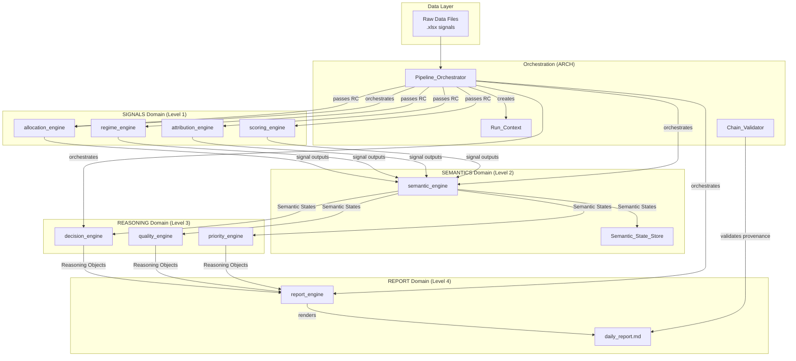
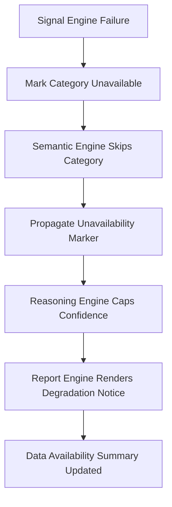

# Design Document: Report Runtime Integrity

## Overview

This design transforms the Portfolio OS report pipeline from a flat engine-runner model (where Signal Engines write briefing files directly consumed by Report Engines) into a layered chain-compliant architecture enforcing the canonical authority flow: SIGNALS → SEMANTICS → REASONING → REPORT.

The current `engine_runner.py` executes 12 engines in dependency order but does not enforce domain boundaries. Signal outputs (`.xlsx` files) flow directly into report engines, and 14 briefing `.txt` files bypass semantic interpretation entirely. This design introduces:

1. **Run_Context** — a temporal snapshot ensuring all engines operate on identical data
2. **Reasoning_Object schema** — a formal contract between REASONING and REPORT layers
3. **Semantic_State_Store** — persistence of canonical semantic snapshots between runs
4. **Pipeline_Orchestrator** — a chain-aware replacement for `engine_runner.py` that validates domain boundaries at runtime
5. **Chain_Validator** — runtime provenance verification ensuring no layer is skipped
6. **Deployment_Matrix** — formalized three-basket capital allocation model
7. **Severity taxonomy and runtime state model** — shared vocabulary for all governance-aware components
8. **Confidence degradation policy** — configurable formula for handling upstream failures

The design respects the FAST LANE REPORT MVP constraint: no plugin systems, no generic orchestration kernels, no enterprise governance engines. Each component is a concrete Python module with a single responsibility.

### Runtime Complexity Audit (Pre-Implementation)

Before task decomposition, the following runtime complexity risks have been identified and mitigated in this design:

| Risk | Mitigation |
|------|-----------|
| Runtime state ordering assumes linear severity | Multi-dimensional state model with orthogonal integrity dimensions (Hardening 1) |
| Report Engine becomes God Object | Decomposed into 4 sub-components: classifier, provenance assembler, section renderer, degradation renderer (Hardening 2) |
| YAML provenance in markdown is fragile | Canonical provenance lives in sidecar file; markdown embedding is informational only (Hardening 3) |
| Chain Validator recursive traversal | Pre-normalized immutable identifier graph with O(1) lookups (Hardening 4) |
| Anonymous temporal validity tuples | Explicit TemporalValidity model with valid_from, valid_until, stale_after (Hardening 5) |
| Destructive semantic snapshot overwrite | Immutable snapshot archive with latest pointer and historical replay (Hardening 6) |
| Untyped PipelineResult | Explicit typed PipelineResult dataclass contract (Hardening 7) |
| Byte-identical determinism too broad | Semantic determinism for markdown; byte-identity only for governed YAML serializations (Hardening 8) |

**Implementation goal:** Deterministic institutional reporting, not governance maximalism.

### Implementation Phasing

| Phase | Components | Goal |
|-------|-----------|------|
| A — Foundation | Run_Context, Reasoning_Object schema, Semantic persistence, Provenance schema, Severity taxonomy, Runtime state model, Schema version contracts | Establish data contracts |
| B — Chain Runtime | Chain Validator, Deterministic ordering, Report Engine rewrite, Degradation propagation, Section completeness states, Provenance performance | Execute the chain |
| C — Semantic Expansion | New semantic states, Deployment Matrix, Confidence governance, Portfolio/Watchlist separation | Expand coverage |
| D — Compatibility Cleanup | Briefing deprecation with sunset governance, Registry completion, Observability polish, Canonical boundary enforcement | Remove legacy |

## Architecture

### System Context



### Directory Structure (New Artifacts)

```
portfolio_os_v1/
├── engines/
│   ├── pipeline_orchestrator.py      # Replaces engine_runner.py orchestration
│   ├── engine_runner.py              # Retained for backward compat (deprecated)
│   ├── semantic_engine.py            # Extended for full 14-category coverage
│   └── report_engine.py             # Rewritten: decomposed into sub-components
├── runtime/
│   ├── run_context.py                # Run_Context creation and validation
│   ├── reasoning_object.py           # Reasoning_Object schema + TemporalValidity model
│   ├── semantic_state_store.py       # Immutable archive persistence layer
│   ├── chain_validator.py            # Pre-normalized graph-based provenance verification
│   ├── deployment_matrix.py          # Three-basket model schema
│   ├── severity_taxonomy.py          # Canonical severity levels
│   ├── runtime_state_model.py        # Multi-dimensional runtime states
│   ├── confidence_policy.py          # Configurable degradation policy
│   └── pipeline_result.py            # Typed PipelineResult contract
├── governance/
│   ├── provenance_schema.py          # Provenance structure + sidecar persistence
│   ├── schema_version_registry.py    # Version tracking for all schemas
│   └── canonical_boundary.py         # Canonical vs transient classification
├── output/
│   ├── daily_report.md               # Generated daily report (human-readable)
│   ├── <run_id>_provenance.yaml      # Canonical provenance sidecar (machine truth)
│   └── <run_id>_run_context.yaml     # Persisted run context per execution
└── state/
    ├── snapshots/                     # Immutable semantic snapshot archive
    │   └── <run_id>_semantic_snapshot.yaml
    ├── latest_snapshot.yaml           # Pointer to current canonical snapshot
    └── semantic_delta_log.yaml        # Append-only delta entries between runs
```


## Components and Interfaces

### Component 1: Run_Context (`runtime/run_context.py`)

**Domain:** ARCH  
**Responsibility:** Create and validate temporal snapshots for pipeline consistency.

```python
@dataclass
class DataSourceReference:
    file_path: str           # Relative path from project root
    content_hash: str        # SHA-256 of file content at snapshot time
    status: str              # "available" | "unavailable" | "inconsistent"

@dataclass
class RunContext:
    run_id: str              # UUID v4
    timestamp: str           # ISO 8601 UTC with second precision
    data_sources: list[DataSourceReference]
    schema_version: str      # Semantic version "1.0.0"
    pipeline_state: str      # Runtime state from canonical model
    report_hash: str | None  # SHA-256 of final daily_report.md (set after completion)

    def create(input_files: list[str]) -> "RunContext":
        """Snapshot all input files, compute hashes, return frozen context."""

    def validate_source(self, file_path: str) -> bool:
        """Verify file content hash matches recorded hash."""

    def persist(self, output_dir: str) -> str:
        """Write run context as YAML to output directory. Returns file path."""

    def load(file_path: str) -> "RunContext":
        """Load previously persisted run context for replay."""
```

**Interface contract:**
- Pipeline_Orchestrator creates exactly one RunContext per pipeline execution
- All engines receive the same RunContext instance
- RunContext is immutable after creation (no field mutation during pipeline run)
- Persisted as `<run_id>_run_context.yaml` in output directory

---

### Component 2: Reasoning_Object (`runtime/reasoning_object.py`)

**Domain:** REASONING  
**Responsibility:** Formal schema for the interface between REASONING and REPORT layers.

```python
@dataclass
class ActionImplication:
    action: str              # What could be done
    rationale: str           # Why it matters

@dataclass
class Conclusion:
    summary: str             # 1-1000 characters
    category: str            # Signal category this conclusion addresses

@dataclass
class ReasoningObject:
    reasoning_id: str                    # Unique, 1-128 chars
    source_semantic_states: list[str]    # signal_ids, 1-50 entries
    conclusion: Conclusion
    confidence_level: int                # 0-100
    confidence_explanation: str          # 1-500 chars
    action_implications: list[ActionImplication]  # 0-20 entries
    temporal_validity: "TemporalValidity"  # Explicit validity model
    producing_engine: str                # "decision_engine" | "quality_engine" | "priority_engine"
    schema_version: str                  # "1.0.0"

    def validate(self) -> list[str]:
        """Return list of validation errors. Empty list = valid."""

@dataclass
class TemporalValidity:
    """Explicit temporal validity model (Hardening 5).
    Replaces anonymous tuple semantics with named fields and stale-state handling."""
    valid_from: str          # ISO 8601 UTC — when this object becomes valid
    valid_until: str         # ISO 8601 UTC — when this object expires
    stale_after: str | None  # ISO 8601 UTC — when to warn about staleness (optional, before valid_until)

    @property
    def validity_state(self) -> str:
        """Return 'valid', 'stale', or 'expired' based on current time vs boundaries."""
```

**Interface contract:**
- Each Reasoning Engine produces exactly one ReasoningObject per signal category
- Report Engine rejects objects failing `validate()`
- `source_semantic_states` must reference signal_ids from the current RunContext's semantic snapshot

---

### Component 3: Semantic_State_Store (`runtime/semantic_state_store.py`)

**Domain:** SEMANTICS  
**Responsibility:** Persist semantic states between pipeline runs, maintain canonical snapshot.

```python
class SemanticStateStore:
    def __init__(self, state_dir: str = "state/"):
        """Initialize with directory for snapshot and delta files."""

    def save_snapshot(self, states: list[dict], run_context: RunContext) -> None:
        """Persist current semantic states as immutable archived snapshot.
        Archives previous snapshot (never overwrites destructively).
        Computes delta from previous snapshot and logs changes.
        Updates 'latest' pointer to new snapshot."""

    def load_snapshot(self) -> tuple[list[dict], str]:
        """Return (current canonical states, run_id that produced them).
        Reads from 'latest' pointer. Must complete within 5 seconds."""

    def load_historical(self, run_id: str) -> tuple[list[dict], str]:
        """Return historical snapshot for a specific run_id.
        Enables forensic replay and diff reconstruction."""

    def get_delta(self, run_id: str) -> dict:
        """Return delta entry for a specific run: additions, removals, changes."""
```

**Storage format (Hardening 6 — immutable archive):** YAML files in `state/` directory
- `state/snapshots/<run_id>_semantic_snapshot.yaml` — immutable archived snapshot per run (never overwritten)
- `state/latest_snapshot.yaml` — symlink or pointer to the most recent canonical snapshot
- `state/semantic_delta_log.yaml` — append-only log of deltas between runs

**Design Decision:** Semantic snapshots are NEVER destructively overwritten. Each run produces an immutable archive file. A stable `latest` pointer references the current canonical snapshot. Historical snapshots remain available for replay, rollback, and forensic diff reconstruction.

**Interface contract:**
- Write failure preserves previous snapshot unchanged
- Snapshot retrieval does not require re-running Semantic_Engine
- Delta records previous value, current value, and run_id for each change

---

### Component 4: Pipeline_Orchestrator (`engines/pipeline_orchestrator.py`)

**Domain:** ARCH  
**Responsibility:** Replace `engine_runner.py` with chain-aware orchestration that enforces domain boundaries.

```python
@dataclass
class PipelineResult:
    """Explicit pipeline result contract (Hardening 7).
    Avoids implicit dict-based orchestration outputs."""
    run_id: str
    runtime_state: str                    # From canonical RuntimeState enum
    generated_artifacts: list[str]        # File paths of all generated canonical artifacts
    degraded_categories: list[str]        # Signal categories that were unavailable
    severity_events: list[dict]           # All governance events emitted during execution
    report_path: str | None               # Path to daily_report.md (None if collapsed)
    provenance_path: str | None           # Path to provenance sidecar file
    run_context_path: str                 # Path to persisted run context
    deterministic_integrity_state: str    # "verified" | "unverified" | "failed"
    semantic_snapshot_path: str | None    # Path to archived semantic snapshot

class PipelineOrchestrator:
    def __init__(self, config_path: str = ".domainization/config.yaml"):
        """Load enforcement mode and observer configuration."""

    def execute(self, input_files: list[str] | None = None) -> PipelineResult:
        """Full pipeline execution:
        1. Create RunContext from input files
        2. Execute Signal Engines (Level 1)
        3. Execute Semantic Engine (Level 2) — produces Semantic States
        4. Persist Semantic States to store (immutable archive)
        5. Execute Reasoning Engines (Level 3) — produces Reasoning Objects
        6. Execute Report Engine (Level 4) — renders daily_report.md
        7. Persist provenance sidecar file
        8. Run Chain Validator on provenance sidecar
        9. Persist RunContext with report hash
        10. Return typed PipelineResult
        """

    def detect_forbidden_flows(self, engine_outputs: dict) -> list[GovernanceViolation]:
        """Check if any signal output reaches report without passing through
        SEMANTICS and REASONING layers."""

    def handle_engine_failure(self, engine_id: str, error: Exception) -> None:
        """Mark affected signal categories as unavailable, continue processing."""
```

**Interface contract:**
- Replaces `run_all_engines()` as the primary entry point
- `engine_runner.py` remains for backward compatibility but is deprecated
- Forbidden flow detection runs in observability mode (warnings only)
- Engine timeout: 60 seconds per engine

---

### Component 5: Chain_Validator (`runtime/chain_validator.py`)

**Domain:** GOV  
**Responsibility:** Verify provenance chain integrity for each report section.

**Design Decision (Hardening 4):** Chain validation operates on pre-normalized identifier graphs, not on repeated nested object traversal. Immutable runtime identifier maps and precomputed dependency edges prevent recursive deep graph walking during section validation.

```python
@dataclass
class ProvenanceBlock:
    section_name: str
    reasoning_object_ids: list[str]
    semantic_state_ids: list[str]
    signal_engine_ids: list[str]
    completeness_state: str  # "complete" | "partial" | "degraded" | "unavailable" | "invalid"
    unavailability_reasons: list[str]  # Empty if complete

@dataclass
class IdentifierGraph:
    """Pre-normalized, immutable identifier graph built once per pipeline run.
    Enables O(1) lookups and prevents recursive traversal during validation."""
    reasoning_to_semantics: dict[str, list[str]]  # reasoning_id → [semantic_state_ids]
    semantics_to_signals: dict[str, list[str]]    # signal_id → [signal_engine_ids]
    all_reasoning_ids: frozenset[str]
    all_semantic_ids: frozenset[str]
    all_signal_engine_ids: frozenset[str]

class ChainValidator:
    def __init__(self):
        self._graph: IdentifierGraph | None = None

    def build_graph(self, reasoning_objects: list, semantic_states: list) -> None:
        """Build immutable identifier graph with precomputed dependency edges.
        Called once per pipeline run before validation begins.
        All subsequent lookups are O(1) dict access."""

    def validate_section(self, provenance: ProvenanceBlock) -> list[GovernanceViolation]:
        """Verify chain completeness for a single section using pre-built graph.
        No recursive traversal — only dict lookups against the immutable graph."""

    def validate_all(self, provenance_blocks: list[ProvenanceBlock]) -> ValidationResult:
        """Validate all 9 sections. Must complete within 2 seconds total.
        Reads from canonical provenance sidecar file, not from markdown."""
```

**Interface contract:**
- Identifier graph is built once per run (immutable after construction)
- All validation uses O(1) dict lookups against the pre-built graph
- No recursive deep graph walking during section validation
- Reads provenance from sidecar file (`<run_id>_provenance.yaml`), not from markdown parsing
- Performance budget: 2 seconds for all 9 sections with up to 50 Reasoning Objects and 200 Semantic States

---

### Component 6: Severity Taxonomy (`runtime/severity_taxonomy.py`)

**Domain:** GOV  
**Responsibility:** Single canonical definition of severity levels used system-wide.

```python
from enum import IntEnum

class Severity(IntEnum):
    INFO = 0
    WARNING = 1
    DEGRADED = 2
    CRITICAL = 3
    CANONICAL_BREAK = 4
    DETERMINISTIC_FAILURE = 5

SEVERITY_DEFINITIONS = {
    Severity.INFO: {
        "meaning": "Informational event, no action required",
        "blocks_pipeline_hard_mode": False,
        "triggers_audit_log": False,
        "appears_in_data_availability": False,
    },
    Severity.WARNING: {
        "meaning": "Non-critical issue detected, pipeline continues",
        "blocks_pipeline_hard_mode": False,
        "triggers_audit_log": True,
        "appears_in_data_availability": False,
    },
    Severity.DEGRADED: {
        "meaning": "Partial data loss, output quality reduced",
        "blocks_pipeline_hard_mode": False,
        "triggers_audit_log": True,
        "appears_in_data_availability": True,
    },
    Severity.CRITICAL: {
        "meaning": "Significant failure, section may be unavailable",
        "blocks_pipeline_hard_mode": True,
        "triggers_audit_log": True,
        "appears_in_data_availability": True,
    },
    Severity.CANONICAL_BREAK: {
        "meaning": "Chain integrity violated, canonical truth compromised",
        "blocks_pipeline_hard_mode": True,
        "triggers_audit_log": True,
        "appears_in_data_availability": True,
    },
    Severity.DETERMINISTIC_FAILURE: {
        "meaning": "Determinism guarantee broken, output not reproducible",
        "blocks_pipeline_hard_mode": True,
        "triggers_audit_log": True,
        "appears_in_data_availability": True,
    },
}
```

---

### Component 7: Runtime State Model (`runtime/runtime_state_model.py`)

**Domain:** GOV  
**Responsibility:** Shared runtime state vocabulary for all governance-aware components.

**Design Decision (Hardening 1):** Runtime states are NOT a single linear severity ladder. States belong to orthogonal integrity dimensions because `INVALID` (structurally unusable artifact) and `INCONSISTENT` (contradictory runtime truth) represent different failure modes, not comparable severities. Similarly, `DETERMINISTIC_FAILURE` (replay integrity compromise) and `CANONICAL_BREAK` (chain/provenance integrity compromise) are orthogonal concerns.

```python
from enum import StrEnum

class RuntimeState(StrEnum):
    HEALTHY = "healthy"
    DEGRADED = "degraded"
    UNAVAILABLE = "unavailable"
    INVALID = "invalid"
    INCONSISTENT = "inconsistent"
    COLLAPSED = "collapsed"
    DETERMINISTIC_FAILURE = "deterministic_failure"
    CANONICAL_BREAK = "canonical_break"

class IntegrityDimension(StrEnum):
    """States belong to orthogonal integrity dimensions, not a single linear ladder."""
    DATA_AVAILABILITY = "data_availability"      # healthy → degraded → unavailable → collapsed
    STRUCTURAL_VALIDITY = "structural_validity"  # healthy → invalid
    RUNTIME_CONSISTENCY = "runtime_consistency"  # healthy → inconsistent
    REPLAY_INTEGRITY = "replay_integrity"        # healthy → deterministic_failure
    CHAIN_INTEGRITY = "chain_integrity"          # healthy → canonical_break

# States grouped by dimension (a state may indicate failure in one dimension while others remain healthy)
STATE_DIMENSIONS = {
    RuntimeState.HEALTHY: [],  # No dimension compromised
    RuntimeState.DEGRADED: [IntegrityDimension.DATA_AVAILABILITY],
    RuntimeState.UNAVAILABLE: [IntegrityDimension.DATA_AVAILABILITY],
    RuntimeState.COLLAPSED: [IntegrityDimension.DATA_AVAILABILITY],
    RuntimeState.INVALID: [IntegrityDimension.STRUCTURAL_VALIDITY],
    RuntimeState.INCONSISTENT: [IntegrityDimension.RUNTIME_CONSISTENCY],
    RuntimeState.DETERMINISTIC_FAILURE: [IntegrityDimension.REPLAY_INTEGRITY],
    RuntimeState.CANONICAL_BREAK: [IntegrityDimension.CHAIN_INTEGRITY],
}

def aggregate_pipeline_state(component_states: list[RuntimeState]) -> RuntimeState:
    """Aggregate component states into pipeline state.
    Uses worst-state-per-dimension, then selects the most impactful overall.
    CANONICAL_BREAK and DETERMINISTIC_FAILURE are treated as equally critical."""
    if RuntimeState.CANONICAL_BREAK in component_states or RuntimeState.DETERMINISTIC_FAILURE in component_states:
        return RuntimeState.CANONICAL_BREAK if RuntimeState.CANONICAL_BREAK in component_states else RuntimeState.DETERMINISTIC_FAILURE
    if RuntimeState.COLLAPSED in component_states:
        return RuntimeState.COLLAPSED
    if RuntimeState.INCONSISTENT in component_states:
        return RuntimeState.INCONSISTENT
    if RuntimeState.INVALID in component_states:
        return RuntimeState.INVALID
    if RuntimeState.UNAVAILABLE in component_states:
        return RuntimeState.UNAVAILABLE
    if RuntimeState.DEGRADED in component_states:
        return RuntimeState.DEGRADED
    return RuntimeState.HEALTHY
```

---

### Component 8: Confidence Degradation Policy (`runtime/confidence_policy.py`)

**Domain:** GOV  
**Responsibility:** Configurable formula for confidence reduction when upstream inputs are missing.

```python
@dataclass
class ConfidenceDegradationPolicy:
    base_ceiling: int = 50          # Max confidence when degradation applies
    penalty_per_missing_category: int = 10  # Deducted per missing signal category
    minimum_floor: int = 0          # Confidence never goes below this
    version: str = "1.0.0"

    def compute(self, missing_category_count: int) -> int:
        """Return degraded confidence level."""
        return max(
            self.minimum_floor,
            self.base_ceiling - (self.penalty_per_missing_category * missing_category_count)
        )

    @classmethod
    def load(cls, config_path: str = "governance/confidence_policy.yaml") -> "ConfidenceDegradationPolicy":
        """Load policy from YAML config file."""
```

---

### Component 9: Deployment_Matrix (`runtime/deployment_matrix.py`)

**Domain:** REASONING  
**Responsibility:** Formalize the three-basket capital allocation model.

```python
@dataclass
class PositionAssignment:
    position_id: str
    basket: str              # "momentum_core" | "diversification_candidates" | "risk_thresholds" | "unclassified"
    rationale: str           # References at least one semantic state
    semantic_state_refs: list[str]  # signal_ids supporting this assignment
    confidence_level: int    # 0-100
    temporal_validity: TemporalValidity  # Explicit validity model

@dataclass
class DeploymentMatrix:
    positions: list[PositionAssignment]
    run_context_id: str
    schema_version: str = "1.0.0"

    def get_basket(self, basket_name: str) -> list[PositionAssignment]:
        """Return all positions in a given basket."""

    def validate(self) -> list[str]:
        """Return validation errors. Each position must be in exactly one basket."""
```

---

### Component 10: Report Engine Rewrite (`engines/report_engine.py`)

**Domain:** REPORT  
**Responsibility:** Render Reasoning Objects into the 9-section daily_report.md with provenance.

**Design Decision (Hardening 2):** The Report Engine is decomposed into four composable sub-components to avoid a God Object. Each has a single responsibility. No generic rendering framework — just concrete, composable modules.

```python
# --- Sub-component: Section Completeness Classifier ---
class SectionCompletenessClassifier:
    """Classifies each section into a completeness state based on available Reasoning Objects."""

    def classify(self, section_name: str, available_objects: list[ReasoningObject]) -> str:
        """Return: complete | partial | degraded | unavailable | invalid"""

# --- Sub-component: Provenance Assembler ---
class ProvenanceAssembler:
    """Assembles provenance metadata for each section from Reasoning Objects and Semantic States."""

    def assemble(self, section_name: str, objects: list[ReasoningObject], completeness: str) -> SectionProvenance:
        """Build provenance block for a section."""

# --- Sub-component: Section Renderer ---
class SectionRenderer:
    """Renders markdown content for a single section based on completeness state."""

    def render(self, section_name: str, objects: list[ReasoningObject], completeness: str) -> str:
        """Render section markdown. Behavior determined by completeness state."""

# --- Sub-component: Degradation Renderer ---
class DegradationRenderer:
    """Renders degradation notices, confidence warnings, and error notices."""

    def render_degradation_notice(self, section_name: str, unavailable_reasons: list[str]) -> str:
        """Render unavailability notice for a section."""

    def render_confidence_warning(self, section_name: str, confidence_level: int) -> str:
        """Render low-confidence warning."""

    def render_error_notice(self, section_name: str, validation_errors: list[str]) -> str:
        """Render schema validation error with remediation guidance."""

# --- Orchestrating class ---
class ReportEngine:
    CANONICAL_SECTIONS = [
        "Executive Summary",
        "Market Regime",
        "Portfolio Structure",
        "Concentration and Dependency",
        "Deployment Analysis",
        "Scenario Analysis",
        "Action Space",
        "Confidence Interpretation",
        "PM Summary",
    ]

    def __init__(self):
        self.classifier = SectionCompletenessClassifier()
        self.provenance_assembler = ProvenanceAssembler()
        self.section_renderer = SectionRenderer()
        self.degradation_renderer = DegradationRenderer()

    def render(
        self,
        reasoning_objects: list[ReasoningObject],
        deployment_matrix: DeploymentMatrix,
        portfolio_state: dict,
        watchlist: dict,
        run_context: RunContext,
    ) -> str:
        """Render full daily_report.md. Must complete within 30 seconds.
        Delegates to sub-components for each section."""

    def render_section(
        self, section_name: str, objects: list[ReasoningObject]
    ) -> tuple[str, SectionProvenance]:
        """Orchestrate classification → rendering → provenance assembly for one section."""
```

**Rendering rules by completeness state:**
- `complete` → full content from Reasoning Objects
- `partial` → available content + partial-data notice
- `degraded` → content + confidence warning
- `unavailable` → degradation notice only (no synthetic content)
- `invalid` → error notice with remediation guidance

---

### Component 11: Provenance Schema (`governance/provenance_schema.py`)

**Domain:** GOV  
**Responsibility:** Define the structure of provenance metadata. Canonical provenance truth exists as a sidecar file independent of markdown rendering.

**Design Decision (Hardening 3):** Inline fenced YAML blocks in markdown are fragile (parser stability, multiline content corruption, downstream tooling issues). Canonical provenance truth SHALL exist as a structured sidecar file. Markdown-embedded provenance remains human-visible but is NOT the canonical transport mechanism.

```python
@dataclass
class SectionProvenance:
    section_name: str
    reasoning_object_ids: list[str]    # At least one (or unavailability marker)
    semantic_state_ids: list[str]      # At least one (or unavailability marker)
    signal_engine_ids: list[str]       # At least one (or unavailability marker)
    completeness_state: str
    unavailable_layers: list[dict]     # [{"layer": "SIGNALS", "reason": "..."}]
    schema_version: str = "1.0.0"

    def to_yaml(self) -> str:
        """Serialize to YAML for sidecar file and optional markdown embedding."""

    def to_json(self) -> str:
        """Serialize to JSON for sidecar file and optional markdown embedding."""

@dataclass
class ReportProvenance:
    """Full provenance for an entire daily report — persisted as canonical sidecar file."""
    run_context_id: str
    timestamp: str
    sections: list[SectionProvenance]
    schema_version: str = "1.0.0"

    def persist(self, output_dir: str) -> str:
        """Write canonical provenance as <run_id>_provenance.yaml sidecar file.
        This is the canonical provenance truth, not the markdown embedding."""

    def embed_in_markdown(self, section_name: str) -> str:
        """Generate human-readable provenance summary for markdown embedding.
        This is informational only — canonical truth lives in the sidecar file."""
```

**Provenance storage:**
- **Canonical truth:** `output/<run_id>_provenance.yaml` — structured sidecar file, machine-parseable, used by Chain_Validator
- **Human-visible:** Embedded in `daily_report.md` as fenced YAML blocks — informational, not authoritative
- Chain_Validator reads from the sidecar file, never from markdown parsing

---

### Component 12: Canonical Boundary (`governance/canonical_boundary.py`)

**Domain:** GOV  
**Responsibility:** Classify artifacts as canonical or transient, enforce boundary rules.

```python
CANONICAL_ARTIFACTS = {
    "semantic_state_snapshot",
    "reasoning_object",
    "daily_report",
    "deployment_matrix",
    "run_context",
    "provenance_metadata",
}

TRANSIENT_ARTIFACTS = {
    "orchestration_buffer",
    "in_memory_transform",
    "pre_validation_staging",
    "intermediate_draft_reasoning",
}

def classify(artifact_type: str) -> str:
    """Return 'canonical' or 'transient'. Raises ValueError for unknown types."""

def enforce_boundary(artifact_type: str, is_persisted: bool, is_passed_downstream: bool) -> str:
    """If a transient artifact is persisted or passed downstream,
    reclassify as canonical and return 'promoted'. Otherwise return original classification."""
```


## Data Models

### Semantic State (persisted in `state/semantic_snapshot.yaml`)

```yaml
schema_version: "1.0.0"
run_context_id: "a1b2c3d4-..."
timestamp: "2026-05-27T06:00:00Z"
states:
  - signal_id: "concentration_risk_elevated"
    category: "concentration"
    meaning: "Portfolio exposure depends heavily on a limited number of positions."
    signal_origin:
      - "allocation_engine"
      - "correlation_engine"
    value: 32.5
    confidence_behavior:
      increases_when:
        - "top holdings dominate allocation"
        - "correlations rise"
  - signal_id: "semiconductor_dependency_high"
    category: "narrative_dependency"
    meaning: "Portfolio performance strongly depends on semiconductor infrastructure leadership."
    signal_origin:
      - "allocation_engine"
      - "attribution_engine"
    value: 28.0
    confidence_behavior:
      increases_when:
        - "semiconductor allocation concentrated"
        - "AI infrastructure correlation rises"
```

### Reasoning Object (persisted per run in output directory)

```yaml
schema_version: "1.0.0"
reasoning_id: "ro_concentration_2026-05-27_a1b2c3d4"
source_semantic_states:
  - "concentration_risk_elevated"
  - "ai_dependency_high"
  - "semiconductor_dependency_high"
conclusion:
  summary: "Portfolio concentration remains structurally elevated with dominant exposure to AI and semiconductor themes. Diversification pressure increases."
  category: "concentration"
confidence_level: 72
confidence_explanation: "Three aligned semantic states confirm concentration. No conflicting signals detected."
action_implications:
  - action: "Consider diversification into non-correlated sectors"
    rationale: "Reduces single-narrative dependency risk"
  - action: "Monitor semiconductor earnings for thesis validation"
    rationale: "High-conviction position requires ongoing confirmation"
temporal_validity:
  valid_from: "2026-05-27T06:00:00Z"
  valid_until: "2026-05-28T06:00:00Z"
  stale_after: "2026-05-27T18:00:00Z"
producing_engine: "decision_engine"
```

### Run_Context (persisted as `<run_id>_run_context.yaml`)

```yaml
schema_version: "1.0.0"
run_id: "a1b2c3d4-e5f6-7890-abcd-ef1234567890"
timestamp: "2026-05-27T06:00:00Z"
data_sources:
  - file_path: "allocation_engine.xlsx"
    content_hash: "sha256:abc123..."
    status: "available"
  - file_path: "regime_engine.xlsx"
    content_hash: "sha256:def456..."
    status: "available"
pipeline_state: "healthy"
report_hash: "sha256:789xyz..."
confidence_policy_version: "1.0.0"
severity_events:
  - severity: "info"
    component: "pipeline_orchestrator"
    description: "Pipeline execution started"
    timestamp: "2026-05-27T06:00:00Z"
```

### Deployment Matrix (persisted per run)

```yaml
schema_version: "1.0.0"
run_context_id: "a1b2c3d4-..."
positions:
  - position_id: "NVDA"
    basket: "momentum_core"
    rationale: "Semiconductor leadership confirmed by allocation and attribution signals"
    semantic_state_refs:
      - "semiconductor_dependency_high"
      - "ai_dependency_high"
    confidence_level: 85
    temporal_validity:
      valid_from: "2026-05-27T06:00:00Z"
      valid_until: "2026-05-28T06:00:00Z"
      stale_after: "2026-05-27T18:00:00Z"
  - position_id: "XYZ_UTILITY"
    basket: "diversification_candidates"
    rationale: "Low correlation to dominant themes, improves portfolio resilience"
    semantic_state_refs:
      - "portfolio_health_fragile"
    confidence_level: 60
    temporal_validity:
      valid_from: "2026-05-27T06:00:00Z"
      valid_until: "2026-05-28T06:00:00Z"
      stale_after: "2026-05-27T18:00:00Z"
```

### Provenance Block (embedded in daily_report.md per section)

```yaml
provenance:
  section: "Concentration and Dependency"
  completeness: "complete"
  reasoning_objects:
    - "ro_concentration_2026-05-27_a1b2c3d4"
    - "ro_narrative_dep_2026-05-27_a1b2c3d4"
  semantic_states:
    - "concentration_risk_elevated"
    - "ai_dependency_high"
    - "semiconductor_dependency_high"
    - "defense_dependency_elevated"
  signal_engines:
    - "allocation_engine"
    - "attribution_engine"
    - "correlation_engine"
  schema_version: "1.0.0"
```

### Severity Event (used in governance logging)

```yaml
severity: "degraded"
component: "semantic_engine"
description: "Failed to produce semantic state for 'flow' category: flow_engine timeout"
timestamp: "2026-05-27T06:00:12Z"
affected_categories:
  - "flow"
```

### Confidence Degradation Policy (persisted in `governance/confidence_policy.yaml`)

```yaml
schema_version: "1.0.0"
policy_name: "default_degradation"
version: "1.0.0"
base_ceiling: 50
penalty_per_missing_category: 10
minimum_floor: 0
effective_date: "2026-05-27"
```

### Section Completeness State Mapping

| State | Condition | Rendering Behavior |
|-------|-----------|-------------------|
| complete | All Reasoning Objects available and valid | Full content |
| partial | Some Reasoning Objects available, others degraded | Available content + partial-data notice |
| degraded | Reasoning Objects available but confidence < 50 | Content + confidence warning |
| unavailable | No Reasoning Objects for this section | Degradation notice only |
| invalid | Reasoning Objects present but failing schema validation | Error notice + remediation guidance |

### Schema Version Registry

All canonical schemas start at version `1.0.0`:

| Schema | Initial Version | Location |
|--------|----------------|----------|
| Semantic_State | 1.0.0 | `runtime/reasoning_object.py` |
| Reasoning_Object | 1.0.0 | `runtime/reasoning_object.py` |
| Run_Context | 1.0.0 | `runtime/run_context.py` |
| Deployment_Matrix | 1.0.0 | `runtime/deployment_matrix.py` |
| Provenance | 1.0.0 | `governance/provenance_schema.py` |

Version increments follow semantic versioning: MAJOR (breaking), MINOR (additive), PATCH (clarification).


## Correctness Properties

*A property is a characteristic or behavior that should hold true across all valid executions of a system — essentially, a formal statement about what the system should do. Properties serve as the bridge between human-readable specifications and machine-verifiable correctness guarantees.*

### Property 1: Chain Provenance Integrity

*For any* rendered report section with completeness state "complete" or "partial", the provenance block SHALL contain at least one Reasoning Object identifier referencing at least one Semantic State identifier referencing at least one Signal Engine identifier, forming an unbroken chain from SIGNALS through SEMANTICS through REASONING to REPORT.

**Validates: Requirements 1.1, 10.1, 13.1, 13.4, 13.6**

### Property 2: Forbidden Flow Detection

*For any* pipeline execution where a Signal Engine output reaches a Report Section without passing through both SEMANTICS and REASONING layers, the Pipeline_Orchestrator SHALL detect the violation and emit a warning containing the source engine identifier, target section name, and list of skipped layers, without blocking pipeline execution.

**Validates: Requirements 1.2, 1.3, 10.4**

### Property 3: Graceful Degradation Propagation

*For any* Signal Engine failure (exception, timeout, or no output), the Pipeline_Orchestrator SHALL mark the affected signal categories as unavailable, the Semantic_Engine SHALL skip those categories and propagate a structured unavailability marker downstream, and remaining categories SHALL continue processing independently.

**Validates: Requirements 1.4, 2.6, 8.5, 11.1, 11.2**

### Property 4: Semantic Coverage Invariant

*For any* valid set of signal outputs covering all 14 signal categories, the Semantic_Engine SHALL produce at least one Semantic State per category, and the Reasoning_Engine SHALL produce exactly one Reasoning Object per category.

**Validates: Requirements 2.1, 2.2**

### Property 5: Reasoning Object to Report Section Mapping

*For any* Reasoning Object with a valid conclusion category, the Report_Engine SHALL render content from that object into the Report Section to which the category is mapped, and the provenance block of that section SHALL reference the object's reasoning_id.

**Validates: Requirements 2.3, 13.2**

### Property 6: Report Value Validation

*For any* report_value field in the Artifact_Registry, the category sub-field SHALL match one of the 10 accepted categories, and the justification sub-field SHALL not contain speculative language patterns ("might improve", "could help", "potentially", "in the future", "indirectly").

**Validates: Requirements 4.2, 4.4**

### Property 7: Portfolio/Watchlist Separation

*For any* Daily_Report output, the "Current Portfolio Reality" block SHALL appear before the "Watchlist and Deployment Candidates" block, positions in Portfolio_State SHALL appear only in the portfolio block, positions in Watchlist SHALL appear only in the watchlist block, and any position appearing in both data sources SHALL be classified per Portfolio_State with a data conflict warning logged.

**Validates: Requirements 5.1, 5.2, 5.3, 5.4, 5.6**

### Property 8: Report Structure Invariant

*For any* valid set of Reasoning Objects, the Daily_Report SHALL contain all 9 canonical sections in the fixed order (Executive Summary, Market Regime, Portfolio Structure, Concentration and Dependency, Deployment Analysis, Scenario Analysis, Action Space, Confidence Interpretation, PM Summary), where each section contains either Reasoning Object-derived content or a degradation notice.

**Validates: Requirements 6.1, 6.4**

### Property 9: Pipeline Determinism

*For any* identical Run_Context (same input data files, same timestamp, same deterministic substitutes), executing the pipeline SHALL produce semantically equivalent canonical outputs. Byte-identical guarantees apply only to explicitly governed serialized artifacts (Run_Context YAML, provenance sidecar YAML, Reasoning Object YAML, Semantic State snapshot YAML). Markdown rendering (daily_report.md) SHALL use canonical normalization (consistent section ordering, deterministic content) but MAY differ in insignificant whitespace without constituting a determinism failure.

**Validates: Requirements 6.5, 15.1, 15.2, 15.3, 15.4, 22.1, 22.2**

### Property 10: Provenance Parseability

*For any* provenance block embedded in the Daily_Report, the block SHALL be a fenced code block annotated with "yaml" or "json" that parses successfully with a standard YAML or JSON parser, and SHALL contain the section's completeness state.

**Validates: Requirements 13.3, 24.3**

### Property 11: Reasoning Object Schema Enforcement

*For any* object presented to the Report_Engine as a Reasoning Object, if it fails schema validation (missing fields, out-of-range values, invalid references), the Report_Engine SHALL reject it, log a validation error identifying the failing field and producing engine, and render a degradation notice in the affected section.

**Validates: Requirements 9.1, 9.4, 9.5**

### Property 12: Confidence Degradation Computation

*For any* number of missing signal categories N (0 ≤ N ≤ 14), the Reasoning_Engine SHALL compute confidence_level as max(minimum_floor, base_ceiling - penalty_per_missing_category × N) using the active confidence_degradation_policy, and SHALL include an explanation listing each missing input.

**Validates: Requirements 11.3, 19.3**

### Property 13: Section Completeness State Classification

*For any* report section, the Report_Engine SHALL classify it into exactly one completeness state (complete, partial, degraded, unavailable, invalid), and rendering behavior SHALL be determined exclusively by that state: "complete" renders full content, "partial" renders with partial-data notice, "degraded" renders with confidence warning, "unavailable" renders degradation notice only, "invalid" renders error notice.

**Validates: Requirements 24.1, 24.2**

### Property 14: Run_Context Temporal Consistency

*For any* active Run_Context, if an engine attempts to read a data source whose current content hash differs from the hash recorded at Run_Context creation, the Pipeline_Orchestrator SHALL reject the read and log a temporal consistency violation identifying the engine, data source, and hash mismatch.

**Validates: Requirements 8.1, 8.3**

### Property 15: Semantic State Persistence Round-Trip

*For any* set of Semantic States produced by the Semantic_Engine, persisting them to the Semantic_State_Store and then loading the canonical snapshot SHALL return structurally identical states (same signal_ids, categories, meanings, and values).

**Validates: Requirements 12.1, 12.2**

### Property 16: Semantic Delta Correctness

*For any* two consecutive semantic snapshots, the delta entry SHALL correctly identify every addition (state in new but not old), every removal (state in old but not new), and every change (state in both with different values), recording both previous and current values for changes.

**Validates: Requirements 12.3, 12.5**

### Property 17: Deployment Matrix Partition Invariant

*For any* set of positions evaluated by the Reasoning_Engine, each position SHALL be assigned to exactly one basket (momentum_core, diversification_candidates, risk_thresholds, or unclassified), with a confidence_level, at least one semantic_state_ref, and valid temporal_validity timestamps.

**Validates: Requirements 14.2, 14.3**

### Property 18: Canonical Boundary Enforcement

*For any* artifact classified as Transient, it SHALL NOT be persisted to disk or passed to a downstream engine as canonical input. If a Transient artifact is persisted or passed downstream, it SHALL be reclassified as Canonical with full governance enforcement applied from that point forward.

**Validates: Requirements 16.4, 16.5**

### Property 19: Governance Event Completeness

*For any* governance event emitted by any component (validator, orchestrator, engine), the event SHALL include a severity level from the canonical taxonomy, a human-readable description, the component identifier, and a timestamp. State transitions SHALL additionally include previous state and new state.

**Validates: Requirements 17.2, 17.4, 18.2, 18.4**

### Property 20: Pipeline State Aggregation

*For any* set of component runtime states during a pipeline execution, the pipeline-level runtime state SHALL equal the highest-severity component state according to the canonical state severity ordering.

**Validates: Requirements 18.5**

### Property 21: Schema Version Compatibility

*For any* set of artifacts consumed during a pipeline run, the Pipeline_Orchestrator SHALL validate that all artifacts use compatible schema versions (same MAJOR version) and log a warning if MINOR versions differ between producer and consumer.

**Validates: Requirements 23.2, 23.4**

### Property 22: Sunset Governance Behavior

*For any* legacy Briefing_File that has reached its sunset_target_date, if downstream_dependency_count is zero the Pipeline_Orchestrator SHALL stop generating the file, and if downstream_dependency_count is greater than zero the Pipeline_Orchestrator SHALL continue generating the file and log a critical-severity warning listing remaining consumers.

**Validates: Requirements 25.3, 25.4**

### Property 23: Position Transition Rendering

*For any* position that transitions from Watchlist to Portfolio_State (or vice versa), the Report_Engine SHALL render the position in its new block and include a transition notice stating the position identifier, previous classification, and new classification.

**Validates: Requirements 5.5**

### Property 24: Data Availability Summary Completeness

*For any* pipeline execution, the Daily_Report SHALL include a "Data Availability" summary listing all signal categories with exactly one status from: "available", "unavailable_engine_failure", "unavailable_timeout", "unavailable_no_output".

**Validates: Requirements 11.5**

### Property 25: Non-Determinism Injection

*For any* engine requiring a value that would introduce non-determinism (random seeds, wall-clock timestamps, iteration over unordered collections), the Pipeline_Orchestrator SHALL inject a deterministic substitute from the Run_Context before that engine executes, and the SHA-256 hash of the Daily_Report SHALL be recorded in the Run_Context metadata.

**Validates: Requirements 15.5, 15.6**


## Error Handling

### Error Categories and Responses

| Error Category | Severity | Pipeline Behavior | Report Impact |
|---------------|----------|-------------------|---------------|
| Signal Engine timeout (>60s) | DEGRADED | Mark category unavailable, continue | Section degradation notice |
| Signal Engine exception | DEGRADED | Mark category unavailable, continue | Section degradation notice |
| Semantic Engine failure for category | DEGRADED | Skip category, propagate marker | Reduced confidence in downstream reasoning |
| Reasoning Object schema violation | CRITICAL | Reject object, log error | Section rendered as "invalid" with remediation |
| Run_Context hash mismatch | CANONICAL_BREAK | Reject read, mark source inconsistent | Affected categories marked inconsistent |
| Semantic_State_Store write failure | WARNING | Retain previous snapshot, log warning | No immediate report impact (current run unaffected) |
| All Signal Engines fail | COLLAPSED | Produce minimal report | Only Data Availability summary rendered |
| Chain_Validator finds broken chain | WARNING (observability) | Emit warning, continue | Report generated with warning logged |
| Report rendering exceeds 30s | CRITICAL | Timeout, produce partial report | Sections rendered up to timeout point |
| Confidence policy load failure | WARNING | Use hardcoded defaults | Confidence computed with default policy |

### Error Propagation Flow



### Failure Isolation Principle

Each engine failure is isolated to its signal category. The pipeline never fails atomically — it degrades gracefully per-category. The only scenario producing a near-empty report is total Signal Engine failure (all engines fail), which produces a report containing only the Data Availability summary.

### Recovery Behavior

- **Semantic_State_Store write failure:** Previous canonical snapshot preserved unchanged. Next successful run overwrites.
- **Run_Context hash mismatch:** Affected data source marked inconsistent. Pipeline continues with remaining consistent sources.
- **Schema validation failure:** Non-conforming Reasoning Object rejected. Section rendered with "invalid" completeness state and remediation guidance.

### Observability Mode Guarantees

During `observability` enforcement mode (current phase):
- No governance violation blocks pipeline execution
- No governance violation blocks commits
- All violations are logged with full context for future enforcement
- Chain_Validator emits warnings but never modifies rendered content
- Registration_Validator emits warnings but never prevents artifact creation


## Testing Strategy

### Property-Based Testing

This feature is well-suited for property-based testing because:
- Core components are pure functions with clear input/output behavior (schema validation, confidence computation, delta calculation, provenance verification, determinism checks)
- Universal properties hold across wide input spaces (any reasoning object, any semantic state set, any provenance chain)
- The input space is large (combinations of 14 signal categories × multiple engines × various failure modes)

**Library:** [Hypothesis](https://hypothesis.readthedocs.io/) (Python property-based testing)

**Configuration:**
- Minimum 100 iterations per property test
- Each property test references its design document property
- Tag format: `# Feature: report-runtime-integrity, Property {number}: {property_text}`

**Property tests to implement (one test per correctness property):**

| Property | Test Focus | Key Generators |
|----------|-----------|----------------|
| 1 | Chain provenance integrity | Random provenance blocks with valid/broken chains |
| 2 | Forbidden flow detection | Random engine output configurations with/without shortcuts |
| 3 | Graceful degradation propagation | Random engine failure subsets |
| 4 | Semantic coverage invariant | Random valid signal output sets |
| 5 | Reasoning Object to section mapping | Random reasoning objects with various categories |
| 6 | Report value validation | Random category strings and justification texts |
| 7 | Portfolio/Watchlist separation | Random position sets with overlaps |
| 8 | Report structure invariant | Random reasoning object sets (complete/partial) |
| 9 | Pipeline determinism | Random valid inputs executed twice |
| 10 | Provenance parseability | Random provenance blocks serialized to YAML/JSON |
| 11 | Schema enforcement | Random valid/invalid reasoning objects |
| 12 | Confidence degradation | Random missing category counts (0-14) |
| 13 | Section completeness classification | Random section input configurations |
| 14 | Temporal consistency | Random data source mutations after context creation |
| 15 | Semantic state persistence round-trip | Random semantic state sets |
| 16 | Semantic delta correctness | Random consecutive snapshot pairs |
| 17 | Deployment matrix partition | Random position sets with various semantic states |
| 18 | Canonical boundary enforcement | Random artifact lifecycle scenarios |
| 19 | Governance event completeness | Random event emissions from various components |
| 20 | Pipeline state aggregation | Random component state sets |
| 21 | Schema version compatibility | Random version combinations |
| 22 | Sunset governance behavior | Random sunset date/dependency scenarios |
| 23 | Position transition rendering | Random position transitions |
| 24 | Data availability summary | Random category availability configurations |
| 25 | Non-determinism injection | Random pipeline executions requiring timestamp substitution |

### Unit Tests (Example-Based)

Unit tests cover specific examples, edge cases, and integration points:

| Test Area | Examples |
|-----------|----------|
| Reasoning Object schema | Valid object passes, missing field fails, out-of-range confidence fails |
| Run_Context creation | Correct hash computation for known file content |
| Severity taxonomy | Enum ordering matches specification |
| Default confidence policy | base_ceiling=50, penalty=10, floor=0 produces expected values |
| Report section ordering | 9 sections appear in canonical order for known input |
| Empty portfolio/watchlist | Empty-state notice rendered correctly |
| All-engines-fail scenario | Only Data Availability summary in output |
| Semantic state registry | 3 new states have complete signal structure |
| Existing states unchanged | ai_dependency_high, defense_dependency_elevated unchanged |

### Integration Tests

| Test Area | Scope |
|-----------|-------|
| Full pipeline execution | End-to-end from raw data to daily_report.md |
| Semantic_State_Store persistence | Write and read back from filesystem |
| Run_Context file I/O | Persist and reload YAML |
| Report file output | Verify file written to configured path |
| Chain_Validator performance | 9 sections validated within 2-second budget |
| Report rendering performance | Full render within 30-second budget |
| Snapshot retrieval performance | Load within 5-second budget |

### Test Organization

```
tests/
├── test_run_context_properties.py          # Property tests for Run_Context
├── test_reasoning_object_properties.py     # Property tests for schema validation
├── test_chain_validator_properties.py      # Property tests for provenance verification
├── test_semantic_state_store_properties.py # Property tests for persistence round-trip
├── test_confidence_policy_properties.py    # Property tests for degradation computation
├── test_deployment_matrix_properties.py    # Property tests for basket assignment
├── test_report_engine_properties.py        # Property tests for rendering behavior
├── test_pipeline_orchestrator_properties.py # Property tests for orchestration
├── test_governance_properties.py           # Property tests for severity/state/boundary
├── test_sunset_governance_properties.py    # Property tests for legacy file lifecycle
├── test_pipeline_integration.py            # Integration tests
└── test_performance_benchmarks.py          # Performance budget verification
```

### Test Execution

```bash
# Run all property tests
.venv/bin/python -m pytest tests/ -v --hypothesis-show-statistics

# Run specific property test
.venv/bin/python -m pytest tests/test_reasoning_object_properties.py -v

# Run integration tests
.venv/bin/python -m pytest tests/test_pipeline_integration.py -v

# Run performance benchmarks
.venv/bin/python -m pytest tests/test_performance_benchmarks.py -v --timeout=60
```

