# Narrative Framework

---
artifact_id: narrative_framework_md
primary_domain: ARCH
artifact_type: SSOT
lifecycle_status: canonical
created_date: 2026-05-31
last_modified: 2026-06-02
owner_role: Defines the ontology of Narrative as a primitive in the MoneyHorst architecture
ssot_relationship: canonical
topic: narrative_ontology
allowed_writers: [ARCH, GOV]
allowed_readers: [ALL]
dependencies: [market_organism.principles_md, dependency_types_v2_md, temporal_taxonomy_md, expansion_taxonomy_md, explanation_framework_md, language_rendering_framework_md]
version: v2
alignment_spec: narrative-framework-alignment
---

## 1. Scope Statement

This document defines the Narrative ontology as a formal primitive in the Market Organism architecture. Narrative occupies the second position in the canonical primitive chain (`State_Change → Narrative → System → Asset`) and serves as the explanatory container that organizes how a State_Change's effects are understood by market participants.

This is a **definition-layer document**. It declares WHAT a Narrative is, how it relates to other primitives, and what rules govern its lifecycle and membership — nothing more.

For consolidated prohibitions on what this document does NOT contain and does NOT authorize, see Section 15: Exclusion Constraints.

**Explicit exclusions**: This document does NOT contain data, engines, scores, implementation details, or runtime behavior. It does not populate registries, execute algorithms, produce dashboards, assign numeric weights, calculate probabilities, or recommend portfolio allocations.

## 2. Glossary Reference

All terms used in this document are defined in the canonical glossary:
→ `.kiro/specs/market-organism-framework/requirements.md`, Section: Glossary
(See: README_shared_glossary_reference, Section: Glossary Usage Rules)

This document does not define terms except for the three amendments below.

### Glossary Amendments

| Term | Definition | Status |
|------|-----------|--------|
| Narrative_Container | The structural role of a Narrative as the explanatory grouping that organizes how a State_Change's effects are understood by market participants. Distinguished from `dep.narrative`, which is the propagation mechanism — not the container itself. | CANONICAL |
| Narrative_Membership | The relationship between an Asset and a Narrative, classified by membership type (primary/secondary/emerging/legacy) and qualitative influence descriptor (strong/moderate/weak). These are categorical labels, not ordinal numeric proxies. | CANONICAL |
| Narrative_Interaction | A causal relationship between a State_Change and a Narrative, classified by interaction type (Creates/Strengthens/Weakens/Kills/Revives). State_Changes cause interactions; signals detect their effects. | CANONICAL |

**Disambiguation — Narrative_Container vs `dep.narrative`:**
- **Narrative_Container** refers to the structural ENTITY — the explanatory grouping under which assets are organized. It is a primitive in the chain (`State_Change → Narrative → System → Asset`).
- **`dep.narrative`** refers to the Dependency_Type — a propagation MECHANISM through shared belief. It is one of 10 equal Dependency_Types and does not have special authority over other propagation mechanisms simply because it shares the word "Narrative."

These are orthogonal concepts that happen to share the word "Narrative." A State_Change may propagate THROUGH `dep.narrative` (mechanism) INTO a Narrative_Container (entity). The mechanism and the container are not the same thing.
(See: README_dependency_types_v2, Section: Narrative)

**Governance note**: These amendments are formalized locally inside Narrative Framework v2 for the purpose of this alignment. Updating the central Market Organism glossary (`.kiro/specs/market-organism-framework/requirements.md`, Section: Glossary) is not performed by this spec unless separately authorized by a future governance task. The glossary-first rule remains intact — these terms are defined here before use, and will be proposed for central inclusion as a follow-up action.

## 3. The Primitive Chain

The Market Organism architecture is organized around a canonical primitive chain that defines the causal ordering of all analysis:

```
State_Change → Narrative → System → Asset
```

This chain is not a pipeline or a data flow — it is the ontological ordering of cause and effect. Every analytical traversal moves from left to right: from root cause to observable endpoint.

### Primitive Responsibilities

| Primitive | Position | Responsibility | Question Answered |
|-----------|----------|---------------|-------------------|
| State_Change | Root (1st) | Root cause — the originating event or regime shift that enters the system | "What happened?" |
| Narrative | 2nd | Explanatory container — the shared belief structure that organizes how market participants interpret the State_Change | "Why does it matter? What do participants believe?" |
| System | 3rd | Affected functional domain — the operational or structural system impacted by the narrative's explanatory frame | "Which systems are affected?" |
| Asset | Leaf (4th) | Observable endpoint — the security or instrument where effects ultimately manifest in price or flow | "Which assets are affected?" |

**Invariants:**
- State_Change is ALWAYS the root cause. No other primitive may be promoted to causal root.
- Narrative is ALWAYS the explanatory container. It does not cause; it organizes understanding.
- System is ALWAYS the affected functional domain. It is not conflated with Narrative.
- Asset is ALWAYS the leaf node. It is never root, never causal, never the starting point of analysis.

### Taxonomy-Before-Assets Principle

The primitive chain enforces a strict analytical ordering: classify the change FIRST (State_Change), understand the belief (Narrative), identify the system (System), THEN identify assets (Asset). Analysis never begins from assets and works backward.

This is the **taxonomy-before-assets** principle: the classification hierarchy is mandatory and inviolable. No system may begin reasoning from an asset and work backward to infer a State_Change. Assets are always leaf nodes — endpoints of a causal chain, never origins.

**Violation**: Any design, engine, or analytical process that starts with an asset (ticker, security, position) and attempts to derive or infer the originating State_Change from asset behavior violates this principle.

(See: README_market_organism_principles, Section: Principle 2 — Taxonomy Precedes Assets)

### Position in the Explanation Chain

Narrative occupies Level 4 in the explanation chain, answering the question "Because of which narratives?" This position connects upward to Level 3 (State_Changes — "What caused this?") and downward to Level 5 (Expansion paths — "How does it spread?"). Every canonical narrative must be reachable from at least one State_Change and must connect to at least one System — no dead ends permitted.

(See: README_explanation_framework, Section: Explanation Levels)


## 4. What Is a Narrative? (Definition and Formal Properties)

### Formal Definition

A **Narrative** is an explanatory container — a shared belief structure held by market participants that organizes how a State_Change's effects are understood, interpreted, and acted upon. It is the second primitive in the canonical chain (`State_Change → Narrative → System → Asset`) and answers the question: "Why does it matter? What do participants believe?"

A Narrative does not cause anything. It does not originate events, trigger signals, or generate data. It is the *organizing frame* through which a population of market participants collectively interprets a root-cause State_Change and channels capital accordingly.

**Key ontological properties:**

- A Narrative is always CAUSED by at least one State_Change — it never self-generates.
- A Narrative CONTAINS assets through membership relationships — it is the grouping mechanism.
- A Narrative CONNECTS to at least one System — no dead ends are permitted.
- A Narrative has a LIFECYCLE — it emerges, strengthens, dominates, weakens, goes dormant, or dies.
- A Narrative is FALSIFIABLE — contradicting evidence can invalidate it.

### Canonical ID Format

Every canonical narrative carries a stable, language-independent identifier using the `narrative.*` namespace.

```
Pattern: narrative.[descriptive_token]
```

**Token Rules:**

| # | Rule | Description |
|---|------|-------------|
| 1 | Lowercase only | All characters in the descriptive token must be lowercase |
| 2 | Underscore-separated | Multi-word tokens use underscores as word separators |
| 3 | Language-neutral | English descriptive tokens are canonical codes, not display text |
| 4 | Stable once assigned | Renaming display text does NOT change the canonical ID |

The namespace is flat — hierarchical depth is expressed through naming convention, not through nested IDs. All narratives, regardless of their position in a meta-narrative/sub-narrative hierarchy, occupy the same `narrative.*` namespace.

### Assignment Rules

New canonical narrative IDs must satisfy all of the following assignment rules:

| # | Rule | Rationale |
|---|------|-----------|
| 1 | Unique within namespace | No collisions — each `narrative.*` ID maps to exactly one narrative |
| 2 | Descriptive of the belief structure | Tokens describe the shared belief, not opaque codes (e.g., `narrative.ai_infrastructure` not `narrative.nar_0042`) |
| 3 | Language-neutral | English tokens function as canonical codes, not as English-language display text |
| 4 | Stable once assigned | Immutable after first use in any canonical document — the ID is a permanent key |

Once a `narrative.*` ID is assigned and used in any canonical document, it MUST NOT be changed, reassigned, or recycled. If a narrative's display text is updated in any language, the canonical ID remains unchanged.

If a narrative is referenced in any canonical document, it SHALL carry a `narrative.*` ID from the moment of first reference.

### Rendering Independence Declaration

> Display text in any language is rendering — never identity.
> Renaming a narrative's display text does NOT change its canonical ID.

A narrative's canonical identity is its `narrative.*` ID. All human-readable names — in any language — are renderings of that identity. The rendering may change; the identity is permanent.

**Example (illustrative only, not canonical registry entries, not asset registry population, not system registry population):**

| Canonical ID | English Rendering | German Rendering | Status |
|-------------|-------------------|------------------|--------|
| `narrative.ai_infrastructure` | "AI Infrastructure" | "KI-Infrastruktur" | Same narrative |
| `narrative.higher_for_longer` | "Higher for Longer" | "Höher für Länger" | Same narrative |

Both renderings refer to the same canonical identity. Changing the English display text from "AI Infrastructure" to "AI Compute Infrastructure" does NOT create a new narrative — the canonical ID `narrative.ai_infrastructure` remains unchanged.

(See: README_language_rendering_framework, Section: Rule 4 — Display Text is Never Identity)

### Illustrative Examples

The following examples demonstrate the canonical ID format in practice. These are **illustrative only, not canonical registry entries, not asset registry population, not system registry population.**

```
narrative.ai_infrastructure        — belief that AI requires massive infrastructure buildout
narrative.higher_for_longer        — belief that interest rates will remain elevated
narrative.defense_rearmament       — belief that global defense spending will increase structurally
narrative.compute_sovereignty      — belief that nations will pursue domestic compute capacity
narrative.ai_transformation        — meta-narrative: belief that AI transforms economic structure
```

These examples exist solely to demonstrate the ID format and token rules. They do NOT populate any registry, do NOT create asset memberships, and do NOT establish canonical truth about which narratives exist in the system.

### Qualitative Descriptors Declaration

Narrative membership and influence use qualitative categorical labels:

- **Membership types**: primary, secondary, emerging, legacy
- **Influence descriptors**: strong, moderate, weak

These are **categorical labels — not ordinal numeric proxies.** They classify relationships into discrete categories. They do not imply a numeric scale, do not permit arithmetic operations, and do not authorize conversion to scores.

Converting categorical labels to numbers (e.g., strong=3, moderate=2, weak=1) is explicitly prohibited. These descriptors enable human reasoning about narrative structure — they are not inputs to computation.


## 5. Narrative vs. State_Change

### The Distinction

Narrative and State_Change are both primitives in the canonical chain (`State_Change → Narrative → System → Asset`), but they serve fundamentally different ontological roles:

| Primitive | Role | Question Answered | Ontological Function |
|-----------|------|-------------------|---------------------|
| State_Change | CAUSE | "What happened?" | The originating event or regime shift that enters the system |
| Narrative | CONTAINER | "Why does it matter? What do participants believe?" | The explanatory grouping that organizes how a State_Change's effects are understood |

A **State_Change** is what triggered the belief. A **Narrative** is what the belief is about.

State_Changes CREATE narratives. Narratives do NOT create State_Changes.

### Causality Direction Declaration

The causal arrow between State_Change and Narrative is **unidirectional and irreversible**:

```
State_Change ──causes──▶ Narrative
```

The following invariants govern this relationship:

1. **State_Change remains the causal root.** No Narrative may be promoted to causal root under any circumstance. A Narrative is always the EFFECT of a State_Change — never its cause.

2. **Narratives do not cause State_Changes.** A narrative may be widely believed, dominant, and driving massive capital flows — but it does not originate events. Events originate narratives.

3. **Narratives organize understanding; they do not generate facts.** A narrative is the shared interpretive frame that market participants use to make sense of a State_Change. The frame does not produce the event it explains.

4. **Signals detect effects; they do not cause them.** A signal may observe evidence that a narrative is strengthening or weakening. The signal is a sensor — it reports what has already happened. It does not trigger narrative transitions. Only State_Changes trigger transitions. (See Section 14 for the full Signal Sensor Relationship Declaration.)

### Illustrative Example

The following example demonstrates the causality direction. It is **illustrative only** — it does not populate any registry, does not create canonical entries, and does not establish truth about which narratives or State_Changes exist in the system.

**Scenario**: Hyperscaler capex announcements

```
State_Change:  sc.corporate.capex.hyperscaler_increase
               (Nvidia announces $40B capex guidance for AI infrastructure)

This State_Change CREATES:
  narrative.ai_infrastructure
               (the shared belief that AI requires massive infrastructure buildout)
```

**Reading the causality correctly:**

- The capex announcement (State_Change) **caused** market participants to form and strengthen the belief (Narrative) that AI requires massive infrastructure investment.
- The narrative (belief about AI infrastructure) did **NOT** cause Nvidia to announce $40B in capex. The corporate decision preceded and produced the narrative — not the reverse.
- A signal (e.g., increased options volume on semiconductor ETFs) may **detect** that `narrative.ai_infrastructure` is strengthening. The signal does not cause the strengthening. The underlying State_Change caused it.

### Why This Matters

Confusing the container with the cause is the most common analytical error in narrative-based reasoning. If a Narrative is mistakenly treated as a causal root:

- The primitive chain collapses — analysis begins from a belief rather than from an event
- The taxonomy-before-assets principle is violated — classification starts from interpretation rather than fact
- Falsifiability is lost — beliefs without originating events cannot be invalidated by contradicting events

The distinction is not merely semantic. It preserves the analytical integrity of the entire primitive chain.

(See: README_market_organism_principles, Section: Principle 1 — Everything Connects)


## 6. Narrative Lifecycle State Machine (Formalized)

Every canonical narrative progresses through a lifecycle — a directed sequence of states that describes how a shared belief structure emerges, evolves, and ultimately dies or goes dormant. This section formalizes the lifecycle as a state machine with canonical IDs, qualitative transition triggers, and explicit constraints.

### State Definitions

| State | Canonical ID | Definition | Transition Trigger FROM Previous State | Transition Trigger TO Next State |
|-------|-------------|-----------|---------------------------------------|----------------------------------|
| Emerging | `narrative.lifecycle.emerging` | A new explanatory belief gaining initial believers after a triggering State_Change | A State_Change creates a new causal explanation adopted by multiple participants (T1: Birth) | A State_Change provides confirming evidence; participant count growing (T2: Confirm) |
| Strengthening | `narrative.lifecycle.strengthening` | Growing consensus as more participants adopt the explanation and allocate capital accordingly | A State_Change provides confirming evidence (T2: Confirm from Emerging) | Broad market consensus reached; explanation treated as obvious (T3: Dominate) |
| Dominant | `narrative.lifecycle.dominant` | Widely accepted as obvious truth; peak positioning and crowding risk present | Broad consensus reached (T3: Dominate from Strengthening) | A State_Change provides contradicting evidence; some participants exit (T4: Contradict) |
| Weakening | `narrative.lifecycle.weakening` | Contradicting evidence appearing; some participants exiting positions | A State_Change provides contradicting evidence (T4: Contradict from Dominant) | Capital flows cease (T5: Exhaust → Dormant) or belief fully invalidated (T6: Invalidate → Dead) |
| Dormant | `narrative.lifecycle.dormant` | No longer driving capital flows but not fully invalidated; belief persists without active allocation | Capital flows cease; belief not actively driving allocation (T5: Exhaust from Weakening) | A new State_Change provides fresh evidence for the dormant belief (T7: Revive → Emerging) |
| Dead | `narrative.lifecycle.dead` | Fully invalidated; no believers remain; the underlying causal explanation has been conclusively disproven | A State_Change fully invalidates the underlying belief (T6: Invalidate from Weakening) | Terminal state — no outbound transitions |

### Transition Graph

```mermaid
stateDiagram-v2
    [*] --> Emerging : T1: State_Change creates new belief
    Emerging --> Strengthening : T2: State_Change provides confirming evidence
    Strengthening --> Dominant : T3: Broad consensus reached
    Dominant --> Weakening : T4: State_Change provides contradicting evidence
    Weakening --> Dormant : T5: Capital flows cease; belief not disproven
    Weakening --> Dead : T6: State_Change fully invalidates belief
    Dormant --> Emerging : T7: State_Change provides fresh evidence (revival)
```



**Valid transitions**: 7 total (T1–T7). No other transitions are permitted. A narrative cannot skip states (e.g., Emerging cannot transition directly to Dominant), cannot move backward along the primary path (e.g., Dominant cannot return to Strengthening), and Dead is a terminal state with no outbound transitions. The sole exception is the revival path: Dormant → Emerging (T7).

### Transition Definitions

| Transition | From | To | Trigger | Prohibition |
|-----------|------|-----|---------|-------------|
| T1: Birth | [none] | `narrative.lifecycle.emerging` | A State_Change creates a new causal explanation adopted by multiple participants | No numeric threshold |
| T2: Confirm | `narrative.lifecycle.emerging` | `narrative.lifecycle.strengthening` | A State_Change provides confirming evidence; participant count growing | No numeric threshold |
| T3: Dominate | `narrative.lifecycle.strengthening` | `narrative.lifecycle.dominant` | Broad market consensus reached; explanation treated as obvious | No numeric threshold |
| T4: Contradict | `narrative.lifecycle.dominant` | `narrative.lifecycle.weakening` | A State_Change provides contradicting evidence; some participants exit | No numeric threshold |
| T5: Exhaust | `narrative.lifecycle.weakening` | `narrative.lifecycle.dormant` | Capital flows cease; belief is not actively driving allocation | No numeric threshold |
| T6: Invalidate | `narrative.lifecycle.weakening` | `narrative.lifecycle.dead` | A State_Change fully invalidates the underlying belief | No numeric threshold |
| T7: Revive | `narrative.lifecycle.dormant` | `narrative.lifecycle.emerging` | A new State_Change provides fresh evidence for the dormant belief | No numeric threshold |

### Key Constraints

1. **All transitions are triggered by State_Changes only.** No signal, score, time duration, or computed value may trigger a lifecycle transition. A transition occurs because a State_Change provided evidence (confirming or contradicting) — never because a threshold was crossed or a timer expired.

2. **No numeric thresholds.** Transition triggers are qualitative observations about market participant behavior and belief consensus. Formulations like "transitions to Dominant when score > 0.8" or "transitions to Weakening after 90 days" are INVALID. The "Prohibition" column in the Transition Definitions table applies to every transition without exception.

3. **Signals may DETECT transitions but do not CAUSE them.** A signal (e.g., increased options volume, sector rotation metrics) may observe evidence that a transition has occurred or is occurring. The signal reports what State_Changes have already caused — it does not trigger the transition itself. (See Section 14 for the full Signal Sensor Relationship Declaration.)

4. **Revival requires a new State_Change.** The T7 (Revive) transition from Dormant to Emerging is not automatic. A dormant narrative does not self-revive through time passage alone. Revival requires a new State_Change that provides fresh evidence reactivating the dormant belief structure.

(See: README_temporal_taxonomy, Section: Temporal Property Enumeration)

### Velocity — Qualitative Observation Property

Velocity describes the qualitative observation of how quickly a narrative's lifecycle is progressing — whether belief adoption (or erosion) is speeding up, holding constant, or slowing down.

**Values**: Accelerating | Steady | Decelerating

**Definition**: Velocity is a narrative-specific qualitative observation. It annotates the pace of lifecycle progression as perceived by market participants. It does NOT measure, compute, or quantify anything — it categorizes an observable phenomenon into three discrete qualitative states.

> Velocity is a narrative-specific qualitative observation. It is NOT a property of the Temporal_Taxonomy. It does NOT appear on Dependency_Paths. It describes the narrative's own lifecycle momentum as observed by market participants.

**Explicit Prohibitions — Velocity MUST NOT be used as:**

| Prohibited Use | Rationale |
|---------------|-----------|
| Lifecycle transition trigger | Transitions are caused by State_Changes only — velocity is an observation about pace, not a triggering event |
| Ranking input | No narrative property may be used as input to ranking, ordering, or prioritization logic |
| Score proxy | Velocity is not a number, not a scale, and not convertible to numeric form |
| Temporal_Taxonomy extension | The canonical 5-property temporal model (Latency, Duration, Amplification, Dampening, Feedback_Delay) is unchanged; velocity is NOT a 6th property |

Velocity is NOT a Temporal_Taxonomy extension. It does NOT extend, modify, or supplement the canonical 5-property temporal model defined in `README_temporal_taxonomy`. The Temporal_Taxonomy's canonical properties (Latency, Duration, Amplification, Dampening, Feedback_Delay) remain exactly 5 — velocity is not among them.

(See: README_temporal_taxonomy, Section: Temporal Property Enumeration)


## 7. Narrative Hierarchy (Containment Rules)

Narratives exist at different levels of abstraction. A broad, overarching belief structure (meta-narrative) may contain several more specific belief structures (sub-narratives) that express particular facets of the parent thesis. This section defines how hierarchy is expressed within the flat `narrative.*` namespace.

### Hierarchy Principle: Flat Namespace, Declared Relationships

Narrative hierarchy is expressed through **naming convention and explicit declaration** — not through nested IDs or computed relationships.

All narratives — regardless of hierarchy level — use the same `narrative.*` namespace and follow the same canonical ID rules defined in Section 4. There is no syntactic distinction between a meta-narrative ID and a sub-narrative ID. The namespace remains flat.

**Key declarations:**

1. **Single namespace.** Meta-narratives and sub-narratives both carry `narrative.*` canonical IDs. There is no `narrative.meta.*` or `narrative.sub.*` prefix — the namespace is flat.

2. **Naming convention signals hierarchy.** A sub-narrative's descriptive token is typically more specific than its parent's token. The naming relationship is a human-readable signal of containment — not a structural enforcement mechanism.

3. **Relationships are declared, not computed.** Parent-child containment is established by explicit declaration in canonical documentation. No algorithm, engine, or heuristic derives containment from token patterns, string matching, or semantic similarity.

4. **All levels carry canonical IDs.** Every hierarchy level — whether meta-narrative, sub-narrative, or any future intermediate level — carries a canonical `narrative.*` ID assigned per the rules in Section 4 (lowercase, underscore-separated, language-neutral, stable once assigned, unique within namespace).

### Containment Rules

A sub-narrative is contained within a parent meta-narrative when the following conditions are met:

| Rule | Description |
|------|-------------|
| C-1: Declared parentage | The parent-child relationship is explicitly declared in canonical documentation |
| C-2: Shared causal lineage | The sub-narrative's originating State_Change(s) are thematically connected to the meta-narrative's causal thesis |
| C-3: Scope subset | The sub-narrative addresses a specific facet of the broader belief structure expressed by the meta-narrative |
| C-4: Independent identity | The sub-narrative carries its own canonical ID, lifecycle state, and membership records — containment does not merge identities |

**What containment means:**
- A sub-narrative expresses a more specific facet of the meta-narrative's belief structure
- Lifecycle progression of a sub-narrative may influence the meta-narrative (declared, not computed)
- An asset may belong to both the meta-narrative and a sub-narrative simultaneously

**What containment does NOT mean:**
- Sub-narratives are not "owned by" or "controlled by" their parent
- A meta-narrative's lifecycle state is not automatically derived from its sub-narratives' states
- Containment does not create numeric aggregation, scoring, or roll-up logic

### Illustrative Example

The following example demonstrates hierarchy through naming convention and declared containment. It is **illustrative only** — it does not create canonical registry entries, does not populate any registry, and does not establish truth about which narratives exist in the system.

```
Meta-narrative:  narrative.ai_transformation
                 (broad belief that AI fundamentally transforms economic production)

Sub-narrative:   narrative.ai_infrastructure
                 (specific belief that AI requires massive physical infrastructure buildout)

Declared relationship:
  parent: narrative.ai_transformation
  child:  narrative.ai_infrastructure
  basis:  AI infrastructure buildout is one specific facet of the broader
          AI economic transformation thesis
```

**Observations:**
- Both IDs follow the same `narrative.*` format — no structural nesting
- The naming tokens (`ai_transformation` vs `ai_infrastructure`) signal specificity — but this is convention, not enforcement
- The parent-child relationship is declared — not inferred from token similarity
- Each narrative carries its own lifecycle state independently (the sub-narrative may be Dominant while the meta-narrative is Strengthening, or vice versa)

### Hierarchy and Extension Criteria

Narrative hierarchy informs the Extension Criteria defined in Section 13. When evaluating whether a proposed narrative qualifies for canonical inclusion:

- If the proposed narrative is a specific facet of an existing meta-narrative, it should be registered as a sub-narrative with declared parentage
- If the proposed narrative represents a broader belief that encompasses existing narratives, it may be registered as a meta-narrative with those existing narratives declared as children
- Hierarchy depth is not limited by this framework, but each level must satisfy all Extension Criteria independently

(See: Section 13 — Narrative Extension Criteria)

## 8. Multi-Narrative Membership

Assets do not belong to a single narrative in isolation. The real world is multi-causal: a single asset may be explained by multiple overlapping belief structures simultaneously, with those memberships evolving over time. This section defines the rules governing multi-narrative membership and the structure of membership records.

### Revised Multi-Narrative Rules

The following five rules govern how assets relate to narratives through membership:

**Rule 1 — Primary Narrative:** Every asset has a primary narrative — the dominant explanation for its current capital flows. The primary narrative is the single most explanatory belief structure currently driving participant behavior toward the asset.

**Rule 2 — Secondary Narratives:** Every asset may have secondary narratives — additional explanations that contribute to capital flows but are not the dominant driver. An asset may carry zero or more secondary narrative memberships simultaneously.

**Rule 3 — Time-Dependent:** Narrative membership is time-dependent — an asset's primary narrative can change as market conditions evolve. What is primary today may become secondary or legacy tomorrow as new State_Changes create new belief structures.

**Rule 4 — Qualitatively Classified:** Narrative membership is qualitatively classified — membership influence is described categorically (strong/moderate/weak), never as numeric weights or scores. These are discrete categorical labels that enable human reasoning about narrative structure. They are not ordinal numeric proxies, not inputs to computation, and not convertible to numeric form.

**Rule 5 — Dominant Narrative Determines Primary Propagation Path:** When narratives conflict, the dominant narrative determines the asset's primary propagation path. If an asset belongs to multiple narratives with contradictory implications, the narrative classified as primary determines the expected direction of capital flow propagation.

### Membership Record Structure

Each narrative membership relationship is described by the following record structure:

```
asset_id:         [canonical asset ID]
narrative_id:     narrative.[name]          ← canonical ID, not display text
membership_type:  primary | secondary | emerging | legacy
influence:        strong | moderate | weak  ← categorical label, NOT ordinal numeric proxy
since:            [date of membership establishment]
evidence:         [qualitative description of the connection between asset and narrative]
```

**Field definitions:**

| Field | Type | Description |
|-------|------|-------------|
| `asset_id` | Canonical ID | The asset that holds membership in the narrative |
| `narrative_id` | `narrative.*` ID | The canonical narrative ID — never display text, never a rendering |
| `membership_type` | Categorical | Classification of the membership relationship: primary (dominant explanation), secondary (contributing explanation), emerging (newly forming connection), legacy (historical connection no longer actively driving flows) |
| `influence` | Categorical | Qualitative descriptor of how strongly the narrative explains the asset's behavior: strong, moderate, or weak. These are categorical labels — not scores. |
| `since` | Date | When the membership relationship was established or last reclassified |
| `evidence` | Text | Qualitative description explaining WHY the asset belongs to this narrative — the observable basis for the membership claim |

### Field Rename: `strength` → `influence`

The field previously named `strength` has been renamed to `influence` to eliminate scoring-adjacent language. The word "strength" implies measurement on a numeric scale; "influence" describes a qualitative categorical relationship.

This is a terminology change only — the semantics remain identical. The field describes how strongly a narrative explains an asset's behavior, classified into three discrete categories (strong/moderate/weak).

### Categorical Label Prohibition

The influence descriptors (strong, moderate, weak) and membership types (primary, secondary, emerging, legacy) are **categorical labels — not ordinal numeric proxies.**

**Converting categorical labels to numbers (strong=3, moderate=2, weak=1) is explicitly prohibited.**

These labels classify relationships into discrete categories for human reasoning. They do not:
- Imply a numeric scale or magnitude
- Permit arithmetic operations (e.g., averaging influence across memberships)
- Authorize conversion to scores, weights, or ranking inputs
- Enable computation of "total narrative influence" or similar aggregations

Any system, engine, or analytical process that converts these categorical labels to numeric values violates this framework's ontological constraints and the Exclusion Constraints defined in Section 15.

### Illustrative Example

The following example demonstrates the membership record structure in practice. It is **illustrative only, not canonical registry entries, not asset registry population.**

```yaml
# Example 1 — Primary membership (illustrative only)
asset_id: asset.nvidia
narrative_id: narrative.ai_infrastructure
membership_type: primary
influence: strong
since: 2023-03-14
evidence: "Primary GPU supplier for AI training workloads; dominant market share in datacenter AI accelerators"

# Example 2 — Secondary membership (illustrative only)
asset_id: asset.nvidia
narrative_id: narrative.compute_sovereignty
membership_type: secondary
influence: moderate
since: 2024-01-15
evidence: "National AI strategies reference Nvidia hardware as critical infrastructure; government procurement programs"

# Example 3 — Emerging membership (illustrative only)
asset_id: asset.broadcom
narrative_id: narrative.ai_infrastructure
membership_type: emerging
influence: moderate
since: 2024-06-01
evidence: "Custom AI accelerator (TPU) design wins; growing datacenter networking share through VMware acquisition"
```

**These examples are illustrative only.** They do NOT populate a canonical narrative registry, do NOT create asset registry entries, and do NOT establish canonical truth about which assets belong to which narratives. They exist solely to demonstrate the membership record format.

### Multi-Narrative Membership and the Primitive Chain

Multi-narrative membership operates within the constraints of the primitive chain (`State_Change → Narrative → System → Asset`). Membership relationships describe which narratives explain an asset's behavior — they do not alter the causal ordering. State_Changes still cause narratives; narratives still explain (not cause) asset behavior.

When an asset's primary narrative changes, this reflects a shift in which belief structure most explains the asset's capital flows — it does not imply that the asset caused a new narrative or that the membership change originated from the asset itself.

(See: Section 3 — The Primitive Chain)
(See: Section 5 — Narrative vs. State_Change)


## 9. State_Change-to-Narrative Interactions

State_Changes are the sole causal agents that create, modify, and destroy narratives. Every narrative lifecycle transition (Section 6) is triggered by a State_Change — and every interaction between a State_Change and a Narrative is classified by one of five canonical interaction types defined in this section.

This section formalizes the Narrative_Interaction concept: the causal relationship between a State_Change and a Narrative, classified by type and supported by qualitative evidence.

### Interaction Types

Every interaction between a State_Change and a Narrative is classified as exactly one of the following five types:

| # | Interaction Type | Definition | Lifecycle Effect |
|---|-----------------|-----------|-----------------|
| 1 | **Creates** | The State_Change introduces a new causal explanation that did not previously exist as a shared belief structure among market participants | Triggers T1 (Birth): [none] → `narrative.lifecycle.emerging` |
| 2 | **Strengthens** | The State_Change provides confirming evidence for an existing narrative, increasing participant consensus and capital commitment | Triggers T2 (Confirm) or sustains current lifecycle state without transition |
| 3 | **Weakens** | The State_Change provides contradicting evidence against an existing narrative, reducing participant consensus or prompting capital withdrawal | Triggers T4 (Contradict) or reduces conviction without state transition |
| 4 | **Kills** | The State_Change fully invalidates the underlying belief structure, leaving no credible basis for the narrative to persist | Triggers T6 (Invalidate): `narrative.lifecycle.weakening` → `narrative.lifecycle.dead` |
| 5 | **Revives** | The State_Change provides fresh evidence that reactivates a dormant belief structure, returning it to active consideration by market participants | Triggers T7 (Revive): `narrative.lifecycle.dormant` → `narrative.lifecycle.emerging` |

### Causality Declaration

**All interactions are caused by State_Changes.** This is consistent with the lifecycle transition triggers defined in Section 6 and the causality direction established in Section 5.

The five interaction types are the ONLY mechanisms through which a State_Change affects a Narrative. No other causal pathway exists:

- Signals do NOT create, strengthen, weaken, kill, or revive narratives — they detect the effects of interactions that have already occurred.
- Time passage alone does NOT constitute an interaction — a narrative does not weaken or die because a calendar duration elapsed.
- Other narratives do NOT directly interact with narratives — if one narrative's strengthening appears to weaken another, it is because an underlying State_Change provided contradicting evidence to the weakened narrative.
- Assets do NOT interact with narratives — assets are leaf nodes that manifest narrative effects; they do not cause them.

### Narrative Interaction Model

Each State_Change-to-Narrative interaction is described by the following record structure:

```
state_change_id:   sc.*                    ← canonical State_Change ID
narrative_id:      narrative.*             ← canonical Narrative ID
interaction_type:  Creates | Strengthens | Weakens | Kills | Revives
evidence:          [qualitative description of how the State_Change affects the Narrative]
```

**Field definitions:**

| Field | Type | Description |
|-------|------|-------------|
| `state_change_id` | `sc.*` ID | The canonical ID of the State_Change that causes the interaction — must reference a valid entry in the State_Change taxonomy |
| `narrative_id` | `narrative.*` ID | The canonical ID of the Narrative being affected — must reference a valid canonical narrative |
| `interaction_type` | Categorical | Exactly one of the five interaction types: Creates, Strengthens, Weakens, Kills, Revives |
| `evidence` | Text | Qualitative description explaining HOW the State_Change affects the Narrative — the observable basis for classifying this interaction |

### Interaction Rules

| # | Rule | Description |
|---|------|-------------|
| IR-1 | Single classification | Each interaction record classifies exactly ONE State_Change acting on exactly ONE Narrative with exactly ONE interaction type |
| IR-2 | Multiple interactions permitted | A single State_Change may interact with multiple narratives simultaneously (e.g., one State_Change may Strengthen one narrative while Weakening another) |
| IR-3 | Multiple causes permitted | A single Narrative may be affected by multiple State_Changes over time — each interaction is recorded independently |
| IR-4 | Evidence required | Every interaction must include qualitative evidence describing the causal relationship — bare classifications without evidence are incomplete |
| IR-5 | Lifecycle consistency | The interaction type must be consistent with the narrative's current lifecycle state and the transition definitions in Section 6 (e.g., a "Kills" interaction requires the narrative to be in `narrative.lifecycle.weakening`) |

### Interaction-to-Lifecycle Mapping

The five interaction types map to lifecycle transitions as follows:

| Interaction Type | Lifecycle Transition(s) Triggered | Precondition |
|-----------------|----------------------------------|-------------|
| Creates | T1: Birth ([none] → Emerging) | No prior narrative with this belief structure exists |
| Strengthens | T2: Confirm (Emerging → Strengthening) or T3: Dominate (Strengthening → Dominant) | Narrative is in Emerging or Strengthening state |
| Weakens | T4: Contradict (Dominant → Weakening) or T5: Exhaust (Weakening → Dormant) | Narrative is in Dominant or Weakening state |
| Kills | T6: Invalidate (Weakening → Dead) | Narrative is in Weakening state |
| Revives | T7: Revive (Dormant → Emerging) | Narrative is in Dormant state |

**Note:** A "Strengthens" interaction on an already-Dominant narrative or a "Weakens" interaction on an already-Weakening narrative may provide additional evidence without triggering a state transition. Not every interaction necessarily causes a lifecycle transition — some reinforce the current state.

### Illustrative Examples

The following examples demonstrate the Narrative Interaction model in practice. They are **illustrative only, not canonical registry entries.** They do NOT populate any registry, do NOT create canonical State_Change entries, and do NOT establish truth about which interactions have occurred.

```yaml
# Example 1 — Strengthens interaction (illustrative only, not canonical registry entries)
state_change_id: sc.corporate.capex.hyperscaler_increase
narrative_id: narrative.ai_infrastructure
interaction_type: Strengthens
evidence: "Increased capex guidance confirms continued AI infrastructure investment thesis"

# Example 2 — Creates interaction (illustrative only, not canonical registry entries)
state_change_id: sc.policy.regulation.ai_export_controls
narrative_id: narrative.compute_sovereignty
interaction_type: Creates
evidence: "Export restrictions on advanced chips create a new shared belief that nations must develop domestic compute capacity"

# Example 3 — Weakens interaction (illustrative only, not canonical registry entries)
state_change_id: sc.corporate.earnings.ai_revenue_miss
narrative_id: narrative.ai_infrastructure
interaction_type: Weakens
evidence: "Disappointing AI-related revenue suggests infrastructure buildout may not translate to proportional returns"

# Example 4 — Kills interaction (illustrative only, not canonical registry entries)
state_change_id: sc.macro.rates.fed_cuts_to_zero
narrative_id: narrative.higher_for_longer
interaction_type: Kills
evidence: "Federal Reserve cuts rates to zero, fully invalidating the belief that rates will remain elevated"

# Example 5 — Revives interaction (illustrative only, not canonical registry entries)
state_change_id: sc.geopolitical.conflict.new_theater
narrative_id: narrative.defense_rearmament
interaction_type: Revives
evidence: "New geopolitical conflict provides fresh evidence reactivating the dormant belief in structural defense spending increases"
```

**These examples are illustrative only.** They exist solely to demonstrate the interaction record format and classification logic. They do NOT populate a canonical registry, do NOT create State_Change taxonomy entries, and do NOT establish canonical truth about which interactions have occurred in the system.

(See: README_state_change_taxonomy, Section: Classification Hierarchy)


## 10. Dependency_Type Integration

The word "Narrative" appears in two distinct roles within the Market Organism architecture: once as a **Dependency_Type** (a propagation mechanism) and once as the **primitive container** defined by this document. These two uses are orthogonal. This section disambiguates them explicitly to prevent conflation.

### Dual-Use Distinction

| Context | Role | Canonical ID Pattern | Meaning |
|---------|------|---------------------|---------|
| Dependency_Type | Propagation MECHANISM | `dep.narrative` | How effects spread — through shared belief. One of 10 equal Dependency_Types that describe HOW a State_Change's effects propagate between nodes in the Organism_Graph. |
| Narrative Container | Explanatory STRUCTURE | `narrative.*` | What the belief IS — the grouping that organizes assets under a shared causal explanation. The second primitive in the canonical chain (`State_Change → Narrative → System → Asset`). |

**Key distinction:**

- `dep.narrative` answers: "By what mechanism did the effect travel?"
- `narrative.*` answers: "What is the shared belief that organizes these assets?"

These are not the same question. A propagation mechanism is not a container. A container is not a mechanism. They share the word "Narrative" because shared belief is both a way effects spread (mechanism) and a way assets are grouped (structure) — but the two concepts operate at different ontological levels.

### Worked Example: Both Uses Simultaneously

The following example demonstrates both uses of "Narrative" appearing in the same analytical scenario — a State_Change propagating THROUGH `dep.narrative` (mechanism) INTO a Narrative Container (structure). This is **illustrative only, not canonical registry entries, not asset registry population, not system registry population.**

> **State_Change:** `sc.corporate.capex.hyperscaler_increase` (Nvidia raises capex guidance for AI infrastructure)
>
> **Propagation mechanism:** The effects of this State_Change spread THROUGH `dep.narrative` — the shared belief mechanism. Market participants interpret the guidance raise as confirming the AI Infrastructure thesis. The belief propagates across participants who hold related positions, causing correlated capital reallocation. `dep.narrative` is the HOW — the channel through which effects travel.
>
> **Container destination:** The effects flow INTO `narrative.ai_infrastructure` — the explanatory container that groups Nvidia, AMD, Broadcom, Vertiv, and other assets under the same shared causal explanation ("AI requires massive infrastructure buildout"). `narrative.ai_infrastructure` is the WHAT — the belief structure that organizes the affected assets.
>
> **Reading both together:**
> - `dep.narrative` is HOW belief propagates (mechanism — one of 10 equal dependency types)
> - `narrative.ai_infrastructure` is WHAT the belief is about (container — the explanatory grouping)
> - The State_Change travels THROUGH the mechanism INTO the container

**Why this matters:** Without this distinction, a consumer might conflate the propagation channel with the belief structure — treating `dep.narrative` as if it were the narrative itself, or treating `narrative.ai_infrastructure` as if it were a dependency type. These are orthogonal concepts that happen to share a word.

### Authority Declaration

`dep.narrative` is one of 10 equal Dependency_Types. It does not have special authority over other propagation mechanisms simply because it shares the word "Narrative."

The 10 Dependency_Types are equal-authority mechanisms — no single type is privileged, dominant, or more fundamental than another. The fact that this document defines the Narrative ontology does not elevate `dep.narrative` above `dep.flow`, `dep.supply_chain`, `dep.regulatory`, or any other Dependency_Type. Each mechanism describes a different channel through which effects propagate; none is "more real" or "more causal" than another.

**Specifically:**
- This document (the Narrative Framework) defines the Narrative CONTAINER (`narrative.*`) — not the `dep.narrative` Dependency_Type
- The `dep.narrative` Dependency_Type is defined and governed by `README_dependency_types_v2` — not by this document
- This document acknowledges `dep.narrative` exists and disambiguates it from the container concept — it does not claim authority over its definition, scope, or behavior

(See: README_dependency_types_v2, Section: Narrative)


## 11. Feedback Loop Integration

Narratives participate in Feedback_Loops within the Organism_Graph. Unlike lifecycle progression (which is linear and directional), narrative feedback is circular: effects produced by a narrative's influence can return as confirming evidence that strengthens the originating narrative itself. This self-reinforcing circularity is a structural norm of market behavior — not an anomaly to be eliminated.

Narrative feedback is consistent with Principle 4: Feedback is Structural. Markets are non-DAG systems where effects routinely become causes. Narrative-driven circular causation is one of the primary mechanisms through which this structural feedback manifests.

(See: README_market_organism_principles, Section: Principle 4 — Feedback is Structural)

### Narrative Feedback Loop: Self-Reinforcing Belief

The following illustrative example demonstrates narrative-driven circular causation:

```
Narrative Feedback Loop: Self-Reinforcing Belief (illustrative only, not canonical registry entries)

narrative.ai_infrastructure strengthens
  -> More capital flows into AI-related assets (dep.flow)
  -> Asset prices rise, confirming the thesis (dep.price)
  -> Rising prices become evidence that the narrative is correct (dep.narrative)
  -> narrative.ai_infrastructure strengthens further

Feedback_Delay: Month
```

In this loop, the narrative's influence on capital allocation produces price outcomes that participants interpret as validation of the narrative itself. The effect (rising prices) becomes evidence for the cause (the belief that AI infrastructure is a structural investment theme). This is circular causation — not a linear chain with a beginning and end.

**This example is illustrative only.** It does NOT populate a canonical registry, does NOT create dependency entries, and does NOT establish canonical truth about feedback loops that exist in the system.

### Feedback_Delay

Narrative feedback loops carry **Feedback_Delay** as a qualitative temporal descriptor. Feedback_Delay characterizes the time scale at which the circular reinforcement completes one full cycle — from narrative influence, through market effects, back to narrative-confirming evidence.

Feedback_Delay is a qualitative descriptor (e.g., Day, Week, Month, Quarter) — not a numeric measurement. It describes the characteristic time scale of the feedback cycle, not a precise duration.

(See: README_temporal_taxonomy, Section: Feedback_Delay)

### Distinction: Feedback vs. Lifecycle Progression

Narrative feedback and narrative lifecycle progression are distinct phenomena that operate on different structural principles:

| Property | Narrative Feedback | Narrative Lifecycle Progression |
|----------|-------------------|-------------------------------|
| **Structure** | Circular — effects confirm the belief that caused them | Linear — state transitions move in a directed sequence |
| **Mechanism** | Self-reinforcing belief through market price confirmation | State_Changes trigger transitions between lifecycle states (T1 through T7) |
| **Direction** | No direction — circular causation has no endpoint | Directional — each transition moves to a defined next state |
| **Scope** | Occurs WITHIN a lifecycle state | Moves BETWEEN lifecycle states |
| **Example** | A Dominant narrative stays Dominant through self-reinforcement | A Strengthening narrative becomes Dominant via T3 (Dominate) |

**Key distinction:** Feedback can occur WITHIN a lifecycle state — a Dominant narrative remains Dominant because its effects continually confirm the belief that produced them. Lifecycle progression moves BETWEEN states — a narrative transitions from Strengthening to Dominant because a State_Change provides sufficient confirming evidence to cross the qualitative threshold.

These are not competing explanations. Both phenomena can operate simultaneously: a narrative may be sustained in its current lifecycle state by feedback (circular reinforcement) while also being subject to lifecycle progression triggered by new State_Changes (linear transitions).

(See: Section 6 — Narrative Lifecycle State Machine)

---

## 12. Explanation Readiness Contract (Level 4)

Narratives serve as Level 4 in the 6-level explanation chain. When a portfolio consumer asks "why did this happen?", the explanation traversal moves through progressively deeper levels. At Level 4, the question is: **"Because of which narratives?"**

This section defines the contract that every canonical narrative must satisfy to participate in the explanation chain without producing dead ends or untraceable references.

_Requirements: NFA-REQ-5 (all acceptance criteria)_

### Level 4 Contract

| Property | Value |
|----------|-------|
| **Level** | 4 |
| **Question** | "Because of which narratives?" |
| **Position in chain** | Between Level 3 (State_Changes) and Level 5 (Expansion paths) |
| **Information provided** | Narrative canonical ID, lifecycle state, birth trigger State_Change, membership evidence |
| **Traversal ID type** | `narrative.*` canonical IDs only — never display text |

Explanation traversal at Level 4 provides the consumer with:
1. The canonical narrative ID (`narrative.*`) that explains the observed effect
2. The current lifecycle state of that narrative (`narrative.lifecycle.*`)
3. The birth trigger State_Change (`sc.*`) that originated the narrative
4. Membership evidence connecting the narrative to the affected entities

### Upward Connection (Level 4 → Level 3)

Every canonical narrative MUST reference at least one originating State_Change (`sc.*` ID). This is the **birth trigger** — the State_Change that caused the narrative to emerge as a shared market belief.

When an explanation traversal moves from Level 4 upward to Level 3, it follows the narrative's birth trigger to the originating State_Change. This provides causal grounding: the narrative exists BECAUSE a specific State_Change introduced the conditions for a shared belief to form.

A narrative without an originating State_Change has no causal root and cannot participate in upward traversal.

### Downward Connection (Level 4 → Level 5)

Every canonical narrative MUST connect to at least one System (`system.*` ID). Narrative membership channels propagation into specific expansion paths — the structural pathways through which the narrative's influence manifests in asset-level outcomes.

When an explanation traversal moves from Level 4 downward to Level 5, it follows the narrative's system membership to identify expansion paths. This provides structural direction: the narrative's influence propagates INTO specific systems through identifiable channels.

A narrative without at least one connected System has no downward path and cannot participate in downward traversal.

### No Dead Ends Guarantee

Every canonical narrative must be:
- **Reachable FROM** at least one State_Change (upward path exists)
- **Connected TO** at least one System (downward path exists)

A narrative that fails either condition is not valid for canonical registry inclusion. This guarantee ensures that the explanation chain never terminates at Level 4 — every narrative can be traced upward to its causal origin (Level 3) and downward to its structural manifestation (Level 5).

### Traversal ID Declaration

Explanation traversal uses **only canonical IDs** — never display text. All references within the traversal chain use their respective canonical namespaces:
- Narratives: `narrative.*` canonical IDs
- State_Changes: `sc.*` canonical IDs
- Systems: `system.*` canonical IDs

Display text, human-readable labels, and descriptive names are presentation concerns that exist outside the traversal mechanism. The explanation engine resolves canonical IDs to display text at render time — not at traversal time.

(See: README_explanation_framework, Section: Explanation Levels)


## 13. Narrative Extension Criteria

The canonical narrative registry grows through controlled additions. Not every market concept qualifies as a narrative — only those that satisfy the formal criteria defined in this section. These criteria ensure that every canonical narrative is a genuine explanatory container that connects State_Changes to Systems through falsifiable shared belief, rather than a loose theme, sector label, or statistical artifact.

This section defines: (a) what qualifies for canonical inclusion, (b) what does NOT qualify, and (c) the required fields for new narrative registration.

### Inclusion Criteria

A new narrative qualifies for canonical registry inclusion when it satisfies ALL of the following criteria:

| # | Criterion | Verification Method |
|---|----------|-------------------|
| 1 | Represents a distinct, shared market belief structure not already covered by existing narratives | Check existing `narrative.*` namespace for overlap — if an existing narrative already captures this belief, the new entry is a duplicate, not an extension |
| 2 | Is falsifiable — contradicting evidence can invalidate it | State the falsification condition explicitly at registration time. If no falsification condition can be articulated, the concept is an unfalsifiable assertion, not a narrative |
| 3 | Connects at least one State_Change to at least one System through an identifiable causal explanation | Identify the `sc.*` → `narrative.*` → `system.*` path. If no such path exists, the concept does not function as an explanatory container |
| 4 | Assigned a canonical `narrative.*` ID before first use in any canonical document | ID follows namespace rules from Section 4: lowercase, underscore-separated, language-neutral, stable once assigned |

**All four criteria are conjunctive.** A candidate that fails any single criterion does not qualify — partial satisfaction is insufficient for canonical inclusion.

### Exclusion Criteria

The following concepts do NOT qualify as canonical narratives, regardless of how frequently they appear in market commentary:

| # | Non-Qualifying Concept | Why It Fails |
|---|----------------------|-------------|
| 1 | A theme without an identifiable originating State_Change | No causal root. A narrative must be born from a specific State_Change (Inclusion Criterion 3). A theme that "just exists" without a triggering event is a label, not an explanatory container with a traceable origin in the primitive chain. |
| 2 | A sector classification without a causal belief | Structural category, not explanatory container. "Technology" or "Healthcare" describe what companies do — they do not represent a shared belief about WHY capital flows in a particular direction. Sector classifications lack the falsifiable causal structure required by Inclusion Criterion 2. |
| 3 | A statistical pattern without a shared market interpretation | Correlation without causal explanation. A pattern such as "these stocks moved together last quarter" describes observed co-movement — it does not identify a shared belief structure that market participants use to explain and predict capital allocation. Statistical patterns lack the shared interpretive belief required by Inclusion Criterion 1. |

### Required Fields for New Narrative Registration

Every new narrative submitted for canonical inclusion MUST provide the following fields at registration time:

| # | Field | Format | Description |
|---|-------|--------|-------------|
| 1 | Canonical ID | `narrative.*` | Unique identifier following namespace rules (Section 4): lowercase, underscore-separated, language-neutral, stable once assigned. Must not collide with any existing `narrative.*` ID. |
| 2 | Scope definition | Text | What shared belief structure this narrative represents — the causal explanation that market participants use to interpret events and allocate capital. |
| 3 | Birth trigger State_Change | `sc.*` ID | The originating State_Change that created this narrative. Must reference a valid canonical State_Change. This is the upward connection required by the Explanation Readiness Contract (Section 12). |
| 4 | At least one connected System | `system.*` ID | At least one System that this narrative connects to through its explanatory structure. This is the downward connection required by the Explanation Readiness Contract (Section 12). |
| 5 | At least one falsification condition | Text | An explicit statement describing what contradicting evidence would invalidate this narrative. Must be specific enough that an observer could determine whether the condition has been met. |
| 6 | Initial lifecycle state | `narrative.lifecycle.emerging` | Always `narrative.lifecycle.emerging` at registration. No narrative enters the registry in any other lifecycle state — all narratives begin as emerging beliefs. Lifecycle progression occurs only through subsequent State_Change interactions (Section 6, Section 9). |

**No Dead Ends:** The required fields enforce the No Dead Ends Guarantee from the Explanation Readiness Contract. Every registered narrative is:
- Reachable FROM at least one State_Change (Field 3: birth trigger)
- Connected TO at least one System (Field 4: connected system)

This ensures the `sc.*` → `narrative.*` → `system.*` path is complete at registration time — no narrative enters the registry without both upward and downward connections in the explanation chain.

(See: Section 4 — What Is a Narrative?)
(See: Section 6 — Narrative Lifecycle State Machine)
(See: Section 12 — Explanation Readiness Contract)


## 14. Signal Sensor Relationship Declaration

Signals detect narrative-level effects. They do not cause them. This section establishes the explicit boundary between signal observation and narrative causation — ensuring that no consumer of this framework confuses detection with causation, or treats a sensor reading as a lifecycle trigger.

The following four declarations define the complete relationship between the Signal layer and the Narrative layer:

### Declaration 1: Signals as Sensors

**Signals are sensors that detect narrative-level effects — evidence that propagation has manifested.**

A signal observes the downstream consequences of narrative activity: capital flows that confirm a belief, price movements that reflect narrative momentum, or positioning shifts that indicate narrative participation. The signal reports what it detects. It does not create the condition it observes. The narrative-level effect exists independently of whether any signal detects it — the signal makes the effect visible, not real.

### Declaration 2: Signals Do Not Cause Lifecycle Transitions

**Signals do NOT cause narrative lifecycle transitions — only State_Changes cause transitions.**

Every lifecycle transition defined in Section 6 (T1 through T7) is triggered exclusively by a State_Change. No signal — regardless of its type, frequency, confidence, or source — can trigger a lifecycle transition. A signal may detect evidence that a transition has occurred or is occurring, but detection is not causation. The causal authority for lifecycle transitions belongs solely to State_Changes, as established in Section 5 (Narrative vs. State_Change) and Section 9 (State_Change-to-Narrative Interactions).

### Declaration 3: Signal_Bubble_v0 as Leaf-Node Observations

**Signal_Bubble_v0 signals are leaf-node observations in the Organism_Graph that may detect evidence of narrative membership or narrative lifecycle state — but they do not define or control those states.**

Signal_Bubble_v0 represents the first-generation sensor layer. These signals sit at the leaf nodes of the Organism_Graph — they observe the terminal effects of propagation chains. A signal may detect that an asset is behaving consistently with membership in a particular narrative, or that capital flow patterns suggest a narrative is strengthening. These are observations — evidence that a narrative's influence has manifested at the observable layer. The signal does not define the membership relationship, does not control the lifecycle state, and cannot alter either. Membership and lifecycle state are determined by the structural definitions in this document (Sections 6, 8) and caused by State_Changes (Section 9).

### Declaration 4: Explicit Causation Boundary Statement

**"A signal may detect that a narrative is strengthening. The signal does not cause the strengthening. The underlying State_Change causes it."**

This statement is the canonical formulation of the signal-narrative boundary. It applies universally:

- A signal may detect that a narrative is emerging — the signal does not cause the emergence
- A signal may detect that a narrative is weakening — the signal does not cause the weakening
- A signal may detect narrative membership evidence — the signal does not create the membership
- A signal may detect feedback loop effects — the signal does not drive the feedback

In every case, the causal agent is a State_Change. The signal is the sensor that makes the effect observable to consumers. Confusing the sensor with the cause is a category error that this declaration explicitly prohibits.

### Summary

| # | Declaration | Principle |
|---|-------------|-----------|
| 1 | Signals are sensors detecting narrative-level effects | Observation ≠ Causation |
| 2 | Signals do NOT cause lifecycle transitions — only State_Changes do | Causal authority belongs to State_Changes |
| 3 | Signal_Bubble_v0 signals are leaf-node observations that do not define or control states | Sensors detect; they do not govern |
| 4 | "A signal may detect that a narrative is strengthening. The signal does not cause the strengthening. The underlying State_Change causes it." | Canonical boundary statement |

(See: README_market_organism_principles, Section: Architectural Compatibility)
(See: README_market_organism_principles, Section: Signal Layer as Sensor (Req 9.4))